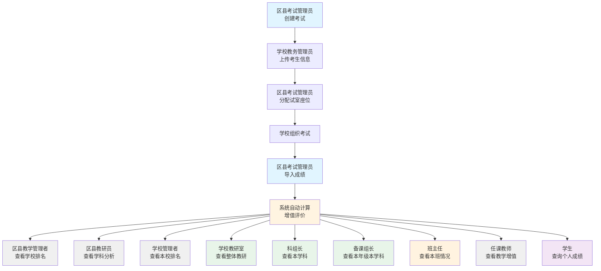
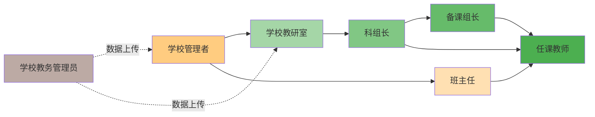

# 教学增值评价功能 PRD v2.7

## 文档修订记录

| 版本 | 日期 | 修订内容 | 修订人 |
|------|------|---------|--------|
| v1.0 | 2026-01-11 | 初版 | Claude |
| v2.0 | 2026-01-11 | 补充缺失模型、完善权限控制、细化实施计划 | Claude |
| v2.1 | 2026-01-11 | Score 模型增强：解决学号变化问题，支持跨学年学生追踪 | Claude |
| v2.2 | 2026-01-11 | **⭐⭐ 多期评价支持：首尾对比、累计增值、线性回归三种计算模型** | Claude |
| v2.3 | 2026-01-12 | **⭐⭐⭐ 基于率指标的增值评价：新增优秀率、优良率、合格率、低分率评价模型** | Claude |
| v2.4 | 2026-01-12 | **⭐⭐⭐⭐ 通用数据导入系统：支持多学段字段，智能识别，统一模板** | Claude |
| v2.5 | 2026-01-12 | **⭐⭐⭐⭐⭐ K12成绩导入系统：智能学科识别，支持文理分科，动态学科列** | Claude |
| v2.6 | 2026-01-12 | **⭐⭐⭐⭐⭐⭐ 真实Excel格式适配：智能学段识别，字段映射，多标识符支持，总分验证** | Claude |
| v2.7 | 2026-01-12 | **⭐⭐⭐⭐⭐⭐⭐ 统一导入模板与考号映射：移除总分列，系统自动计算，建立考号-身份证号永久映射，支持跨学年长期追踪** | Claude |

---

## 1. 产品概述

### 1.1 功能简介
教学增值评价（Value-Added Evaluation）是一种基于学生学业成绩进步情况的教育质量评价方法。与传统的绝对成绩评价不同，增值评价关注的是学生、教师或学校在一定时期内的**相对进步幅度**，而非绝对分数。

### 1.2 核心价值
- **公平性**：消除学生起点差异影响，评价教师/学校真实贡献
- **激励性**：关注进步过程，激发教师教学积极性
- **科学性**：基于统计模型，多因素综合分析
- **导向性**：引导关注教学改进，而非唯分数论

### 1.3 应用场景
| 场景 | 评价对象 | 核心指标 |
|------|---------|---------|
| 教师教学质量评价 | 教师 | 学生平均进步分、增值达标率 |
| 学校办学质量评估 | 学校 | 整体增值分数、学科增值排名 |
| 学生成长追踪 | 学生 | 个人进步曲线、学科增值 |
| 教育政策制定 | 区域 | 区域增值对比分析 |

---

### 1.4 用户角色与使用场景 ⭐ v2.7

本系统服务于区县、学校、教师、学生四个层级，共11个角色，实现从考试组织到增值分析的全流程闭环。

#### 角色矩阵

| 层级 | 角色 | 主要职责 | 权限范围 |
|------|------|---------|---------|
| **区县级** | 区县考试管理员 | 组织考试、分配试室、导入成绩 | 管理全区县考试数据 |
| | 区县教学管理者 | 监控全区县教学质量趋势 | 查看全区县增值排名 |
| | 区县教研员 | 分析学科教学质量 | 查看本学科增值情况 |
| **学校级** | 学校管理者 | 管理本校教学质量 | 查看本校排名和增值 |
| | 学校教研室 | 管理学校整体教研情况 | 查看本校所有学科数据 ⭐ v2.7 |
| | 科组长 | 管理特定学科（跨年级） | 查看本学科所有年级数据 ⭐ v2.7 |
| | 备课组长 | 管理某年级某学科 | 查看本学科本年级数据 ⭐ v2.7 |
| | 班主任 | 管理班级整体情况 | 查看本班所有学科 + 本人所教学科 ⭐ v2.7 |
| | 学校教务管理员 | 上传基础数据、教室安排 | 管理本校数据 |
| | 任课教师 | 查看所教学科成绩 | 查看本学科增值 |
| **学生级** | 学生 | 查询个人成绩和排名 | 查看个人成绩趋势 |

---

#### 1.4.1 角色1：区县考试管理员

**用户画像**：
- 区县教育局考试部门工作人员
- 负责全区县统考的组织和实施

**核心任务**：
1. **创建考试**
   - 设置考试名称（如"2024年春季学期期末考试"）
   - 选择考试年级（小学、初中、高中）
   - 设置考试时间
   - 选择考试科目（支持多科目）
   - 配置科目满分和及格线

2. **管理考生信息**
   - 接收各学校上传的考生基础信息
   - 验证数据完整性（身份证号、学号、班级等）
   - 处理数据异常（重复、缺失、格式错误）

3. **分配试室和座位**（小学、初中）
   - 为每个学校分配试室（考场）
   - 为每个学生分配座位号
   - 生成试室安排表
   - 导出试室分配Excel

4. **导入成绩**
   - 下载统一成绩导入模板
   - 上传学校提交的成绩Excel
   - 系统自动匹配考生号与考生信息
   - 验证成绩数据完整性
   - 处理导入异常（缺考、作弊标记）

**工作流程**：
```
创建考试 → 发布考试通知 → 学校上传考生信息 → 分配试室座位 →
导出试室安排 → 学校组织考试 → 回收成绩表 → 导入成绩 →
数据校验 → 发布成绩 → 触发增值评价计算
```

**关键功能需求**：
- ✅ 考试CRUD（创建、编辑、删除、查询）
- ✅ 批量导入考生信息（Excel）
- ✅ 试室自动分配算法（按学校、班级、考号）
- ✅ 座位号自动生成（01-99）
- ✅ 试室安排表导出
- ✅ 成绩批量导入
- ✅ 考生号与身份证号匹配验证
- ✅ 导入进度和结果反馈

---

#### 1.4.2 角色2：区县教学管理者

**用户画像**：
- 区县教育局分管教学的领导
- 关注全区县整体教学质量和发展趋势

**核心任务**：
1. **查看区域整体趋势**
   - 本次考试总体情况（平均分、及格率、优秀率）
   - 与历史考试对比（同比、环比）
   - 各学校成绩对比分布图

2. **学校增值排名**
   - 查看学校增值排名表（基于增值评价算法）
   - 对比不同学期学校排名变化
   - 识别进步显著和退步学校
   - 导出学校增值排名报告

3. **多维度分析**
   - 按学校类型分析（公办/民办、小学/初中/高中）
   - 按学科分析（语文、数学、英语等）
   - 按区域分析（不同街道/镇）
   - 按时间段分析（学期对比、年度对比）

**数据可视化需求**：
```
📊 学校增值排行榜（Top 20）
📈 区域平均分趋势图（近5次考试）
🥧 学科贡献度饼图
🗺️ 学校热力地图（按地理位置展示增值情况）
```

**关键功能需求**：
- ✅ 区域考试总览Dashboard
- ✅ 学校增值排名查询（多维度排序）
- ✅ 趋势对比分析（同比、环比）
- ✅ 数据导出（Excel、PDF报告）
- ✅ 学校异常预警（排名大幅下滑）
- ✅ 自定义分析维度

---

#### 1.4.3 角色3：区县教研员

**用户画像**：
- 区县教育局学科教研员（如语文教研员、数学教研员）
- 负责本学科教学质量监控和教师指导

**核心任务**：
1. **学科成绩分析**
   - 查看本学科全区县平均分
   - 对比不同学校本学科成绩
   - 分析学科难度和区分度
   - 识别学科教学薄弱环节

2. **教师教学增值分析**
   - 查看本学科教师增值排名
   - 对比不同学校教师表现
   - 识别骨干教师和待提升教师
   - 生成教师教学质量报告

3. **跨学科对比**
   - 对比本学科与其他学科成绩
   - 分析学科相关性（如数学与物理）
   - 发现学科教学问题

**数据关注点**：
```
📌 学科平均分：85.5分（全区语文）
📌 学科增值：+3.2分（相比上次考试）
📌 教师增值排名Top 10
📌 学校本学科排名分布
📌 学科知识点得分率分析
```

**关键功能需求**：
- ✅ 学科Dashboard（按科目筛选）
- ✅ 教师增值排名（本学科）
- ✅ 学校对比分析（本学科）
- ✅ 知识点得分率分析
- ✅ 教师教学质量报告生成
- ✅ 学科教学建议推送

---

#### 1.4.4 角色4：学校管理者

**用户画像**：
- 中小学校长、分管教学副校长
- 关注本校整体教学质量和在区县的排名

**核心任务**：
1. **查看本校整体情况**
   - 本次考试总体成绩（平均分、及格率等）
   - 与历史考试对比
   - 在区县排名情况

2. **教师教学增值监控**
   - 查看本校教师增值排名（校内）
   - 对比教师与区县平均水平
   - 识别优秀教师和待提升教师
   - 教师考核参考数据

3. **学校对比分析**
   - 与同类学校对比
   - 与目标学校对比
   - 优势和薄弱学科分析

**数据关注点**：
```
🏫 本校平均分：88.3分
📈 本校增值：+5.2分（高于区县平均+3.2分）
🏆 区县排名：第5名（共50所学校）
👨‍🏫 教师增值排名Top 5
📊 学科对比：语文优秀，数学待提升
```

**关键功能需求**：
- ✅ 学校Dashboard（本校数据总览）
- ✅ 校内教师增值排名
- ✅ 区县排名查询
- ✅ 同类学校对比
- ✅ 学科分析（本校优势/薄弱学科）
- ✅ 教师绩效报告导出

---

#### 1.4.5 角色4.1：学校教研室 ⭐ v2.7

**用户画像**：
- 学校教研室主任或教研员
- 负责学校整体教学质量和教研工作
- 关注学校所有学科、所有年级的教学情况

**核心任务**：
1. **学校整体教研监控**
   - 查看本校所有学科的教学质量
   - 对比不同学科的增值表现
   - 识别优势学科和薄弱学科
   - 制定学科改进计划

2. **跨年级学科对比**
   - 对比同一学科不同年级的表现
   - 分析学科教学连贯性
   - 识别年级间的教学差异

3. **教师管理**
   - 查看全校教师增值排名
   - 识别骨干教师和待提升教师
   - 组织校内教研活动
   - 教师培训和指导安排

4. **与区县对比**
   - 对比本校与区县平均水平
   - 分析本校在区县的排名
   - 学习先进学校的经验

**数据关注点**：
```
🏫 本校整体情况
   平均分：88.3分（区县平均：85.5分）
   增值：+5.2分（高于区县平均+3.2分）

📊 各学科对比
   语文：90分（增值+6.5）✅ 优势学科
   数学：85分（增值+2.3）
   英语：88分（增值+5.1）
   物理：82分（增值+1.5）⚠️ 薄弱学科

👨‍🏫 教师增值排名Top 10
   跨学科、跨年级排名

📈 学科年级趋势
   各年级各学科增值对比
```

**关键功能需求**：
- ✅ 学校教研Dashboard（所有学科）
- ✅ 学科对比分析（跨学科、跨年级）
- ✅ 教师增值排名（全校）
- ✅ 学科质量报告
- ✅ 教师培训计划制定
- ✅ 教研活动组织

**权限范围**：
- ✅ 查看本校所有学科、所有年级的数据
- ✅ 查看全校教师排名和数据
- ❌ 不能查看其他学校数据（除公开排名外）

---

#### 1.4.6 角色4.2：科组长 ⭐ v2.7

**用户画像**：
- 学校学科组长（如语文科组长、数学科组长）
- 负责本学科所有年级的教学质量
- 通常是资深教师

**核心任务**：
1. **本学科整体管理**
   - 查看本学科所有年级的成绩
   - 对比本学科不同年级的表现
   - 分析学科教学连贯性（如：初一→初二→初三）
   - 识别年级教学薄弱环节

2. **本学科教师管理**
   - 查看本学科教师增值排名（全校）
   - 对比本学科教师与区县平均水平
   - 组织本学科教研活动
   - 指导新教师成长

3. **学科质量分析**
   - 分析本学科知识点得分率
   - 识别教学难点和易错点
   - 分享优秀教学经验
   - 改进教学方法

**数据关注点**：
```
📚 本学科整体情况（语文）
   所有年级平均分：87.5分

📊 年级对比
   初一：89分（增值+5.2）✅
   初二：88分（增值+3.8）
   初三：85分（增值+2.1）⚠️ 需加强

👨‍🏫 本学科教师排名（共10人）
   第1名：张老师（增值+8.5）
   ...
   第10名：李老师（增值-1.2）

📖 知识点分析
   阅读：得分率85%
   写作：得分率78% ⚠️ 薄弱环节
   古诗文：得分率92% ✅
```

**关键功能需求**：
- ✅ 本学科Dashboard（所有年级）
- ✅ 年级对比分析
- ✅ 本学科教师排名
- ✅ 知识点得分率分析
- ✅ 学科教研活动管理
- ✅ 教学资源共享

**权限范围**：
- ✅ 查看本学科所有年级的数据
- ✅ 查看本学科所有教师的数据
- ❌ 不能查看其他学科数据（除公开信息外）
- ❌ 不能查看其他学校详细数据

---

#### 1.4.7 角色4.3：备课组长 ⭐ v2.7

**用户画像**：
- 学校某年级某学科的备课组长
   - 如：初二数学备课组长、高一英语备课组长
- 负责本年级本学科的教学质量
- 是年级组和学科组的桥梁

**核心任务**：
1. **本年级本学科管理**
   - 查看本年级本学科所有班级的成绩
   - 对比不同班级的表现
   - 分析班级差异原因
   - 统一教学进度和难度

2. **备课组教师协调**
   - 查看本备课组教师增值排名
   - 组织集体备课活动
   - 分享教学资源
   - 统一考试命题标准

3. **学生管理**
   - 查看本年级本学科学生成绩分布
   - 识别优秀生和学困生
   - 制定分层教学方案
   - 学科竞赛组织

**数据关注点**：
```
📚 本年级本学科情况（初二数学）
   平均分：86分（区县平均：84分）
   增值：+4.2分 ✅ 高于区县平均

🏫 班级对比（共8个班）
   初二(1)班：88分（增值+5.5）✅
   初二(2)班：87分（增值+4.8）
   ...
   初二(8)班：82分（增值+1.2）⚠️

👨‍🏫 备课组教师（共4人）
   王老师（增值+6.2）第1名
   李老师（增值+4.1）第2名
   张老师（增值+3.5）第3名
   赵老师（增值+2.8）第4名

📊 学生分布
   优秀（≥90分）：25%
   良好（80-89）：45%
   合格（60-79）：25%
   不及格（<60）：5%
```

**关键功能需求**：
- ✅ 本年级本学科Dashboard
- ✅ 班级对比分析
- ✅ 备课组教师排名
- ✅ 学生成绩分布分析
- ✅ 集体备课管理
- ✅ 教学资源共享
- ✅ 分层教学方案

**权限范围**：
- ✅ 查看本年级本学科的所有数据
- ✅ 查看本备课组教师的数据
- ✅ 查看本年级本学科学生成绩
- ❌ 不能查看其他年级、其他学科数据
- ❌ 不能查看其他学校数据

---

#### 1.4.8 角色4.4：班主任 ⭐ v2.7

**用户画像**：
- 班主任老师
- 既可能是任课教师（教某一学科），又负责班级管理
- 关注班级整体发展和每个学生的成长

**核心任务**：
1. **班级整体管理**
   - 查看本班所有学科的成绩
   - 班级平均分、及格率、优秀率
   - 班级在年级的排名
   - 班级增值分析

2. **学生发展追踪**
   - 查看每个学生各科成绩
   - 识别进步学生和退步学生
   - 学生谈心和指导
   - 家校沟通

3. **本学科教学**（如果兼任任课教师）
   - 查看本学科成绩
   - 本学科增值情况
   - 学生作业和考试反馈

4. **班级管理**
   - 班级纪律和出勤
   - 学生综合评价
   - 班级活动组织
   - 家长会准备

**数据关注点**：
```
🏫 本班整体情况（高一(3)班）
   总平均分：268分（年级平均：265分）
   增值：+5.8分 ✅ 高于年级平均
   年级排名：第5名（共10个班）

📊 各学科表现
   语文：88分（班主任任教，增值+4.5）✅
   数学：85分（增值+3.2）
   英语：90分（增值+6.8）✅
   物理：82分（增值+2.1）
   化学：85分（增值+5.5）

👨‍🎓 学生表现Top 10
   第1名：张三（295分，增值+15分）⭐ 进步显著
   ...
   第50名：李四（245分，增值-8分）⚠️ 需关注

📈 班级趋势（近3次考试）
   第1次：260分 → 第2次：262分 → 第3次：268分 ↗
```

**关键功能需求**：
- ✅ 班级Dashboard（所有学科）
- ✅ 班级排名和增值
- ✅ 学生成绩明细（所有学科）
- ✅ 学生进步/退步预警
- ✅ 本学科成绩分析（如果兼任任课教师）
- ✅ 学生成绩单导出（家长会用）
- ✅ 家校沟通记录

**权限范围**：
- ✅ 查看本班所有学科的数据
- ✅ 查看本班每个学生的详细成绩
- ✅ 如果兼任任课教师，可查看本学科数据
- ❌ 不能查看其他班级数据
- ❌ 不能查看其他学校数据

---

#### 1.4.9 角色5：学校教务管理员

**用户画像**：
- 学校教务处工作人员
- 负责学校考试组织和数据管理

**核心任务**：
1. **上传考生基础信息**
   - 下载统一导入模板
   - 填写考生信息（姓名、身份证号、班级等）
   - 上传Excel文件
   - 查看导入结果和错误提示

2. **上传教室安排表**
   - 录入/导入教室信息（教室名称、容量）
   - 为班级分配教室
   - 生成教室安排表

3. **获取本校考试成绩**
   - 下载本校成绩单
   - 查看学生成绩明细
   - 打印成绩单（分发给学生）
   - 统计分析（班级平均分、年级排名等）

**工作流程**：
```
下载模板 → 填写考生信息 → 上传文件 → 系统验证 →
修正错误数据 → 确认提交 → 分配教室 → 导入成绩 →
下载成绩单 → 分发给学生
```

**关键功能需求**：
- ✅ 考生信息Excel导入
- ✅ 数据验证和错误提示
- ✅ 教室信息管理
- ✅ 教室安排表生成
- ✅ 本校成绩查询和导出
- ✅ 学生成绩单打印
- ✅ 基础统计分析

---

#### 1.4.10 角色9：任课教师

**用户画像**：
- 学校学科教师（如语文教师、数学教师）
- 关注所教学科的教学效果

**核心任务**：
1. **查看所教学科成绩**
   - 本班级平均分、及格率、优秀率
   - 学生成绩分布
   - 学生成绩明细

2. **教学增值分析**
   - 个人增值分数（相比上次考试）
   - 校内增值排名（本学科）
   - 区县增值排名（本学科）
   - 与区县平均水平对比

3. **学生追踪**
   - 识别进步显著学生
   - 识别待帮扶学生
   - 查看学生历史成绩趋势

**数据关注点**：
```
📚 本班级平均分：87.5分（区县平均85.5分）
📈 个人增值：+4.2分（高于区县教师平均增值）
🏆 校内排名：第3名（共10名语文教师）
🏅 区县排名：第25名（共200名语文教师）
👨‍🎓 进步显著学生：张三（+15分）
⚠️ 待帮扶学生：李四（-5分）
```

**关键功能需求**：
- ✅ 任课班级成绩查询
- ✅ 教学增值分析（个人vs区县）
- ✅ 学生成绩明细
- ✅ 学生进步/退步预警
- ✅ 学生历史成绩曲线
- ✅ 学科教学建议

---

#### 1.4.11 角色10：学生

**用户画像**：
- 在校学生
- 关注个人学习成绩和进步

**核心任务**：
1. **查询本次考试成绩**
   - 各科成绩
   - 总分
   - 班级排名
   - 年级排名

2. **查看历史成绩**
   - 历次考试成绩列表
   - 成绩趋势图（进步曲线）
   - 排名变化趋势

3. **个人增值分析**
   - 相比上次考试的进步分数
   - 相比去年同期的进步分数
   - 优势学科和薄弱学科分析

**数据展示界面**：
```
📊 本次考试成绩
   语文：85分（班级排名：15/50）
   数学：90分（班级排名：10/50）
   英语：88分（班级排名：12/50）
   总分：263分（班级排名：12/50）

📈 成绩趋势（近5次考试）
   2023秋：250分 → 2024春：255分 → 2024秋：263分 ↗

✨ 个人增值
   相比上次考试：+8分 ✅ 进步显著
   相比去年同期：+13分 📈 稳步提升
```

**关键功能需求**：
- ✅ 本次成绩查询
- ✅ 历史成绩列表
- ✅ 成绩趋势图表（可视化）
- ✅ 排名查询（班级/年级）
- ✅ 个人增值分析
- ✅ 优势/薄弱学科提示
- ✅ 成绩单分享（家长）

---

### 1.5 角色协作流程

#### 完整考试周期流程



#### 学校内部角色协作



#### 数据流向（更新版 ⭐ v2.7）

```
┌─────────────────┐
│ 区县考试管理员  │ → 创建考试 → 导入成绩 → 数据发布
└─────────────────┘
        ↓
┌─────────────────┐
│学校教务管理员  │ → 上传考生信息 → 获取成绩单
└─────────────────┘
        ↓
┌─────────────────┐
│   系统计算      │ → 增值评价算法 → 排名计算
└─────────────────┘
        ↓
┌───────────────────────────────────────────────────────────┐
│                  数据分发与查看                         │
├──────────────┬──────────────┬──────────────┬──────────────┤
│  区县级      │   学校管理层  │  教师层     │   学生层    │
├──────────────┼──────────────┼──────────────┼──────────────┤
│区县教学管理者│ 学校管理者   │ 学校教研室  │             │
│(学校排名)    │(本校排名)    │(整体教研)   │             │
│              │ 科组长       │ 备课组长    │             │
│区县教研员    │(本学科)      │(本年级本学科)│             │
│(学科分析)    │              │             │             │
│              │ 班主任       │ 任课教师    │  学生      │
│              │(班级管理)    │(教学增值)   │(个人成绩)  │
└──────────────┴──────────────┴──────────────┴──────────────┘
```

#### 权限层级图（⭐ v2.7）

```
┌─────────────────────────────────────────────────────────┐
│                  数据访问权限层级                       │
└─────────────────────────────────────────────────────────┘

┌────────────────────┐
│  区县级 (全局视角)  │
│                    │
│ • 所有学校数据      │
│ • 所有学科数据      │
│ • 所有年级数据      │
│ • 全区县排名        │
└────────────────────┘
         ↓ 查看范围缩小
┌────────────────────┐
│  学校管理层         │
│                    │
│ • 本校所有数据      │
│ • 本校排名          │
└────────────────────┘
         ↓
┌────────────────────┬────────────────────┐
│   学校教研室       │      班主任         │
│ (所有学科所有年级)  │  (本班所有学科)     │
│                    │                     │
└────────────────────┴────────────────────┘
         ↓                   ↓
┌────────────────────┐        ┌──────────────┐
│     科组长         │        │   任课教师   │
│  (本学科所有年级)   │        │  (本学科班级) │
│                    │        │              │
└────────────────────┘        └──────────────┘
         ↓
┌────────────────────┐
│    备课组长         │
│(本学科本年级班级)   │
│                    │
└────────────────────┘
         ↓
┌────────────────────┐
│     学生           │
│  (个人数据)        │
└────────────────────┘
```

---

## 2. 数据模型设计

### 2.1 新增表 vs 现有模型映射

| 新文档表结构 | 现有系统模型 | 映射关系 | 处理方式 |
|-------------|------------|---------|---------|
| `Region` | `Region` | ✅ 完全对应 | 无需修改 |
| `School` | `School` | ✅ 完全对应 | 无需修改 |
| `Grade` | `Grade` | ✅ 完全对应 | 无需修改 |
| `Class` | `Classroom` | ⚠️ 名称差异 | 映射：Class → Classroom，需增加 capacity 字段 |
| `Student` | `User` (role=student) | ⚠️ 设计差异 | 现有 User 已有 student_id_number，可直接使用 ✅ |
| `Teacher` | `User` (role=teacher) | ⚠️ 设计差异 | 使用 User 模型 |
| `Subject` | `Subject` | ✅ 完全对应 | 无需修改 |
| `Semester` | ❌ 不存在 | ❌ 缺失 | **新增模型** ⭐ |
| `Exam` | ❌ 不存在 | ❌ 缺失 | **新增模型** ⭐ |
| `Score` | ❌ 不存在 | ❌ 缺失 | **新增模型** ⭐ |
| `EvaluationMetrics` | ❌ 不存在 | ❌ 缺失 | **新增模型** ⭐ |
| `ValueAddedEvaluation` | ❌ 不存在 | ❌ 缺失 | **新增模型** ⭐ |
| `StatisticalAnalysis` | ❌ 不存在 | ❌ 缺失 | **新增模型** ⭐ |
| `TeacherAssignment` | ❌ 不存在 | ❌ 缺失 | **新增模型** ⭐（v2.0补充）|
| `EvaluationPeriod` | ❌ 不存在 | ❌ 缺失 | **新增模型** ⭐（v2.0补充）|
| `ScoreHistory` | ❌ 不存在 | ❌ 缺失 | **新增模型** ⭐（v2.0补充）|
| `Family` | ❌ 不存在 | ❌ 缺失 | 二期新增 |
| `TeacherTeam` | ❌ 不存在 | ❌ 缺失 | 二期新增 |
| `SubjectRelation` | ❌ 不存在 | ❌ 缺失 | 二期新增 |
| `StudentHistory` | ❌ 不存在 | ❌ 缺失 | 二期新增 |
| `TeacherHistory` | ❌ 不存在 | ❌ 缺失 | 二期新增 |

### 2.2 现有模型增强

#### Classroom 模型增强
需要添加 `capacity` 字段：

```python
# 迁移脚本
class Classroom(Base):
    # ... 现有字段 ...
    capacity = Column(Integer, nullable=True, comment="班级容量")
```

---

### 2.5 数据类型设计规范 ⭐ v2.7

#### 2.5.1 核心字段类型选择

| 字段类别 | 字段名称 | 数据类型 | 长度/精度 | 理由 |
|---------|---------|---------|----------|------|
| **成绩分数** | raw_score | NUMERIC/DECIMAL | (5,2) | ✅ 精确小数，避免浮点误差；最高150分，5位数，保留2位小数 |
| | standard_score | NUMERIC/DECIMAL | (6,3) | 标准分可能有负数和小数，精度要求高 |
| | percentile | NUMERIC/DECIMAL | (5,2) | 百分位0-100，保留2位小数 |
| **学号** | student_no | VARCHAR | 12 | ✅ 学号最多12位（如：2023010101） |
| | exam_number | VARCHAR | 20 | 考号/准考证号，最多20位 |
| **班级** | classroom_name | VARCHAR | 20 | ✅ 班级名称最多20字符（如"高一(1)班"） |
| | class_id | INTEGER | - | 数据库主键，整数 |
| **座位号** | seat_number | VARCHAR | 2 | ✅ 座位号最多2字符（如"01"、"99"） |
| **身份证号** | student_id_number | VARCHAR | 18 | ✅ 身份证号固定18位，精确存储 |
| | id_number | VARCHAR | 18 | 同上 |
| **学生姓名** | student_name | VARCHAR | 50 | 中文姓名最多50字符（考虑少数民族姓名） |
| **学校** | school_name | VARCHAR | 50 | 学校名称最多50字符（如"北京市第一中学"） |
| | school_code | VARCHAR | 20 | 学校代码，最多20字符（如"BJ001"） |
| **地区** | region_name | VARCHAR | 50 | 地区名称最多50字符（如"北京市朝阳区"） |
| | region_code | VARCHAR | 20 | 地区代码，最多20字符 |
| **学科** | subject_name | VARCHAR | 20 | 学科名称最多20字符（如"语文"、"信息技术"） |
| | subject_code | VARCHAR | 10 | 学科代码，最多10字符（如"CH"、"MATH"） |

---

#### 2.5.2 成绩分数类型详解 ⭐⭐⭐

**为什么使用 DECIMAL(5,2) 而不是 FLOAT？**

```python
# ❌ 错误：使用Float
raw_score = Column(Float, nullable=True)
# 问题：
# 1. 85.5 可能存储为 85.499999999
# 2. 0.1 + 0.2 = 0.30000000000000004（浮点误差）
# 3. 总分计算时误差累积

# ✅ 正确：使用Numeric/Decimal
from sqlalchemy.dialects.postgresql import NUMERIC
raw_score = Column(NUMERIC(5, 2), nullable=True, comment="原始分数")
# 优势：
# 1. 精确存储：85.5 = 85.5
# 2. DECIMAL(5,2) 表示：总共5位数，其中2位小数
# 3. 范围：-999.99 到 999.99（足够存储0-150分）
```

**DECIMAL精度选择**：

| 分数字段 | 精度 | 理由 | 示例值 |
|---------|------|------|--------|
| raw_score | DECIMAL(5,2) | 最高150分，可能0.5分 | 85.50, 150.00 |
| standard_score | DECIMAL(6,3) | Z-score可能有负数，精度要求高 | -1.234, 2.567 |
| percentile | DECIMAL(5,2) | 百分位0-100 | 85.67, 99.99 |

**成绩示例数据**：

```sql
-- 正确的成绩存储
CREATE TABLE scores (
    raw_score NUMERIC(5,2)     -- 85.50, 90.00, 100.00, 150.00
    standard_score NUMERIC(6,3) -- -1.234, 0.567, 2.345
    percentile NUMERIC(5,2)     -- 85.67, 95.23, 99.99
);

-- 数据示例
INSERT INTO scores (raw_score) VALUES (85.5);   -- ✅ 精确存储
INSERT INTO scores (raw_score) VALUES (90);     -- ✅ 自动变为 90.00
INSERT INTO scores (raw_score) VALUES (150.0);  -- ✅ 最高分
```

---

#### 2.5.3 学号与座位号类型详解 ⭐⭐⭐

**学号为什么用VARCHAR而不是INTEGER？**

```python
# ❌ 错误：使用整数
student_no = Column(Integer, nullable=True)
# 问题：
# 1. 学号 "2023010101" → 存储为 2023010101（看起来正常）
# 2. 学号 "000123" → 存储为 123（前导零丢失！）❌
# 3. 学号 "A202301" → 无法存储（不支持字母）❌
# 4. 学号 "2023-01-01" → 无法存储（包含特殊字符）❌

# ✅ 正确：使用字符串（优化长度为12）
student_no = Column(String(12), nullable=True, comment="学号（最多12位）")
# 优势：
# 1. "000123" → 完整存储 ✅
# 2. "2023010101" → 完整存储（10位）✅
# 3. 最长支持12位学号
# 4. 精确控制长度，避免过度占用空间
```

**实际学号示例（最多12位）**：

| 学号格式 | 示例 | 长度 | 数据类型 | 存储 |
|---------|------|------|---------|------|
| 纯数字 | 2023010101 | 10位 | VARCHAR(12) | "2023010101" ✅ |
| 带前导零 | 000123456789 | 12位 | VARCHAR(12) | "000123456789" ✅ |
| 带字母 | A20230101 | 9位 | VARCHAR(12) | "A20230101" ✅ |
| 最长学号 | 123456789012 | 12位 | VARCHAR(12) | "123456789012" ✅ |

---

**座位号类型选择（最多2字符）**：

```python
# 座位号示例：01, 02, 99, A1, B2

# ❌ 错误：使用整数
seat_number = Column(Integer, nullable=True)
# "01" → 存储为 1（前导零丢失）

# ✅ 正确：使用字符串（优化长度为2）
seat_number = Column(String(2), nullable=True, comment="座位号（最多2字符）")
# "01" → 完整存储 ✅
# "99" → 完整存储 ✅
# "A1" → 完整存储 ✅
# "AB" → 完整存储 ✅

# 注意：如果座位号超过2字符（如"前排-01"），应使用更长的VARCHAR
seat_number = Column(String(10), nullable=True, comment="座位号（带描述）")
```

---

#### 2.5.4 班级字段类型详解

**班级名称为什么用VARCHAR？**

```python
# 班级名称示例：
# - "高一(1)班"  - 7字符
# - "301班"      - 4字符
# - "七年级1班"  - 6字符
# - "Class 1-A"  - 9字符

# ✅ 正确：使用字符串（优化长度为20）
classroom_name = Column(String(20), nullable=True, comment="班级名称（最多20字符）")

# 数据库索引（提高查询性能）
__table_args__ = (
    Index('idx_classroom_name', 'classroom_name'),
)
```

**班级编码vs名称**：

| 字段 | 类型 | 示例 | 用途 |
|------|------|------|------|
| classroom_id | INTEGER | 1001 | 数据库主键，内部关联 |
| classroom_name | VARCHAR(20) | "高一(1)班" | 显示名称，用户可见，最多20字符 |
| classroom_code | VARCHAR(20) | "G2023-01-01" | 系统编码，可能包含规则，最多20字符 |

---

#### 2.5.5 身份证号类型详解

**身份证号为什么用VARCHAR而不是BIGINT？**

```python
# ❌ 错误：使用整数
id_number = Column(BigInteger, nullable=True)
# 问题：
# 1. 18位身份证号：110101200501011234
# 2. JavaScript最大安全整数：2^53 - 1 = 9007199254740991（16位）
# 3. 18位身份证号超过JS安全整数范围 → 前端传值丢失 ❌
# 4. 首位可能是0（某些特殊情况） → 丢失 ❌

# ✅ 正确：使用字符串（优化长度为18）
id_number = Column(String(18), nullable=False, comment="身份证号（固定18位）")
# 优势：
# 1. 精确存储18位数字 ✅
# 2. 前端传输无精度丢失 ✅
# 3. 支持学籍号格式（G+身份证号）导入时自动转换 ✅
# 4. 精确控制长度，避免浪费空间
```

**身份证号存储示例（固定18位）**：

```sql
CREATE TABLE users (
    id_number VARCHAR(18) NOT NULL,  -- 固定18位
    CONSTRAINT uq_id_number UNIQUE (id_number)
);

-- 插入示例
INSERT INTO users (id_number) VALUES ('110101200501011234');  -- 18位身份证 ✅
-- 注意：学籍号（G+身份证号）导入时自动转换为纯身份证号存储
-- G110101200501011234 → 110101200501011234
```

**长度验证**：

```python
def validate_id_number(id_number: str) -> bool:
    """验证身份证号长度"""
    return len(id_number) == 18 and id_number.isdigit()

# 有效
validate_id_number("110101200501011234")  # ✅ 18位

# 无效
validate_id_number("11010120050101123")   # ❌ 17位
validate_id_number("1101012005010112345") # ❌ 19位
```

---

#### 2.5.6 数据类型对照表（SQLAlchemy → PostgreSQL）

```python
from sqlalchemy import Column, Integer, String, Numeric, Boolean, Date, DateTime
from sqlalchemy.dialects.postgresql import UUID

# 成绩分数
raw_score = Column(Numeric(5, 2), nullable=True)  -- → NUMERIC(5,2)
standard_score = Column(Numeric(6, 3), nullable=True)  -- → NUMERIC(6,3)

# 学号、座位号、班级（优化长度）
student_no = Column(String(12), nullable=True)   -- → VARCHAR(12) 最多12位
seat_number = Column(String(2), nullable=True)  -- → VARCHAR(2)  最多2字符
classroom_name = Column(String(20))              -- → VARCHAR(20) 最多20字符

# 身份证号
id_number = Column(String(18), nullable=False)   -- → VARCHAR(18) 固定18位
student_id_number = Column(String(18), nullable=False)  -- → VARCHAR(18) 固定18位

# 学生姓名、学校、地区
student_name = Column(String(50), nullable=False)  -- → VARCHAR(50) 最多50字符
school_name = Column(String(50), nullable=False)   -- → VARCHAR(50) 最多50字符
region_name = Column(String(50), nullable=False)   -- → VARCHAR(50) 最多50字符

# 考号、学校代码、地区代码
exam_number = Column(String(20), nullable=False)   -- → VARCHAR(20) 最多20位
school_code = Column(String(20), nullable=False)   -- → VARCHAR(20) 最多20字符
region_code = Column(String(20), nullable=False)   -- → VARCHAR(20) 最多20字符

# 学科
subject_name = Column(String(20), nullable=False)  -- → VARCHAR(20) 最多20字符
subject_code = Column(String(10), nullable=False)  -- → VARCHAR(10) 最多10字符

# 主键、外键
id = Column(Integer, primary_key=True)            -- → INTEGER SERIAL
user_id = Column(Integer, ForeignKey("users.id")) -- → INTEGER

# 布尔值
is_active = Column(Boolean, default=True)         -- → BOOLEAN

# 日期时间
created_at = Column(DateTime, server_default=func.now())  -- → TIMESTAMP
start_date = Column(Date, nullable=False)         -- → DATE
```

---

#### 2.5.7 性能优化建议

**索引策略**：

```python
__table_args__ = (
    # 主键自动创建索引
    # 外键自动创建索引

    # 高频查询字段
    Index('idx_score_student_id_number', 'student_id_number'),  # 身份证号
    Index('idx_score_exam_subject', 'exam_id', 'subject_id'),   # 考试+科目

    # 唯一约束（包含索引）
    UniqueConstraint('exam_id', 'user_id', 'subject_id', name='uq_exam_user_subject'),
)
```

**数据长度优化总结 ⭐ v2.7**：

| 字段 | 优化前长度 | 优化后长度 | 节省空间 | 理由 |
|------|-----------|-----------|---------|------|
| **核心学生信息** |
| student_no | VARCHAR(50) | VARCHAR(12) | 38字符 | 学号最多12位 |
| student_id_number | VARCHAR(50) | VARCHAR(18) | 32字符 | 身份证号固定18位 |
| id_number | VARCHAR(50) | VARCHAR(18) | 32字符 | 同上 |
| student_name | VARCHAR(100) | VARCHAR(50) | 50字符 | 中文姓名通常2-4字 |
| **班级与座位** |
| classroom_name | VARCHAR(100) | VARCHAR(20) | 80字符 | 班级名称最多20字符 |
| seat_number | VARCHAR(20) | VARCHAR(2) | 18字符 | 座位号最多2字符 |
| **考试相关** |
| exam_number | VARCHAR(50) | VARCHAR(20) | 30字符 | 考号最多20位 |
| **学校与地区** |
| school_name | VARCHAR(100) | VARCHAR(50) | 50字符 | 学校名称最多50字符 |
| school_code | VARCHAR(50) | VARCHAR(20) | 30字符 | 学校代码最多20字符 |
| region_name | VARCHAR(100) | VARCHAR(50) | 50字符 | 地区名称最多50字符 |
| region_code | VARCHAR(50) | VARCHAR(20) | 30字符 | 地区代码最多20字符 |
| **学科** |
| subject_name | VARCHAR(50) | VARCHAR(20) | 30字符 | 学科名称最多20字符 |
| subject_code | VARCHAR(50) | VARCHAR(10) | 40字符 | 学科代码最多10字符 |

**存储空间节省估算**（以100万学生为例）：

```
单条记录节省：
- student_no: 38字节
- student_id_number: 32字节
- classroom_name: 80字节
- seat_number: 18字节
- exam_number: 30字节
...
总计：约 350字节/条

100万学生节省：350MB + 索引空间节省
```

**查询性能提升**：
- 更短的VARCHAR → 更快的索引扫描
- 更少的数据页 → 更少的磁盘I/O
- 更好的缓存利用率

---

## 3. 核心数据模型详细设计

### 3.1 学期管理（Semester）

**功能**：管理学年学期信息，作为增值评价的时间维度

```python
from sqlalchemy import Column, Integer, String, Boolean, Date, DateTime
from sqlalchemy.orm import relationship
from sqlalchemy.sql import func
from app.core.database import Base

class Semester(Base):
    """学期模型"""
    __tablename__ = "semesters"

    id = Column(Integer, primary_key=True, index=True)
    year = Column(String(20), nullable=False, comment="学年，如 2023-2024")
    term = Column(Integer, nullable=False, comment="学期：1或2")
    name = Column(String(50), nullable=False, comment="学期名称，如 2023-2024学年第一学期")
    start_date = Column(Date, nullable=False, comment="开始日期")
    end_date = Column(Date, nullable=False, comment="结束日期")
    is_active = Column(Boolean, default=True, comment="是否激活")
    is_current = Column(Boolean, default=False, comment="是否当前学期")

    created_at = Column(DateTime(timezone=True), server_default=func.now())
    updated_at = Column(DateTime(timezone=True), server_default=func.now(), onupdate=func.now())

    # 关系
    exams = relationship("Exam", back_populates="semester")

    __table_args__ = (
        Index('idx_semester_year_term', 'year', 'term'),
        UniqueConstraint('year', 'term', name='uq_semester_year_term'),
    )
```

---

### 3.1.1 User 模型增强（v2.5）

**现有 User 模型需要新增字段**：

```python
# 在现有 User 模型中添加
class User(Base):
    """用户模型（已有模型，v2.5 增强）"""
    __tablename__ = "users"

    # ... 现有字段 ...

    # ⭐ v2.5 新增字段：文理分科
    track_type = Column(
        String(20),
        nullable=True,
        comment="文理分科：ARTS(文科)/SCIENCE(理科)/NULL(未分科)"
    )

    # ⭐ v2.5 新增字段：入学年份（用于判断年级）
    enrollment_year = Column(
        Integer,
        nullable=True,
        comment="入学年份，用于自动计算年级"
    )

    # ⭐ v2.5 新增字段：当前年级级别
    current_grade_level = Column(
        Integer,
        nullable=True,
        comment="当前年级级别（1-12），自动计算或手动设置"
    )
```

**字段说明**：

| 字段 | 类型 | 说明 | 示例 |
|------|------|------|------|
| `track_type` | String(20) | 文理分科标记 | "ARTS", "SCIENCE", NULL |
| `enrollment_year` | Integer | 入学年份 | 2023 |
| `current_grade_level` | Integer | 当前年级 | 10（高一） |

**使用场景**：
```python
# 1. 文理分科后更新学生标记
student.track_type = "SCIENCE"  # 理科
student.track_type = "ARTS"     # 文科

# 2. 根据入学年份自动计算年级
from datetime import datetime
current_year = datetime.now().year
student_grade = current_year - student.enrollment_year + 1
# 例如：2024年入学，2026年当前为3年级

# 3. 获取学生应考学科
if student.track_type == "SCIENCE":
    # 理科学生：物理、化学、生物
    subjects = ["物理", "化学", "生物"]
elif student.track_type == "ARTS":
    # 文科学生：政治、历史、地理
    subjects = ["政治", "历史", "地理"]
else:
    # 未分科：所有学科
    subjects = ["物理", "化学", "生物", "政治", "历史", "地理"]
```

---

### 3.2 考试管理（Exam）

**功能**：管理各类考试信息

```python
class Exam(Base):
    """
    考试模型 - 代表一次考试事件（不关联具体科目）⭐ v2.7 修改

    设计说明：
    - 一次考试（如"2023秋季期末考试"）包含多个科目
    - 科目关联在Score表中，实现窄字段设计
    - 一个学生在一次考试中有多少科，就有多少条Score记录
    """
    __tablename__ = "exams"

    id = Column(Integer, primary_key=True, index=True)
    name = Column(String(200), nullable=False, comment="考试名称：2023秋季期末考试")
    exam_type = Column(String(50), nullable=False, comment="考试类型：MIDTERM/FINAL/MONTHLY/ENTRANCE/MAKEUP")

    # ⭐ v2.7 移除 subject_id，考试不关联具体科目（科目在Score中）

    grade_id = Column(Integer, ForeignKey("grades.id"), nullable=False)
    semester_id = Column(Integer, ForeignKey("semesters.id"), nullable=False)
    school_id = Column(Integer, ForeignKey("schools.id"), nullable=False, comment="所属学校（支持校级考试）⭐ v2.7")

    start_time = Column(DateTime(timezone=True), nullable=False, comment="考试开始时间")
    end_time = Column(DateTime(timezone=True), nullable=False, comment="考试结束时间")

    # ⭐ v2.7 移除 total_score 和 pass_score（每科满分不同，在Subject或ExamSubjectConfiguration中配置）
    status = Column(String(50), default="PLANNED", comment="状态：PLANNED/ONGOING/COMPLETED/CANCELLED")

    description = Column(Text, nullable=True)
    created_by = Column(Integer, ForeignKey("users.id"))
    created_at = Column(DateTime(timezone=True), server_default=func.now())
    updated_at = Column(DateTime(timezone=True), server_default=func.now(), onupdate=func.now())

    # 关系
    grade = relationship("Grade")
    semester = relationship("Semester", back_populates="exams")
    school = relationship("School")  # ⭐ v2.7 新增
    creator = relationship("User")
    scores = relationship("Score", back_populates="exam", cascade="all, delete-orphan")

    __table_args__ = (
        Index('idx_exam_grade_semester', 'grade_id', 'semester_id'),
        Index('idx_exam_school_semester', 'school_id', 'semester_id'),  # ⭐ v2.7 新增
    )
```

---

### 3.3 教师任课分配（TeacherAssignment）⭐ v2.0 新增

**功能**：管理教师、班级、学科的任课关系

**为什么需要**：
- 确定哪些学生的成绩应该计入某个教师的增值评价
- 支持一个教师教多个班级、多个学科的场景
- 支持一个班级有多个任课教师（正课教师+助教）

```python
class TeacherAssignment(Base):
    """教师任课分配"""
    __tablename__ = "teacher_assignments"

    id = Column(Integer, primary_key=True, index=True)
    teacher_id = Column(Integer, ForeignKey("users.id"), nullable=False)
    classroom_id = Column(Integer, ForeignKey("classrooms.id"), nullable=False)
    subject_id = Column(Integer, ForeignKey("subjects.id"), nullable=False)
    semester_id = Column(Integer, ForeignKey("semesters.id"), nullable=False)

    role = Column(String(50), default="PRIMARY", comment="角色：PRIMARY(主课)/ASSISTANT(助教)")
    start_date = Column(Date, nullable=True, comment="任职开始日期")
    end_date = Column(Date, nullable=True, comment="任职结束日期")
    is_active = Column(Boolean, default=True, comment="是否激活")

    created_at = Column(DateTime(timezone=True), server_default=func.now())
    created_by = Column(Integer, ForeignKey("users.id"))

    # 关系
    teacher = relationship("User", foreign_keys=[teacher_id])
    classroom = relationship("Classroom")
    subject = relationship("Subject")
    semester = relationship("Semester")

    __table_args__ = (
        Index('idx_assignment_teacher_semester', 'teacher_id', 'semester_id'),
        Index('idx_assignment_classroom_subject', 'classroom_id', 'subject_id'),
        UniqueConstraint('teacher_id', 'classroom_id', 'subject_id', 'semester_id',
                       name='uq_teacher_assignment'),
    )
```

---

### 3.4 成绩管理（Score）

**功能**：记录学生考试成绩

**v2.0 修改**：
- 移除冗余的 `subject_id`，添加 `classroom_id`（用于快速查询）
- **⭐ 新增：解决学号变化问题，支持跨学年学生追踪**

**v2.5 修改**：
- **⭐⭐ 新增：支持缺考、作弊标记和成绩类型**

**关键设计说明**：
由于每学年重新分班可能导致学号变化（如 2023010101 → 2024020105），为了支持增值评价的跨学年追踪，Score 表同时记录：
1. `user_id` - 外键关联，保持数据库完整性
2. `student_id_number` - 学籍号/身份证号（永久不变，用于跨学年追踪）⭐
   - **学籍号格式**：G + 身份证号（如：G110101200501011234）
   - **身份证号格式**：18位数字（如：110101200501011234）
   - 系统自动识别并统一存储为身份证号（去除前缀G）
3. `student_no` - 当时的学号（历史快照，记录当时的学号）

**学籍号与身份证号转换规则** ⭐ v2.7：
```python
def normalize_student_id(identifier: str) -> str:
    """
    标准化学生标识符

    输入：学籍号（G开头）或身份证号（纯数字）
    输出：统一返回18位身份证号

    示例：
    - G110101200501011234 → 110101200501011234
    - 110101200501011234 → 110101200501011234
    """
    if identifier.startswith('G'):
        return identifier[1:]  # 去除G前缀
    return identifier
```

```python
from sqlalchemy import Column, Integer, String, Numeric, Boolean, DateTime, ForeignKey, UniqueConstraint, Index
from sqlalchemy.orm import relationship
from sqlalchemy.sql import func

class Score(Base):
    """
    成绩模型 - 窄字段设计（一个学生在一次考试中的一科成绩）⭐ v2.7 修改

    设计说明：
    - 每条记录代表一个学生在某次考试中的某一科成绩
    - 一个学生一次考试有多少科，就有多少条Score记录
    - 方便单科增值评价计算和统计
    """
    __tablename__ = "scores"

    id = Column(Integer, primary_key=True, index=True)

    # 学生标识（三重机制确保跨学年追踪）
    user_id = Column(Integer, ForeignKey("users.id"), nullable=False, comment="用户ID（外键）")
    student_id_number = Column(String(18), nullable=False, index=True, comment="身份证号（固定18位）⭐ v2.7")
    student_no = Column(String(12), nullable=True, comment="当时的学号（最多12位）⭐ v2.7")

    # 考试和科目 ⭐ v2.7 修改
    exam_id = Column(Integer, ForeignKey("exams.id"), nullable=False, comment="考试ID")
    subject_id = Column(Integer, ForeignKey("subjects.id"), nullable=False, comment="科目ID ⭐ v2.7 直接存储")

    # 班级
    classroom_id = Column(Integer, ForeignKey("classrooms.id"), nullable=False, comment="考试时所在班级")

    # 成绩数据 ⭐ v2.7 使用Numeric类型，避免浮点误差
    raw_score = Column(Numeric(5, 2), nullable=True, comment="原始分数（DECIMAL(5,2)，精确到0.01分）⭐ v2.7")
    standard_score = Column(Numeric(6, 3), nullable=True, comment="标准分（Z-score，DECIMAL(6,3)）⭐ v2.7")
    percentile = Column(Numeric(5, 2), nullable=True, comment="百分位排名（0-100，DECIMAL(5,2)）⭐ v2.7")
    grade_level = Column(String(10), nullable=True, comment="等级：A/B/C/D/F")

    # ⭐ v2.5 新增字段
    score_type = Column(String(20), nullable=False, default="RAW", comment="成绩类型：RAW(原始分)/STANDARD(标准分)/LEVEL(等级)")
    is_absent = Column(Boolean, default=False, comment="是否缺考")
    is_cheated = Column(Boolean, default=False, comment="是否作弊")
    note = Column(String(200), nullable=True, comment="备注")

    # 元数据（保留向后兼容）
    status = Column(String(50), default="DRAFT", comment="状态：DRAFT/CONFIRMED/PUBLISHED")
    absence = Column(Boolean, default=False, comment="是否缺考（已弃用，使用is_absent）")

    # 审计字段
    submitted_by = Column(Integer, ForeignKey("users.id"), comment="录入人")
    confirmed_by = Column(Integer, ForeignKey("users.id"), comment="确认人")
    confirmed_at = Column(DateTime(timezone=True), nullable=True)

    created_at = Column(DateTime(timezone=True), server_default=func.now())
    updated_at = Column(DateTime(timezone=True), server_default=func.now(), onupdate=func.now())

    # 关系 ⭐ v2.7 修改
    user = relationship("User", foreign_keys=[user_id])
    exam = relationship("Exam", back_populates="scores", foreign_keys=[exam_id])
    subject = relationship("Subject", foreign_keys=[subject_id])  # ⭐ v2.7 直接关联科目
    classroom = relationship("Classroom")
    submitter = relationship("User", foreign_keys=[submitted_by])
    confirmer = relationship("User", foreign_keys=[confirmed_by])
    history = relationship("ScoreHistory", back_populates="score", cascade="all, delete-orphan")

    __table_args__ = (
        # ⭐ v2.7 唯一约束：一个学生在一次考试中，每科只有一条成绩记录
        UniqueConstraint('exam_id', 'user_id', 'subject_id', name='uq_exam_user_subject'),
        Index('idx_score_user_exam', 'user_id', 'exam_id'),
        Index('idx_score_student_id_number', 'student_id_number'),  # ⭐ 关键索引：跨学年查询
        Index('idx_score_exam_subject', 'exam_id', 'subject_id'),  # ⭐ v2.7 新增：单科查询
        Index('idx_score_exam_classroom', 'exam_id', 'classroom_id'),
        Index('idx_score_classroom_student', 'classroom_id', 'user_id'),
    )
```

**数据示例（窄字段设计）⭐ v2.7**：

```
一次考试：2023秋季期末考试（exam_id=101）

scores表：
┌──────┬─────────┬──────────────────┬─────────┬─────────────┬──────────┬───────────┬───────────┐
│ id   │ user_id │ student_id_number│ exam_id │ subject_id  │ raw_score│ is_absent │ classroom │
├──────┼─────────┼──────────────────┼─────────┼─────────────┼──────────┼───────────┼───────────┤
│ 1001 │ 1001    │ "1101012005..."  │   101   │ 1 (语文)    │   85.0   │   false   │ 高一(1)班 │
│ 1002 │ 1001    │ "1101012005..."  │   101   │ 2 (数学)    │   90.0   │   false   │ 高一(1)班 │
│ 1003 │ 1001    │ "1101012005..."  │   101   │ 3 (英语)    │   88.0   │   false   │ 高一(1)班 │
│ 1004 │ 1001    │ "1101012005..."  │   101   │ 4 (物理)    │   78.0   │   false   │ 高一(1)班 │
│ 1005 │ 1001    │ "1101012005..."  │   101   │ 5 (化学)    │   82.0   │   false   │ 高一(1)班 │
│ 1006 │ 1002    │ "1101012006..."  │   101   │ 1 (语文)    │   92.0   │   false   │ 高一(1)班 │
│ 1007 │ 1002    │ "1101012006..."  │   101   │ 2 (数学)    │   95.0   │   false   │ 高一(1)班 │
│ 1008 │ 1002    │ "1101012006..."  │   101   │ 3 (英语)    │   90.0   │   false   │ 高一(1)班 │
│ 1009 │ 1002    │ "1101012006..."  │   101   │ 4 (物理)    │   null   │   true    │ 高一(1)班 │ ← 缺考
│ 1010 │ 1002    │ "1101012006..."  │   101   │ 5 (化学)    │   85.0   │   false   │ 高一(1)班 │
└──────┴─────────┴──────────────────┴─────────┴─────────────┴──────────┴───────────┴───────────┘
                            ↑ 同一个学生              ↑ 同一次考试        ↑ 不同科目

**student_id_number 存储说明** ⭐ v2.7：
- 统一存储为18位身份证号（不含G前缀）
- 导入时自动转换学籍号：G110101200501011234 → 110101200501011234
- 查询时支持两种格式（学籍号或身份证号）

窄字段设计的优势：
✅ 一个学生在一次考试中有多少科，就有多少条记录（5科=5条记录）
✅ 方便单科查询：WHERE exam_id=101 AND subject_id=1
✅ 方便单科统计计算：语文平均分、优秀率、增值
✅ 扩展性强：新增科目无需修改表结构
✅ 唯一约束保证数据一致性：(exam_id, user_id, subject_id) 唯一
✅ 学籍号自动转换：统一存储为身份证号，便于跨学年追踪
```

**窄字段设计查询示例⭐ v2.7**：

```python
# 1. 查询某次考试的语文成绩
chinese_scores = db.query(Score).filter(
    Score.exam_id == 101,
    Score.subject_id == 1  # 语文
).all()

# 2. 计算语文科目平均分
avg_chinese = sum(s.raw_score for s in chinese_scores if not s.is_absent) / len(chinese_scores)

# 3. 计算某学生某次考试的总分
student_total = db.query(func.sum(Score.raw_score)).filter(
    Score.exam_id == 101,
    Score.user_id == 1001,
    Score.is_absent == False
).scalar()

# 4. 查询某学生某次考试的所有科目成绩
all_subjects = db.query(Score).filter(
    Score.exam_id == 101,
    Score.user_id == 1001
).order_by(Score.subject_id).all()

# 结果：[语文85, 数学90, 英语88, 物理78, 化学82]
```

---

**数据示例（跨学年追踪）**：
```
场景：张三重新分班，学号从 2023010101 变为 2024020105

┌──────┬─────────┬──────────────────┬─────────────┬─────────┬─────────────┬──────────┬────────────┐
│ id   │ user_id │ student_id_number│ student_no  │ exam_id │ subject_id  │classroom │ raw_score │
├──────┼─────────┼──────────────────┼─────────────┼─────────┼─────────────┼──────────┼────────────┤
│ 1001 │ 1001    │ "1101012005..."  │"2023010101" │   101   │ 1 (语文)    │高一(1)班 │   85.0   │ 2023秋
│ 1002 │ 1001    │ "1101012005..."  │"2023010101" │   101   │ 2 (数学)    │高一(1)班 │   90.0   │ 2023秋
│ 1003 │ 1001    │ "1101012005..."  │"2024020105" │   205   │ 1 (语文)    │高一(2)班 │   87.0   │ 2024春
│ 1004 │ 1001    │ "1101012005..."  │"2024020105" │   205   │ 2 (数学)    │高一(2)班 │   92.0   │ 2024春
│ 1005 │ 1001    │ "1101012005..."  │"2024030112" │   308   │ 1 (语文)    │高二(3)班 │   89.0   │ 2024秋
│ 1006 │ 1001    │ "1101012005..."  │"2024030112" │   308   │ 2 (数学)    │高二(3)班 │   94.0   │ 2024秋
└──────┴─────────┴──────────────────┴─────────────┴─────────┴─────────────┴──────────┴────────────┘
          ↑同一人        ↑不变（学籍号）  ↑变化（学号）    ↑变化         ↑变化（班级）

跨学年查询示例：
SELECT * FROM scores
WHERE student_id_number = "1101012005..."
ORDER BY created_at;
→ 返回该学生所有学期的所有科目成绩，即使学号和班级都变化了
```

**查询学生历史成绩**：
```python
# 方式1：通过学籍号查询（推荐，最准确）⭐
async def get_student_history_by_id_number(
    student_id_number: str,
    db: AsyncSession
) -> List[Score]:
    """通过学籍号查询学生所有历史成绩（跨学年追踪）"""
    result = await db.execute(
        select(Score)
        .where(Score.student_id_number == student_id_number)
        .order_by(Score.created_at)
    )
    return result.scalars().all()

# 方式2：通过当前用户ID查询
async def get_student_history_by_user_id(
    user_id: int,
    db: AsyncSession
) -> List[Score]:
    """通过用户ID查询所有成绩"""
    result = await db.execute(
        select(Score)
        .where(Score.user_id == user_id)
        .order_by(Score.created_at)
    )
    return result.scalars().all()
```

---

### 3.5 成绩修改历史（ScoreHistory）⭐ v2.0 新增

**功能**：记录成绩修改历史，支持审计和追溯

```python
class ScoreHistory(Base):
    """成绩修改历史"""
    __tablename__ = "score_history"

    id = Column(Integer, primary_key=True, index=True)
    score_id = Column(Integer, ForeignKey("scores.id"), nullable=False)

    old_raw_score = Column(Float, nullable=True, comment="修改前的原始分数")
    new_raw_score = Column(Float, nullable=True, comment="修改后的原始分数")
    old_grade_level = Column(String(10), nullable=True)
    new_grade_level = Column(String(10), nullable=True)

    changed_by = Column(Integer, ForeignKey("users.id"), nullable=False, comment="修改人")
    change_reason = Column(String(500), nullable=True, comment="修改原因")
    change_type = Column(String(50), default="MANUAL", comment="修改类型：MANUAL/IMPORT/BATCH")

    created_at = Column(DateTime(timezone=True), server_default=func.now())

    # 关系
    score = relationship("Score", back_populates="history")
    changer = relationship("User")

    __table_args__ = (
        Index('idx_score_history_score', 'score_id'),
        Index('idx_score_history_changed_by', 'changed_by'),
    )
```

---

### 3.6 评价周期配置（EvaluationPeriod）⭐ v2.0 新增

**功能**：定义增值评价的周期配置，支持多期追踪评价

**⭐ v2.2 增强**：支持纵向多期评价（2-N个考试）

**为什么需要**：
- 明确哪些考试作为基期（起点）和现期（终点）
- 支持多期追踪评价（如：T1上→T1下→T2上→T2下→T3上）
- 支持多种计算模型（首尾对比、累计增值、线性回归）

**应用场景**：
```
单期评价（基期→现期）：
2023春期末 ──────→ 2023秋期末
  基期              现期

多期追踪（3年5期）：
T1上 ─ T1下 ─ T2上 ─ T2下 ─ T3上
 ↓     ↓     ↓     ↓     ↓
 75    78    82    85    88

累计增值：(78-75-预期1) + (82-78-预期2) + (85-82-预期3) + (88-85-预期4)
回归增值：拟合直线 y=3.25x+71.5，斜率3.25即为增值率
```

```python
class EvaluationPeriod(Base):
    """评价周期配置（支持多期）"""
    __tablename__ = "evaluation_periods"

    id = Column(Integer, primary_key=True, index=True)
    name = Column(String(200), nullable=False, comment="周期名称")
    description = Column(Text, nullable=True)

    # ⭐ 计算模型选择
    calculation_model = Column(
        String(50),
        default="SIMPLE_PAIR",
        comment="计算模型：SIMPLE_PAIR(首尾对比)/CUMULATIVE(累计增值)/REGRESSION(线性回归)"
    )

    # 考试配置（灵活支持2-N期）⭐ v2.2 增强
    exam_ids = Column(JSON, nullable=False, comment="考试ID列表，按时间顺序 [基期, ..., 现期]")
    # 首尾对比（2期）: [101, 205]
    # 多期追踪（5期）: [101, 205, 308, 412, 520]

    # 兼容性字段（从 exam_ids[0] 和 exam_ids[-1] 自动获取）
    base_exam_id = Column(Integer, ForeignKey("exams.id"), nullable=True, comment="基期考试ID（兼容）")
    current_exam_id = Column(Integer, ForeignKey("exams.id"), nullable=True, comment="现期考试ID（兼容）")

    # ⭐ 预期进步配置（多格式支持）
    expected_growth_config = Column(JSON, nullable=False, comment={
        # 首尾对比模式
        "total_expected": 9.0,  # 总预期进步

        # 累计模式（每阶段的预期进步）
        "per_stage": [
            {"stage": "1→2", "expected": 3.0, "description": "T1上→T1下"},
            {"stage": "2→3", "expected": 2.5, "description": "T1下→T2上"},
            {"stage": "3→4", "expected": 3.0, "description": "T2上→T2下"},
            {"stage": "4→5", "expected": 2.5, "description": "T2下→T3上"}
        ],

        # 回归模式
        "regression_slope": 1.0  # 预期斜率（每时间单位）
    })

    # 范围限定
    subject_id = Column(Integer, ForeignKey("subjects.id"), nullable=False)
    grade_id = Column(Integer, ForeignKey("grades.id"), nullable=False)
    semester_id = Column(Integer, ForeignKey("semesters.id"), nullable=True, comment="可选，多期评价可能跨学期")

    # 配置
    min_sample_size = Column(Integer, default=20, comment="最小样本量")
    is_active = Column(Boolean, default=True, comment="是否激活")

    created_by = Column(Integer, ForeignKey("users.id"))
    created_at = Column(DateTime(timezone=True), server_default=func.now())

    # 关系
    exams = relationship("Exam", primaryjoin="func.array_contains(EvaluationPeriod.exam_ids, Exam.id)")
    base_exam = relationship("Exam", foreign_keys=[base_exam_id])
    current_exam = relationship("Exam", foreign_keys=[current_exam_id])
    subject = relationship("Subject")
    grade = relationship("Grade")
    semester = relationship("Semester")
    creator = relationship("User")

    __table_args__ = (
        Index('idx_eval_period_semester_subject', 'semester_id', 'subject_id'),
        Index('idx_eval_period_model', 'calculation_model'),
    )

    @property
    def num_stages(self) -> int:
        """返回评价阶段数"""
        return len(self.exam_ids) - 1

    @property
    def is_multi_period(self) -> bool:
        """判断是否为多期评价"""
        return len(self.exam_ids) > 2
```

**配置示例**：

```python
# 示例1：单期评价（首尾对比）
period_simple = EvaluationPeriod(
    name="2023秋季学期增值评价",
    calculation_model="SIMPLE_PAIR",
    exam_ids=[101, 205],  # 基期、现期
    expected_growth_config={"total_expected": 6.0},
    subject_id=1,
    grade_id=10
)

# 示例2：多期累计评价
period_cumulative = EvaluationPeriod(
    name="三年增值评价（数学）",
    calculation_model="CUMULATIVE",
    exam_ids=[101, 205, 308, 412, 520],  # 5个期末考试
    expected_growth_config={
        "per_stage": [
            {"stage": "1→2", "expected": 3.0},
            {"stage": "2→3", "expected": 2.5},
            {"stage": "3→4", "expected": 3.0},
            {"stage": "4→5", "expected": 2.5}
        ]
    },
    subject_id=1,
    grade_id=10
)

# 示例3：多期回归评价
period_regression = EvaluationPeriod(
    name="三年成长趋势分析",
    calculation_model="REGRESSION",
    exam_ids=[101, 205, 308, 412, 520],
    expected_growth_config={"regression_slope": 1.0},
    subject_id=1,
    grade_id=10
)
```

---

### 3.7 评价指标（EvaluationMetric）

```python
class EvaluationMetric(Base):
    """评价指标"""
    __tablename__ = "evaluation_metrics"

    id = Column(Integer, primary_key=True, index=True)
    name = Column(String(200), nullable=False, comment="指标名称")
    code = Column(String(50), unique=True, nullable=False, comment="指标代码")

    metric_type = Column(String(50), nullable=False, comment="指标类型：GROWTH(成长型)/LEVEL(水平型)/RATE_BASED(率指标)")
    category = Column(String(50), nullable=False, comment="分类：SIMPLE/PROGRESS/STANDARDIZED/PERCENTILE")

    weight = Column(Float, default=1.0, comment="权重")
    formula = Column(JSON, nullable=False, comment="计算公式（JSON格式）")
    description = Column(Text, nullable=True)

    is_active = Column(Boolean, default=True)
    is_system = Column(Boolean, default=False, comment="是否系统预设")
    display_order = Column(Integer, default=0)

    created_by = Column(Integer, ForeignKey("users.id"))
    created_at = Column(DateTime(timezone=True), server_default=func.now())
    updated_at = Column(DateTime(timezone=True), server_default=func.now(), onupdate=func.now())

    # 关系
    creator = relationship("User")
```

**⭐ v2.3 新增：基于率指标的评价**

在传统基于平均分的增值评价之外，新增基于**成绩分布率**的评价算法：

| 指标 | 定义 | 计算方式 | 方向 |
|------|------|---------|------|
| **优秀率** | 高分段学生占比 | (分数≥优秀线)人数/总人数×100% | ↑ 越高越好 |
| **优良率** | 良好以上学生占比 | (分数≥优良线)人数/总人数×100% | ↑ 越高越好 |
| **合格率** | 及格以上学生占比 | (分数≥及格线)人数/总人数×100% | ↑ 越高越好 |
| **低分率** | 低分段学生占比 | (分数<低分线)人数/总人数×100% | ↓ 越低越好 |

**分数线配置**（可自定义）：
```python
score_thresholds = {
    "excellent": 90,   # 优秀线
    "good": 80,        # 优良线
    "pass": 60,        # 及格线
    "low": 40,         # 低分线
    "use_low_rate": True  # 是否使用低分率（有些学校不设置）
}
```

**增值计算逻辑**：

```python
# 1. 计算基期和现期的各个率
base_rates = {
    "excellent_rate": 30%,  # 优秀率
    "good_rate": 50%,       # 优良率
    "pass_rate": 80%,       # 合格率
    "low_rate": 10%          # 低分率
}

current_rates = {
    "excellent_rate": 40%,  # 优秀率
    "good_rate": 70%,        # 优良率
    "pass_rate": 90%,        # 合格率
    "low_rate": 5%           # 低分率
}

# 2. 计算每个率的增值
excellent_value_added = (40% - 30%) - 5% = +5%
good_value_added = (70% - 50%) - 10% = +10%
pass_value_added = (90% - 80%) - 5% = +5%
low_value_added = (10% - 5%) - (-3%) = +8%  # 低分率下降是正向

# 3. ⭐ 权重自动归一化处理
def normalize_weights(weights: Dict[str, float], use_low_rate: bool) -> Dict[str, float]:
    """
    当不使用低分率时，自动重新分配权重

    例如：
    - use_low_rate=True: {"excellent": 0.3, "good": 0.3, "pass": 0.2, "low": 0.2}
    - use_low_rate=False: {"excellent": 0.375, "good": 0.375, "pass": 0.25, "low": 0}
                          即 0.3/(0.3+0.3+0.2) = 0.375
    """
    if use_low_rate:
        return weights

    # 移除低分率权重，重新分配
    total_weight = weights["excellent"] + weights["good"] + weights["pass"]
    return {
        "excellent": weights["excellent"] / total_weight,
        "good": weights["good"] / total_weight,
        "pass": weights["pass"] / total_weight,
        "low": 0.0
    }

# 应用归一化
normalized_weights = normalize_weights(
    weights={"excellent": 0.3, "good": 0.3, "pass": 0.2, "low": 0.2},
    use_low_rate=score_thresholds["use_low_rate"]
)

# 4. 加权汇总
total_value_added = (
    excellent_value_added * normalized_weights["excellent"] +
    good_value_added * normalized_weights["good"] +
    pass_value_added * normalized_weights["pass"] +
    low_value_added * normalized_weights["low"]
)
```

**适用场景**：
- 关注教学质量的整体提升（而非仅看平均分）
- 鼓励教师关注后进生（低分率下降）
- 评价教育公平性（让更多学生达到合格线）

**与传统平均分算法对比**：
| 维度 | 平均分算法 | 率指标算法 |
|------|-----------|-----------|
| 关注点 | 分数绝对值 | 成绩分布结构 |
| 优势 | 简单直观 | 关注后进生、更全面 |
| 劣势 | 易被高分学生拉高 | 计算稍复杂 |
| 适用 | 资源均衡班级 | 差异较大班级 |

**配置示例**：

```python
# ====== 场景1：不含低分率（小学/初中常用）======
# 系统会自动将权重归一化：
# 原始权重 0.3+0.3+0.2 = 0.8 → 归一化后 0.375+0.375+0.25 = 1.0

metric_without_low = EvaluationMetric(
    name="基于率的增值评价（不含低分率）",
    code="RATE_BASED_NO_LOW",
    metric_type="RATE_BASED",
    formula={
        "indicators": ["excellent", "good", "pass"],
        "weights": {
            "excellent": 0.3,  # 归一化后: 0.3 / 0.8 = 0.375 (37.5%)
            "good": 0.3,       # 归一化后: 0.3 / 0.8 = 0.375 (37.5%)
            "pass": 0.2,       # 归一化后: 0.2 / 0.8 = 0.25  (25%)
            "low": 0.2         # 归一化后: 0 (不使用)
        },
        "thresholds": {
            "excellent": 90,
            "good": 80,
            "pass": 60,
            "low": 40,
            "use_low_rate": False  # ⭐ 关键配置
        }
    }
)

# ====== 场景2：含低分率（高中/强调后进生转化）======
# 权重总和为 1.0，无需归一化

metric_with_low = EvaluationMetric(
    name="基于率的增值评价（含低分率）",
    code="RATE_BASED_WITH_LOW",
    metric_type="RATE_BASED",
    formula={
        "indicators": ["excellent", "good", "pass", "low"],
        "weights": {
            "excellent": 0.3,  # 30%
            "good": 0.3,       # 30%
            "pass": 0.2,       # 20%
            "low": 0.2         # 20%
        },
        "thresholds": {
            "excellent": 90,
            "good": 80,
            "pass": 60,
            "low": 40,
            "use_low_rate": True  # ⭐ 使用低分率
        }
    }
)

# ====== 场景3：自定义权重（侧重优秀率）======
# 学校可以调整原始权重，系统自动归一化

metric_custom = EvaluationMetric(
    name="侧重优秀率的增值评价",
    code="RATE_BASED_EXCELLENCE_FOCUSED",
    metric_type="RATE_BASED",
    formula={
        "indicators": ["excellent", "good", "pass"],
        "weights": {
            "excellent": 0.5,  # 归一化后: 0.5 / 0.9 = 0.556 (55.6%)
            "good": 0.3,       # 归一化后: 0.3 / 0.9 = 0.333 (33.3%)
            "pass": 0.1,       # 归一化后: 0.1 / 0.9 = 0.111 (11.1%)
            "low": 0.0         # 不使用
        },
        "thresholds": {
            "excellent": 90,
            "good": 80,
            "pass": 60,
            "low": 40,
            "use_low_rate": False
        }
    }
)
```

**权重归一化规则总结**：

| 配置 | 原始权重 | 是否使用低分率 | 归一化后权重 | 说明 |
|------|---------|--------------|-------------|------|
| 标准配置 | {ex:0.3, good:0.3, pass:0.2, low:0.2} | ✅ 是 | {ex:0.3, good:0.3, pass:0.2, low:0.2} | 总和=1.0，无需归一化 |
| 不含低分 | {ex:0.3, good:0.3, pass:0.2, low:0.2} | ❌ 否 | {ex:0.375, good:0.375, pass:0.25, low:0} | 按比例重新分配 |
| 侧重优秀 | {ex:0.5, good:0.3, pass:0.1, low:0.0} | ❌ 否 | {ex:0.556, good:0.333, pass:0.111, low:0} | 保持优秀率优势 |
| 侧重合格 | {ex:0.2, good:0.2, pass:0.5, low:0.1} | ❌ 否 | {ex:0.222, good:0.222, pass:0.556, low:0} | 强调及格率提升 |

**预置指标**：
```python
# 1. 简单进步分
{
    "code": "SIMPLE_GROWTH",
    "name": "简单进步分",
    "formula": {"type": "arithmetic", "expression": "current - base"},
    "description": "现期平均分 - 基期平均分"
}

# 2. 进步率
{
    "code": "GROWTH_RATE",
    "name": "进步率",
    "formula": {"type": "arithmetic", "expression": "(current - base) / (max_score - base)"},
    "description": "进步分 / 可能进步空间"
}

# 3. 标准化增值
{
    "code": "STANDARDIZED_GROWTH",
    "name": "标准化增值",
    "formula": {"type": "arithmetic", "expression": "current_z - base_z"},
    "description": "现期标准分 - 基期标准分"
}

# 4. 百分位提升
{
    "code": "PERCENTILE_GAIN",
    "name": "百分位提升",
    "formula": {"type": "arithmetic", "expression": "current_percentile - base_percentile"},
    "description": "现期百分位 - 基期百分位"
}
```

---

### 3.8 增值评价结果（ValueAddedEvaluation）

```python
class ValueAddedEvaluation(Base):
    """增值评价结果（支持多期评价）"""
    __tablename__ = "value_added_evaluations"

    id = Column(Integer, primary_key=True, index=True)

    # 评价目标
    target_type = Column(String(50), nullable=False, comment="评价对象类型：STUDENT/TEACHER/CLASSROOM/SCHOOL/REGION")
    target_id = Column(Integer, nullable=False, comment="评价对象ID")

    # 评价周期
    evaluation_period_id = Column(Integer, ForeignKey("evaluation_periods.id"), nullable=False)
    subject_id = Column(Integer, ForeignKey("subjects.id"), nullable=False)
    semester_id = Column(Integer, ForeignKey("semesters.id"), nullable=False)

    # 计算参数
    metric_id = Column(Integer, ForeignKey("evaluation_metrics.id"), nullable=False)

    # ⭐ v2.2 新增：计算模型标识（v2.3 增加 RATE_BASED）
    calculation_model = Column(
        String(50),
        default="SIMPLE_PAIR",
        comment="计算模型：SIMPLE_PAIR/CUMULATIVE/REGRESSION/RATE_BASED"
    )

    # 计算结果
    base_score = Column(Float, nullable=True, comment="基期平均分（首尾对比）")
    current_score = Column(Float, nullable=True, comment="现期平均分（首尾对比）")
    added_value = Column(Float, nullable=False, comment="增值分数")
    adjusted_value = Column(Float, nullable=True, comment="调整后增值（考虑影响因素）")

    # 统计信息
    sample_size = Column(Integer, default=0, comment="样本量")
    confidence_interval = Column(JSON, nullable=True, comment="95%置信区间 [lower, upper]")
    std_error = Column(Float, nullable=True, comment="标准误差")

    # 影响因素
    factors = Column(JSON, nullable=True, comment="影响因素调整系数")
    factor_explanations = Column(JSON, nullable=True, comment="因素说明")

    # ⭐ v2.2 新增：多期轨迹数据（累计模型、回归模型）
    trajectory = Column(JSON, nullable=True, comment={
        # 累计模型
        "stages": [
            {"stage": "1→2", "value_added": 0.0, "score_change": 3},
            {"stage": "2→3", "value_added": 1.5, "score_change": 4}
        ],

        # 回归模型
        "time_points": [1, 2, 3, 4, 5],
        "actual_scores": [75, 78, 82, 85, 88],
        "fitted_line": [74.5, 77.75, 81.0, 84.25, 87.5],
        "value_added_series": [0, 0, 1.5, 1.5, 2.0]
    })

    # ⭐ v2.2 新增：回归参数（仅回归模型）
    regression_params = Column(JSON, nullable=True, comment={
        "slope": 3.25,
        "intercept": 71.5,
        "r_squared": 0.99,
        "p_value": 0.001,
        "std_error": 0.15,
        "trend": "上升"  # 上升/下降/平稳
    })

    # ⭐ v2.3 新增：率指标参数（仅 RATE_BASED 模型）
    rate_based_params = Column(JSON, nullable=True, comment={
        "score_thresholds": {
            "excellent": 90,
            "good": 80,
            "pass": 60,
            "low": 40,
            "use_low_rate": True
        },
        "base_rates": {
            "excellent": 30.0,  # 30%
            "good": 50.0,
            "pass": 80.0,
            "low": 10.0
        },
        "current_rates": {
            "excellent": 40.0,
            "good": 70.0,
            "pass": 90.0,
            "low": 5.0
        },
        "rate_changes": {
            "excellent": 10.0,  # +10%
            "good": 20.0,
            "pass": 10.0,
            "low": -5.0  # -5% (下降是正向)
        },
        "original_weights": {  # 原始配置权重
            "excellent": 0.3,
            "good": 0.3,
            "pass": 0.2,
            "low": 0.2
        },
        "normalized_weights": {  # ⭐ 归一化后的实际权重
            "excellent": 0.375,  # 当 use_low_rate=False 时自动归一化
            "good": 0.375,
            "pass": 0.25,
            "low": 0.0
        }
    })

    # 排名信息
    rank_in_scope = Column(Integer, nullable=True, comment="排名")
    total_in_scope = Column(Integer, nullable=True, comment="总人数")
    percentile_in_scope = Column(Float, nullable=True, comment="百分位排名")

    # 状态
    status = Column(String(50), default="DRAFT", comment="状态：DRAFT/CONFIRMED/PUBLISHED")
    quality_flag = Column(String(50), nullable=True, comment="质量标记：OK/LOW_SAMPLE/HIGH_OUTLIER")

    calculated_at = Column(DateTime(timezone=True), server_default=func.now())
    confirmed_by = Column(Integer, ForeignKey("users.id"))
    confirmed_at = Column(DateTime(timezone=True), nullable=True)

    # 关系
    evaluation_period = relationship("EvaluationPeriod")
    subject = relationship("Subject")
    semester = relationship("Semester")
    metric = relationship("EvaluationMetric")
    confirmer = relationship("User")

    __table_args__ = (
        Index('idx_eval_target_period', 'target_type', 'target_id', 'evaluation_period_id'),
        Index('idx_eval_semester_subject', 'semester_id', 'subject_id'),
        Index('idx_eval_ranking', 'target_type', 'evaluation_period_id', 'added_value'),
    )
```

---

### 3.9 统计分析任务（StatisticalAnalysis）

```python
class StatisticalAnalysis(Base):
    """统计分析任务"""
    __tablename__ = "statistical_analyses"

    id = Column(Integer, primary_key=True, index=True)

    # 任务信息
    task_name = Column(String(200), nullable=False)
    task_type = Column(String(50), nullable=False, comment="任务类型：RANKING/TREND/COMPARISON/REPORT")

    # 分析参数
    metric_id = Column(Integer, ForeignKey("evaluation_metrics.id"), nullable=True)
    target_type = Column(String(50), nullable=False)
    target_ids = Column(JSON, nullable=True, comment="分析对象ID列表")
    period_start = Column(Date, nullable=True)
    period_end = Column(Date, nullable=True)

    # 任务状态
    status = Column(String(50), default="PENDING", comment="状态：PENDING/PROCESSING/COMPLETED/FAILED")
    progress = Column(Integer, default=0, comment="进度百分比")
    error_message = Column(Text, nullable=True)

    # 分析结果
    result = Column(JSON, nullable=True, comment="分析结果数据")
    result_summary = Column(JSON, nullable=True, comment="结果摘要")

    # 时间信息
    created_at = Column(DateTime(timezone=True), server_default=func.now())
    started_at = Column(DateTime(timezone=True), nullable=True)
    completed_at = Column(DateTime(timezone=True), nullable=True)

    # 关系
    metric = relationship("EvaluationMetric")
    created_by_user = relationship("User", foreign_keys="StatisticalAnalysis.created_by")

    __table_args__ = (
        Index('idx_analysis_status', 'status'),
        Index('idx_analysis_type_period', 'task_type', 'period_start', 'period_end'),
    )
```

---

## 4. 增值评价计算逻辑

### 4.0 计算模型概览 ⭐ v2.2 新增

增值评价支持三种计算模型，适用于不同的评价场景：

#### 模型 1：首尾对比（SIMPLE_PAIR）⭐ 最简单

**适用场景**：短期评价、单次进步追踪

```python
# 只看起点和终点
增值 = (现期成绩 - 基期成绩) - 预期进步

# 示例：2023秋 → 2024春
基期成绩 = 75
现期成绩 = 81
预期进步 = 3.0（基于历史数据）
增值 = 81 - 75 - 3.0 = +3.0 分
```

**优点**：简单直观、易于解释、计算快速
**缺点**：浪费中间期数据、无法反映波动

---

#### 模型 2：累计增值（CUMULATIVE）⭐ 推荐

**适用场景**：纵向追踪、多期评价、充分利用数据

```python
# 每相邻两期计算增值，然后累加
总增值 = Σ(每期进步 - 每期预期进步)

# 示例：T1上 → T1下 → T2上 → T2下 → T3上
成绩序列: [75, 78, 82, 85, 88]

第1期: (78-75) - 3.0 = 0
第2期: (82-78) - 2.5 = 1.5
第3期: (85-82) - 3.0 = 0
第4期: (88-85) - 2.5 = 0.5

总增值 = 0 + 1.5 + 0 + 0.5 = 2.0 分
```

**优点**：
- ✅ 充分利用所有数据
- ✅ 提供详细成长轨迹
- ✅ 某次异常影响小

**缺点**：计算稍复杂、需配置每阶段预期进步

---

#### 模型 3：线性回归（REGRESSION）⭐ 最科学

**适用场景**：长期追踪、趋势分析、研究报告

```python
import numpy as np
from scipy import stats

# 对多个时间点拟合直线
时间点: [1, 2, 3, 4, 5]
成绩:   [75, 78, 82, 85, 88]

# 线性回归: y = ax + b
slope, intercept, r_value, p_value, std_err = stats.linregress(
    [1, 2, 3, 4, 5],  # 时间点
    [75, 78, 82, 85, 88]  # 成绩
)

# 结果: y = 3.25x + 71.5
斜率 = 3.25（每时间单位进步3.25分）
拟合优度 R² = 0.99（非常好的拟合）

# 计算增值
实际斜率 = 3.25
预期斜率 = 1.0（基于历史数据）
增值斜率 = 3.25 - 1.0 = 2.25

# 总增值 = 增值斜率 × (期末时间 - 期初时间)
总增值 = 2.25 × 4 = 9.0 分
```

**优点**：
- ✅ 最科学、充分利用所有数据
- ✅ 提供拟合优度（R²）判断数据质量
- ✅ 识别趋势（加速/减速）
- ✅ 对异常值相对不敏感

**缺点**：计算复杂、需要统计学解释、小样本不稳定

---

#### 模型对比

| 特性 | 首尾对比 | 累计增值 | 线性回归 | 基于率指标 ⭐ |
|------|---------|---------|---------|-------------|
| 简单性 | ⭐⭐⭐⭐⭐ | ⭐⭐⭐ | ⭐⭐ | ⭐⭐⭐⭐ |
| 数据利用 | 低（2期） | 高（N-1期） | 高（N期） | 中（2期） |
| 解释难度 | 简单 | 中等 | 复杂 | 简单 |
| 适用场景 | 短期评价 | 长期追踪 | 研究报告 | 整体质量评价 |
| 实施优先级 | P0（MVP） | P1（推荐） | P2（可选） | P1（推荐） |
| 关注维度 | 平均分绝对值 | 分数累计变化 | 分数趋势 | 成绩分布结构 |

---

### 4.1 教师增值评价计算流程（支持多模型）

```python
async def calculate_teacher_value_added(
    teacher_id: int,
    evaluation_period_id: int,
    db: AsyncSession
) -> ValueAddedEvaluation:
    """
    计算教师增值评价（支持三种计算模型）

    流程：
    1. 获取评价周期配置
    2. 获取教师任课分配
    3. 获取学生成绩数据
    4. 根据计算模型选择计算方法 ⭐
       - SIMPLE_PAIR: 首尾对比
       - CUMULATIVE: 累计增值
       - REGRESSION: 线性回归
    5. 应用影响因素调整
    6. 计算置信区间
    7. 保存结果
    """

    # 1. 获取评价周期
    period = await db.get(EvaluationPeriod, evaluation_period_id)

    # ⭐ 根据计算模型分发到不同的计算函数
    if period.calculation_model == "SIMPLE_PAIR":
        return await calculate_simple_pair(teacher_id, period, db)
    elif period.calculation_model == "CUMULATIVE":
        return await calculate_cumulative(teacher_id, period, db)
    elif period.calculation_model == "REGRESSION":
        return await calculate_regression(teacher_id, period, db)
    elif period.calculation_model == "RATE_BASED":  # ⭐ v2.3 新增
        return await calculate_rate_based(teacher_id, period, db)
    else:
        raise ValueError(f"不支持的计算模型: {period.calculation_model}")


# ========== 模型1：首尾对比 ==========

async def calculate_simple_pair(
    teacher_id: int,
    period: EvaluationPeriod,
    db: AsyncSession
) -> ValueAddedEvaluation:
    """首尾对比模型"""
    # 1. 获取考试ID
    exam_ids = period.exam_ids  # [基期, 现期]
    base_exam_id = exam_ids[0]
    current_exam_id = exam_ids[-1]

    # 2. 获取教师任课分配
    assignments = await db.execute(
        select(TeacherAssignment)
        .where(TeacherAssignment.teacher_id == teacher_id)
        .where(TeacherAssignment.subject_id == period.subject_id)
        .where(TeacherAssignment.is_active == True)
    )
    assignments = assignments.scalars().all()

    # 3. 获取学生列表
    student_id_numbers = []
    for assignment in assignments:
        students = await get_classroom_students(assignment.classroom_id)
        student_id_numbers.extend([s.student_id_number for s in students])

    # 4. 获取基期和现期成绩
    base_scores = await get_scores_by_exams([base_exam_id], student_id_numbers, db)
    current_scores = await get_scores_by_exams([current_exam_id], student_id_numbers, db)

    # 5. 数据质量检查
    valid_pairs = filter_valid_score_pairs(base_scores, current_scores)
    if len(valid_pairs) < period.min_sample_size:
        raise InsufficientDataError(f"样本量不足：{len(valid_pairs)}")

    # 6. 计算统计量
    base_mean = statistics.mean([p[0] for p in valid_pairs])
    current_mean = statistics.mean([p[1] for p in valid_pairs])

    # 7. 计算增值
    simple_growth = current_mean - base_mean
    expected_growth = period.expected_growth_config.get("total_expected", 0)
    added_value = simple_growth - expected_growth

    # 8. 应用影响因素调整
    factors = await calculate_factors(student_id_numbers, period, db)
    adjusted_value = added_value * factors.get('total', 1.0)

    # 9. 计算置信区间
    std_error = calculate_standard_error(valid_pairs)
    confidence_interval = calculate_confidence_interval(adjusted_value, std_error)

    # 10. 保存结果
    evaluation = ValueAddedEvaluation(
        target_type="TEACHER",
        target_id=teacher_id,
        evaluation_period_id=period.id,
        subject_id=period.subject_id,
        semester_id=period.semester_id,
        metric_id=period.metric_id,
        base_score=base_mean,
        current_score=current_mean,
        added_value=added_value,
        adjusted_value=adjusted_value,
        sample_size=len(valid_pairs),
        confidence_interval=confidence_interval,
        factors=factors,
        calculation_model="SIMPLE_PAIR",
        status="DRAFT"
    )

    db.add(evaluation)
    await db.commit()
    await db.refresh(evaluation)

    return evaluation


# ========== 模型2：累计增值 ==========

async def calculate_cumulative(
    teacher_id: int,
    period: EvaluationPeriod,
    db: AsyncSession
) -> ValueAddedEvaluation:
    """累计增值模型"""
    exam_ids = period.exam_ids  # [T1, T2, T3, T4, T5]
    per_stage_config = period.expected_growth_config.get("per_stage", [])

    # 1. 获取所有期次的成绩
    all_scores = await get_scores_by_exams(exam_ids, student_id_numbers, db)

    # 2. 计算每阶段的增值
    stage_details = []
    total_value_added = 0

    for i in range(len(exam_ids) - 1):
        base_scores = all_scores[i]
        current_scores = all_scores[i + 1]

        # 计算该阶段平均分
        base_mean = statistics.mean(base_scores)
        current_mean = statistics.mean(current_scores)

        # 获取该阶段预期进步
        expected = per_stage_config[i].get("expected", 0)

        # 计算该阶段增值
        stage_growth = current_mean - base_mean
        stage_value_added = stage_growth - expected
        total_value_added += stage_value_added

        stage_details.append({
            "stage": f"{i+1}→{i+2}",
            "base_mean": base_mean,
            "current_mean": current_mean,
            "growth": stage_growth,
            "expected": expected,
            "value_added": stage_value_added
        })

    # 3. 应用影响因素调整
    factors = await calculate_factors(student_id_numbers, period, db)
    adjusted_value = total_value_added * factors.get('total', 1.0)

    # 4. 保存结果
    evaluation = ValueAddedEvaluation(
        target_type="TEACHER",
        target_id=teacher_id,
        evaluation_period_id=period.id,
        subject_id=period.subject_id,
        calculation_model="CUMULATIVE",
        added_value=total_value_added,
        adjusted_value=adjusted_value,
        sample_size=len(student_id_numbers),
        factors=factors,
        trajectory=stage_details,  # ⭐ 详细轨迹
        status="DRAFT"
    )

    db.add(evaluation)
    await db.commit()
    await db.refresh(evaluation)

    return evaluation


# ========== 模型3：线性回归 ==========

async def calculate_regression(
    teacher_id: int,
    period: EvaluationPeriod,
    db: AsyncSession
) -> ValueAddedEvaluation:
    """线性回归模型"""
    from scipy import stats

    exam_ids = period.exam_ids  # [T1, T2, T3, T4, T5]

    # 1. 获取所有期次的成绩
    all_scores = await get_scores_by_exams(exam_ids, student_id_numbers, db)

    # 2. 计算每阶段的平均分
    stage_means = [statistics.mean(scores) for scores in all_scores]
    time_points = list(range(1, len(stage_means) + 1))

    # 3. 线性回归
    slope, intercept, r_value, p_value, std_err = stats.linregress(
        time_points, stage_means
    )

    # 4. 计算增值
    expected_slope = period.expected_growth_config.get("regression_slope", 1.0)
    actual_slope = slope
    value_added_slope = actual_slope - expected_slope

    # 总增值 = 增值斜率 × 时间跨度
    total_value_added = value_added_slope * (len(exam_ids) - 1)

    # 5. 应用影响因素调整
    factors = await calculate_factors(student_id_numbers, period, db)
    adjusted_value = total_value_added * factors.get('total', 1.0)

    # 6. 保存结果
    evaluation = ValueAddedEvaluation(
        target_type="TEACHER",
        target_id=teacher_id,
        evaluation_period_id=period.id,
        subject_id=period.subject_id,
        calculation_model="REGRESSION",
        added_value=total_value_added,
        adjusted_value=adjusted_value,
        sample_size=len(student_id_numbers),
        factors=factors,
        # ⭐ 回归特有字段
        regression_params={
            "slope": actual_slope,
            "intercept": intercept,
            "r_squared": r_value ** 2,
            "p_value": p_value,
            "std_error": std_err
        },
        trajectory={
            "time_points": time_points,
            "actual_scores": stage_means,
            "fitted_line": [slope * t + intercept for t in time_points]
        },
        status="DRAFT"
    )

    db.add(evaluation)
    await db.commit()
    await db.refresh(evaluation)

    return evaluation
```


# ========== 模型4：基于率指标 ⭐ v2.3 新增 ==========

async def calculate_rate_based(
    teacher_id: int,
    period: EvaluationPeriod,
    db: AsyncSession
) -> ValueAddedEvaluation:
    """基于率指标的增值评价模型"""
    exam_ids = period.exam_ids  # [基期, 现期] 或 [T1, T2, T3, ...]

    # 获取评价指标配置
    metric = await db.get(EvaluationMetric, period.metric_id)
    formula = metric.formula

    # 分数线配置
    thresholds = formula.get("thresholds", {
        "excellent": 90,
        "good": 80,
        "pass": 60,
        "low": 40
    })
    use_low_rate = formula.get("use_low_rate", True)

    # 权重配置
    weights = formula.get("weights", {
        "excellent": 0.3,
        "good": 0.3,
        "pass": 0.2,
        "low": 0.2
    })

    # 获取基期和现期成绩
    base_exam_id = exam_ids[0]
    current_exam_id = exam_ids[-1]

    base_scores = await get_scores_by_exams([base_exam_id], student_id_numbers, db)
    current_scores = await get_scores_by_exams([current_exam_id], student_id_numbers, db)

    # 1. 计算基期的各个率
    base_rates = calculate_rates(base_scores, thresholds, use_low_rate)

    # 2. 计算现期的各个率
    current_rates = calculate_rates(current_scores, thresholds, use_low_rate)

    # 3. 计算每个率的增值
    excellent_va = (current_rates["excellent"] - base_rates["excellent"])
    good_va = (current_rates["good"] - base_rates["good"])
    pass_va = (current_rates["pass"] - base_rates["pass"])

    if use_low_rate:
        # 低分率下降是正向
        low_va = (base_rates["low"] - current_rates["low"])
    else:
        low_va = 0

    # 4. ⭐ 权重归一化处理（当不使用低分率时自动重新分配权重）
    def normalize_weights(weights: Dict[str, float], use_low_rate: bool) -> Dict[str, float]:
        """权重归一化：当不使用低分率时，按比例重新分配"""
        if use_low_rate:
            return weights

        # 计算有效权重的总和（排除低分率）
        total_weight = weights["excellent"] + weights["good"] + weights["pass"]
        return {
            "excellent": weights["excellent"] / total_weight,
            "good": weights["good"] / total_weight,
            "pass": weights["pass"] / total_weight,
            "low": 0.0
        }

    normalized_weights = normalize_weights(weights, use_low_rate)

    # 5. 加权汇总（使用归一化后的权重）
    total_value_added = (
        excellent_va * normalized_weights["excellent"] +
        good_va * normalized_weights["good"] +
        pass_va * normalized_weights["pass"] +
        low_va * normalized_weights["low"]
    )

    # 6. 保存结果
    evaluation = ValueAddedEvaluation(
        target_type="TEACHER",
        target_id=teacher_id,
        evaluation_period_id=period.id,
        subject_id=period.subject_id,
        calculation_model="RATE_BASED",
        added_value=total_value_added,
        sample_size=len(student_id_numbers),
        # ⭐ 详细率数据（包含归一化后的权重）
        rate_based_params={
            "base_rates": base_rates,
            "current_rates": current_rates,
            "rate_changes": {
                "excellent": excellent_va,
                "good": good_va,
                "pass": pass_va,
                "low": low_va if use_low_rate else None
            },
            "thresholds": thresholds,
            "use_low_rate": use_low_rate,
            "original_weights": weights,  # 原始权重配置
            "normalized_weights": normalized_weights  # ⭐ 归一化后的实际权重
        },
        trajectory={
            "rate_comparison": {
                "excellent": [base_rates["excellent"], current_rates["excellent"]],
                "good": [base_rates["good"], current_rates["good"]],
                "pass": [base_rates["pass"], current_rates["pass"]],
                "low": [base_rates["low"], current_rates["low"]] if use_low_rate else None
            }
        },
        status="DRAFT"
    )

    db.add(evaluation)
    await db.commit()
    await db.refresh(evaluation)

    return evaluation


def calculate_rates(
    scores: List[float],
    thresholds: Dict[str, int],
    use_low_rate: bool
) -> Dict[str, float]:
    """
    计算成绩分布率

    Args:
        scores: 学生成绩列表
        thresholds: 分数线配置
        use_low_rate: 是否使用低分率

    Returns:
        各个率的字典
    """
    if not scores:
        return {"excellent": 0, "good": 0, "pass": 0, "low": 0}

    total = len(scores)
    excellent = sum(1 for s in scores if s >= thresholds["excellent"])
    good = sum(1 for s in scores if s >= thresholds["good"])
    passed = sum(1 for s in scores if s >= thresholds["pass"])

    rates = {
        "excellent": excellent / total * 100,
        "good": good / total * 100,
        "pass": passed / total * 100
    }

    if use_low_rate:
        low = sum(1 for s in scores if s < thresholds["low"])
        rates["low"] = low / total * 100

    return rates


# 使用示例：多期率指标追踪
async def calculate_rate_based_cumulative(
    teacher_id: int,
    period: EvaluationPeriod,
    db: AsyncSession
) -> ValueAddedEvaluation:
    """
    基于率指标的多期累计评价

    追踪每个阶段优秀率、优良率、合格率（和低分率）的变化
    """
    exam_ids = period.exam_ids  # [T1上, T1下, T2上, T2下, T3上]
    metric = await db.get(EvaluationMetric, period.metric_id)
    formula = metric.formula
    thresholds = formula.get("thresholds", {})

    # 获取所有期次成绩
    all_scores = await get_scores_by_exams(exam_ids, student_id_numbers, db)

    # 计算每个期的率
    rate_series = []
    for scores in all_scores:
        rates = calculate_rates(scores, thresholds, formula.get("use_low_rate", True))
        rate_series.append(rates)

    # 计算累计增值（每个率的变化之和）
    total_value_added = 0
    stage_details = []

    for i in range(len(rate_series) - 1):
        base_rates = rate_series[i]
        current_rates = rate_series[i + 1]

        stage_change = {
            "excellent": current_rates["excellent"] - base_rates["excellent"],
            "good": current_rates["good"] - base_rates["good"],
            "pass": current_rates["pass"] - base_rates["pass"]
        }

        if formula.get("use_low_rate"):
            stage_change["low"] = base_rates["low"] - current_rates["low"]

        stage_details.append({
            "stage": f"{i+1}→{i+2}",
            "base_rates": base_rates,
            "current_rates": current_rates,
            "changes": stage_change
        })

    # 加权汇总
    weights = formula.get("weights", {})
    for change in stage_details:
        total_value_added += (
            change["excellent"] * weights.get("excellent", 0) +
            change["good"] * weights.get("good", 0) +
            change["pass"] * weights.get("pass", 0)
        )
        if "low" in change:
            total_value_added += change["low"] * weights.get("low", 0)

    return total_value_added
```

---

### 4.2 边界情况处理（多期场景）

#### 情况 1：学生转班/转校
```python
# 处理策略：
# 1. 按考试时的班级归属记录成绩（Score.classroom_id）
# 2. 教师增值计算只计算该教师实际任教期间的学生
# 3. 支持按"学籍号"追踪学生跨校/跨班的成长轨迹 ⭐

# 示例：查询张三跨学年成绩（即使转班、转校）
async def get_student_cross_year_scores(
    student_id_number: str,
    base_exam_id: int,
    current_exam_id: int,
    db: AsyncSession
) -> Tuple[float, float]:
    """
    通过学籍号查询学生跨学年成绩
    即使学生转班、转校、学号变化，也能追踪
    """
    # 基期成绩（可能在不同班级、不同学校）
    base_result = await db.execute(
        select(Score)
        .where(Score.student_id_number == student_id_number)  # ⭐ 使用学籍号
        .where(Score.exam_id == base_exam_id)
        .where(Score.absence == False)
    )
    base_score = base_result.scalar_one_or_none()

    # 现期成绩（可能在另一个班级）
    current_result = await db.execute(
        select(Score)
        .where(Score.student_id_number == student_id_number)  # ⭐ 使用学籍号
        .where(Score.exam_id == current_exam_id)
        .where(Score.absence == False)
    )
    current_score = current_result.scalar_one_or_none()

    if base_score and current_score:
        return base_score.raw_score, current_score.raw_score
    raise InsufficientDataError("该学生缺少基期或现期成绩")
```

#### 情况 2：缺考/缺数据
```python
# 处理策略
# 1. 标记缺考（Score.absence=True）
# 2. 增值计算时过滤缺考记录
# 3. 如果有效样本量 < min_sample_size，标记为 LOW_SAMPLE

def filter_valid_score_pairs(
    base_scores: List[Score],
    current_scores: List[Score]
) -> List[Tuple[float, float]]:
    """
    过滤有效的成绩对
    """
    valid_pairs = []

    # 按 student_id_number 匹配基期和现期成绩
    base_dict = {s.student_id_number: s for s in base_scores if not s.absence}
    current_dict = {s.student_id_number: s for s in current_scores if not s.absence}

    # 找出同时有基期和现期成绩的学生
    for student_id_number in base_dict.keys():
        if student_id_number in current_dict:
            valid_pairs.append((
                base_dict[student_id_number].raw_score,
                current_dict[student_id_number].raw_score
            ))

    return valid_pairs
```

#### 情况 3：教师中途接手
```python
# 处理策略
# 1. 使用 TeacherAssignment.start_date 和 end_date 限定任职时间
# 2. 只计算任职期间的学生成绩
# 3. 提供部分学期增值评价选项
```

### 4.3 影响因素调整模型

```python
async def calculate_factors(
    student_id_numbers: List[str],  # ⭐ 使用学籍号列表
    period: EvaluationPeriod,
    db: AsyncSession
) -> Dict[str, Any]:
    """
    计算影响因素调整系数

    因素包括：
    1. 基期成绩水平（低分学生预期进步更快）
    2. 班级平均基期成绩
    3. 学校资源水平（如果有数据）
    4. 家庭背景（如果有数据，二期功能）
    """

    factors = {}

    # 1. 获取学生基期成绩（通过学籍号查询）
    base_scores = await get_student_base_scores(student_id_numbers, period.base_exam_id, db)
    avg_base_score = statistics.mean(base_scores)

    # 2. 基期成绩调整（低分学生进步潜力更大）
    # 调整公式：adjustment = 1.0 + (100 - avg_base_score) * 0.002
    # 示例：平均60分的班级，adjustment = 1.0 + 40 * 0.002 = 1.08
    base_performance_factor = 1.0 + (100 - avg_base_score) * 0.002
    factors['base_performance'] = {
        'value': base_performance_factor,
        'description': f"基期平均分{avg_base_score:.1f}，调整系数{base_performance_factor:.3f}"
    }

    # 3. 学校资源调整（如果有配置）
    # TODO: 二期根据学校等级数据调整

    # 4. 计算总调整系数
    total_factor = base_performance_factor
    factors['total'] = total_factor
    factors['explanations'] = [
        f"基期成绩调整: ×{base_performance_factor:.3f}"
    ]

    return factors
```

---

## 5. 数据导入设计 ⭐ v2.4

### 5.1 问题描述

不同学段（小学、初中、高中）的数据导入格式存在差异，主要体现在：

| 学段 | 字段数量 | 特有字段 | 缺失字段 |
|------|---------|---------|---------|
| **小学** | 11个 | 镇码、镇名 | - |
| **初中** | 9个 | - | 镇码、镇名 |
| **高中** | 7个 | - | 镇码、镇名、考生号、学籍号 |

**核心挑战**：
- ❌ 如果为每个学段设计单独的导入模板，维护成本高
- ❌ 用户需要了解不同学段的模板差异，操作复杂
- ❌ 字段增减需要修改多处代码

### 5.2 解决方案：通用智能导入系统

**设计理念**：
1. **统一模板**：所有学段使用同一套Excel模板
2. **智能识别**：系统自动识别存在的字段，忽略空字段
3. **灵活映射**：字段标记为必填/可选，根据学段自动调整
4. **向后兼容**：新增字段不影响已有导入流程

### 5.3 字段分类与映射

#### 5.3.1 核心字段（所有学段必填）

| Excel表头 | 字段说明 | 数据库映射 | 验证规则 |
|-----------|---------|-----------|---------|
| **地区** | 所属地区 | `Region.region_name` | 非空，自动创建或匹配 |
| **学校全称** | 学校完整名称 | `School.school_name` | 非空，自动创建或匹配 |
| **姓名** | 学生姓名 | `User.name` | 非空，1-50字符 |
| **身份证号** | 身份证号码 | `User.student_id_number` | ⭐ **关键字段**，18位 |
| **就读班级** | 班级名称 | `Classroom.class_name` | 非空，如"301班" |
| **座位号** | 考试座位号 | `ExamSeat.seat_number` | 非空，数字 |
| **学校代码** | 学校编码 | `School.code` | 非空，用于唯一标识 |

#### 5.3.2 扩展字段（可选）

| Excel表头 | 字段说明 | 数据库映射 | 适用学段 | 验证规则 |
|-----------|---------|-----------|---------|---------|
| **考生号** | 考生编号 | `User.student_no` | 小学、初中 | 可为空 |
| **学籍号** | 学籍号 | `User.student_id_number` (备用) | 小学、初中 | 优先使用身份证号 |
| **镇码** | 镇（区）代码 | `Region.code` | 小学 | 可为空 |
| **镇名** | 镇（区）名称 | `Region.region_name` (层级) | 小学 | 可为空 |

### 5.4 统一导入模板设计

#### Excel模板结构

```
| 地区 | 学校全称 | 姓名 | 身份证号 | 考生号 | 就读班级 | 座位号 | 镇码 | 镇名 | 学校代码 | 学籍号 |
|------|---------|------|---------|-------|---------|-------|------|------|---------|-------|
| 开平市 | 开平市三埠达德学校 | 陈浩民 | 440783201601182412 | 36010101XX01 | 301 | 11 | 01 | 三埠 | 60101 | G440783201601182412 |
| (初中行) | ... | ... | ... | (有) | ... | ... | (空) | (空) | ... | (有) |
| (高中行) | ... | ... | ... | (空) | ... | ... | (空) | (空) | ... | (空) |
```

**关键特性**：
- ✅ **所有字段都存在**：不同学段只需填写对应字段，其他留空
- ✅ **表头固定**：系统按表头名称识别字段，不依赖列顺序
- ✅ **空值容忍**：可选字段为空时自动跳过
- ✅ **智能匹配**：系统根据填写内容自动判断学段

### 5.5 数据库字段映射逻辑

```python
class StudentImportMapper:
    """学生数据导入映射器"""

    # 字段映射配置
    FIELD_MAPPING = {
        # 核心字段（必填）
        "region": {
            "excel_header": "地区",
            "db_field": "region_name",
            "required": True,
            "target_model": "Region"
        },
        "school_name": {
            "excel_header": "学校全称",
            "db_field": "school_name",
            "required": True,
            "target_model": "School"
        },
        "student_name": {
            "excel_header": "姓名",
            "db_field": "name",
            "required": True,
            "target_model": "User"
        },
        "id_card": {
            "excel_header": "身份证号",
            "db_field": "student_id_number",
            "required": True,  # ⭐ 核心字段
            "target_model": "User",
            "unique": True
        },
        "class_name": {
            "excel_header": "就读班级",
            "db_field": "class_name",
            "required": True,
            "target_model": "Classroom"
        },
        "seat_number": {
            "excel_header": "座位号",
            "db_field": "seat_number",
            "required": True,
            "target_model": "ExamSeat"
        },
        "school_code": {
            "excel_header": "学校代码",
            "db_field": "code",
            "required": True,
            "target_model": "School",
            "unique": True
        },

        # 扩展字段（可选）
        "student_no": {
            "excel_header": "考生号",
            "db_field": "student_no",
            "required": False,
            "target_model": "User"
        },
        "student_id_number_reserve": {
            "excel_header": "学籍号",
            "db_field": "student_id_number_reserve",
            "required": False,
            "target_model": "User"
        },
        "town_code": {
            "excel_header": "镇码",
            "db_field": "code",
            "required": False,
            "target_model": "Region"
        },
        "town_name": {
            "excel_header": "镇名",
            "db_field": "region_name",
            "required": False,
            "target_model": "Region"
        }
    }

    async def import_from_excel(
        self,
        file: UploadFile,
        db: AsyncSession
    ) -> ImportResult:
        """
        从Excel导入学生数据（不区分学段）

        流程：
        1. 读取Excel文件
        2. 识别表头（支持中文表头）
        3. 验证必填字段
        4. 智能匹配/创建关联对象（学校、地区、班级）
        5. 创建学生记录
        6. 返回导入结果
        """
        # 1. 读取Excel
        df = pd.read_excel(file.file)

        # 2. 智能识别表头（支持模糊匹配）
        detected_columns = self.detect_columns(df.columns)

        # 3. 验证核心字段
        required_fields = ["地区", "学校全称", "姓名", "身份证号", "就读班级", "座位号", "学校代码"]
        missing = [f for f in required_fields if f not in detected_columns]
        if missing:
            raise ImportValidationError(f"缺少必填字段: {', '.join(missing)}")

        # 4. 逐行处理
        results = []
        for idx, row in df.iterrows():
            try:
                # 提取核心数据
                region_name = row["地区"]
                school_name = row["学校全称"]
                student_name = row["姓名"]
                id_card = str(row["身份证号"]).strip()
                class_name = row["就读班级"]
                seat_number = row["座位号"]
                school_code = str(row["学校代码"]).strip()

                # 提取可选数据（可能不存在）
                student_no = row.get("考生号")
                if pd.notna(student_no):
                    student_no = str(student_no).strip()
                else:
                    student_no = None

                town_code = row.get("镇码")
                town_name = row.get("镇名")
                student_id_reserve = row.get("学籍号")

                # 5. 智能匹配/创建关联对象
                region = await self.get_or_create_region(region_name, db)
                school = await self.get_or_create_school(
                    school_name, school_code, region, db
                )
                classroom = await self.get_or_create_classroom(
                    class_name, school, db
                )

                # 6. 创建/更新学生记录
                student = await self.get_or_create_student(
                    id_card=id_card,  # ⭐ 使用身份证号作为唯一标识
                    name=student_name,
                    student_no=student_no,
                    classroom=classroom,
                    school=school,
                    db=db
                )

                # 7. 创建考试座位记录
                exam_seat = await self.create_exam_seat(
                    student=student,
                    seat_number=seat_number,
                    db=db
                )

                results.append({
                    "row": idx + 2,  # Excel行号（含表头）
                    "status": "success",
                    "student_id": student.id,
                    "message": "导入成功"
                })

            except Exception as e:
                results.append({
                    "row": idx + 2,
                    "status": "error",
                    "message": str(e)
                })

        return ImportResult(results=results)

    async def get_or_create_region(
        self,
        region_name: str,
        db: AsyncSession
    ) -> Region:
        """获取或创建地区"""
        result = await db.execute(
            select(Region).where(Region.region_name == region_name)
        )
        region = result.scalar_one_or_none()

        if not region:
            region = Region(region_name=region_name)
            db.add(region)
            await db.flush()

        return region

    async def get_or_create_school(
        self,
        school_name: str,
        school_code: str,
        region: Region,
        db: AsyncSession
    ) -> School:
        """获取或创建学校"""
        result = await db.execute(
            select(School).where(
                School.code == school_code
            )
        )
        school = result.scalar_one_or_none()

        if not school:
            school = School(
                school_name=school_name,
                code=school_code,
                region_id=region.id
            )
            db.add(school)
            await db.flush()

        return school

    async def get_or_create_classroom(
        self,
        class_name: str,
        school: School,
        db: AsyncSession
    ) -> Classroom:
        """获取或创建班级"""
        # 解析班级名称，提取年级
        grade_level = self.extract_grade_level(class_name)

        result = await db.execute(
            select(Classroom).where(
                Classroom.class_name == class_name,
                Classroom.school_id == school.id
            )
        )
        classroom = result.scalar_one_or_none()

        if not classroom:
            # 获取或创建年级
            grade = await self.get_or_create_grade(grade_level, db)

            classroom = Classroom(
                class_name=class_name,
                school_id=school.id,
                grade_id=grade.id
            )
            db.add(classroom)
            await db.flush()

        return classroom

    def extract_grade_level(self, class_name: str) -> int:
        """
        从班级名称提取年级级别

        示例：
        - "301班" → 3
        - "高一(1)班" → 10
        - "七年级1班" → 7
        """
        import re

        # 匹配数字开头
        match = re.match(r'(\d+)', class_name)
        if match:
            grade = int(match.group(1))
            # 如果是3位数，如301，取第一位
            if grade >= 100:
                return grade // 100
            return grade

        # 匹配中文年级
        grade_map = {
            "一": 1, "二": 2, "三": 3, "四": 4, "五": 5, "六": 6,
            "七": 7, "八": 8, "九": 9,
            "十": 10,
            "高一": 10, "高二": 11, "高三": 12
        }

        for name, level in grade_map.items():
            if name in class_name:
                return level

        # 默认为1年级
        return 1
```

### 5.6 数据验证规则

```python
class StudentImportValidator:
    """学生导入数据验证器"""

    @staticmethod
    def validate_id_card(id_card: str) -> bool:
        """
        验证身份证号

        支持：
        - 18位身份证号
        - 15位身份证号（旧版）
        - 学籍号格式（G开头+18位）
        """
        id_card = id_card.strip()

        # 学籍号格式
        if id_card.startswith('G'):
            return len(id_card) == 19

        # 18位身份证号
        if len(id_card) == 18:
            return id_card[:-1].isdigit() and id_card[-1] in '0123456789X'

        # 15位身份证号
        if len(id_card) == 15:
            return id_card.isdigit()

        return False

    @staticmethod
    def validate_school_code(code: str) -> bool:
        """验证学校代码"""
        return len(code) >= 3 and code.isdigit()

    @staticmethod
    def validate_class_name(class_name: str) -> bool:
        """验证班级名称"""
        import re
        # 支持格式：301班、高一(1)班、七年级1班
        return bool(re.match(r'^[\d\u4e00-\u9fa5\(\)]+班$', class_name))

    @staticmethod
    def validate_seat_number(seat: str) -> bool:
        """验证座位号"""
        return str(seat).isdigit() and 1 <= int(seat) <= 99
```

### 5.7 导入API设计

#### 5.7.1 数据导入API

| 方法 | 路径 | 描述 | 权限 |
|------|------|------|------|
| POST | `/api/v1/import/students/` | 导入学生数据（Excel） | Admin |
| GET | `/api/v1/import/template/` | 下载导入模板 | Admin/Teacher |
| POST | `/api/v1/import/validate/` | 预验证导入数据 | Admin/Teacher |
| GET | `/api/v1/import/tasks/{id}` | 查询导入任务状态 | Admin |

#### 5.7.2 导入请求示例

**请求：**
```http
POST /api/v1/import/students/
Content-Type: multipart/form-data

file: students.xlsx
```

**响应：**
```json
{
  "task_id": "import_20250112_143022",
  "status": "processing",
  "total_rows": 150,
  "processed": 0,
  "created": 0,
  "updated": 0,
  "failed": 0,
  "message": "导入任务已创建，正在处理..."
}
```

**任务完成状态：**
```json
{
  "task_id": "import_20250112_143022",
  "status": "completed",
  "total_rows": 150,
  "processed": 150,
  "created": 120,
  "updated": 28,
  "failed": 2,
  "errors": [
    {
      "row": 45,
      "field": "身份证号",
      "message": "身份证号格式错误：123456"
    },
    {
      "row": 89,
      "field": "学校代码",
      "message": "学校代码不能为空"
    }
  ],
  "summary": {
    "total_students": 148,
    "new_students": 120,
    "updated_students": 28,
    "new_schools": 3,
    "new_classrooms": 12
  }
}
```

### 5.8 导入模板下载

**模板路径：** `/api/v1/import/template/`

**模板内容（Excel）：**

| 地区 | 学校全称 | 姓名 | 身份证号 | 考生号 | 就读班级 | 座位号 | 镇码 | 镇名 | 学校代码 | 学籍号 |
|:----:|:-------:|:----:|:-------:|:------:|:-------:|:------:|:----:|:----:|:-------:|:------:|
| *必填* | *必填* | *必填* | *必填(18位)* | 可填 | *必填* | *必填* | 可填 | 可填 | *必填* | 可填 |
| 开平市 | 开平市三埠达德学校 | 陈浩民 | 440783201601182412 | 36010101XX01 | 301 | 11 | 01 | 三埠 | 60101 | G440783201601182412 |
| | | | | | | | | | | |

**表头说明：**
- 🔴 **红色背景**：必填字段
- 🔵 **蓝色背景**：关键字段（身份证号用于唯一识别学生）
- ⚪ **白色背景**：可选字段（根据学段填写）

### 5.9 导入流程图

```
┌─────────────────┐
│ 上传Excel文件   │
└────────┬────────┘
         │
         ▼
┌─────────────────┐
│ 读取并识别表头  │ ← 智能识别中文表头
└────────┬────────┘
         │
         ▼
┌─────────────────┐
│ 验证必填字段    │ ← 检查核心字段是否存在
└────────┬────────┘
         │
         ▼
┌─────────────────┐
│ 逐行处理数据    │
└────────┬────────┘
         │
         ├──► 智能匹配/创建地区
         ├──► 智能匹配/创建学校
         ├──► 智能匹配/创建班级
         ├──► 创建/更新学生记录
         └──► 创建考试座位记录
         │
         ▼
┌─────────────────┐
│ 返回导入结果    │
└─────────────────┘
```

### 5.10 关键优势

| 特性 | 传统方案 | 本方案 |
|------|---------|--------|
| **模板管理** | 每个学段单独模板 | 统一模板，降低维护成本 |
| **用户操作** | 需要选择对应学段模板 | 无需区分学段，自动识别 |
| **字段扩展** | 需修改多个模板 | 只需在统一模板添加列 |
| **容错能力** | 缺少字段直接报错 | 智能识别可选字段 |
| **数据追溯** | 难以区分学段来源 | 自动记录学段类型 |

### 5.11 K12成绩导入系统 ⭐ v2.5

#### 5.11.1 问题描述

**成绩导入的复杂性**：
1. **学科差异**：K12不同学段学科设置不同
2. **文理分科**：高一期末后学生分文理科，学科组合不同
3. **多学科导入**：一次考试需要导入多个学科成绩
4. **成绩类型**：包含原始分、标准分、等级等多种形式

**核心挑战**：
- ❌ 如果为每个学段、每种组合设计单独模板，维护成本极高
- ❌ 文理分科后，同一班级学生学科组合不同
- ❌ 学科列顺序不固定，人工识别困难
- ❌ 缺考、作弊等特殊情况处理

#### 5.11.2 解决方案：智能学科识别系统

**设计理念**：
1. **动态学科列**：系统自动识别学科列，支持任意列顺序
2. **学科配置库**：预置K12全学段学科体系
3. **文理分科标记**：学生标记文理科，自动匹配对应学科
4. **灵活成绩类型**：支持原始分、标准分、等级、缺考标记

#### 5.11.3 K12学科体系设计

**学科分类表**：

| 学段 | 学科代码 | 学科名称 | 学科类型 | 文理归属 | 满分 |
|------|---------|---------|---------|---------|------|
| **小学** | `CH` | 语文 | MAIN | 通用 | 100 |
| | `MA` | 数学 | MAIN | 通用 | 100 |
| | `EN` | 英语 | MAIN | 通用 | 100 |
| | `SC` | 科学 | MINOR | 通用 | 100 |
| | `PE` | 体育 | MINOR | 通用 | 100 |
| | `AR` | 艺术 | MINOR | 通用 | 100 |
| | `MO` | 道德与法治 | MINOR | 通用 | 100 |
| **初中** | `CH` | 语文 | MAIN | 通用 | 120/150 |
| | `MA` | 数学 | MAIN | 通用 | 120/150 |
| | `EN` | 英语 | MAIN | 通用 | 120/150 |
| | `PH` | 物理 | MAIN | 理科 | 100 |
| | `CH` | 化学 | MAIN | 理科 | 100 |
| | `BI` | 生物 | MAIN | 理科 | 100 |
| | `PO` | 政治 | MINOR | 文科 | 100 |
| | `HI` | 历史 | MINOR | 文科 | 100 |
| | `GE` | 地理 | MINOR | 文科 | 100 |
| **高中（分科前）** | `CH` | 语文 | MAIN | 通用 | 150 |
| | `MA` | 数学 | MAIN | 通用 | 150 |
| | `EN` | 英语 | MAIN | 通用 | 150 |
| | `PH` | 物理 | MAIN | 理科 | 100 |
| | `CH` | 化学 | MAIN | 理科 | 100 |
| | `BI` | 生物 | MAIN | 理科 | 100 |
| | `PO` | 政治 | MINOR | 文科 | 100 |
| | `HI` | 历史 | MINOR | 文科 | 100 |
| | `GE` | 地理 | MINOR | 文科 | 100 |
| **高中（理科）** | `CH` | 语文 | MAIN | 通用 | 150 |
| | `MA` | 数学（理） | MAIN | 理科 | 150 |
| | `EN` | 英语 | MAIN | 通用 | 150 |
| | `PH` | 物理 | MAIN | 理科 | 110 |
| | `CH` | 化学 | MAIN | 理科 | 100 |
| | `BI` | 生物 | MAIN | 理科 | 90 |
| **高中（文科）** | `CH` | 语文 | MAIN | 通用 | 150 |
| | `MA` | 数学（文） | MAIN | 文科 | 150 |
| | `EN` | 英语 | MAIN | 通用 | 150 |
| | `PO` | 政治 | MAIN | 文科 | 100 |
| | `HI` | 历史 | MAIN | 文科 | 100 |
| | `GE` | 地理 | MAIN | 文科 | 100 |

#### 5.11.4 成绩导入模板设计

**统一Excel模板**：

```
| 身份证号 | 姓名 | 班级 | 文理 | 语文 | 数学 | 英语 | 物理 | 化学 | 生物 | 政治 | 历史 | 地理 | 总分 |
|---------|------|------|------|------|------|------|------|------|------|------|------|------|------|
| 440783...| 张三 | 高一(1)班 | 理科 | 125 | 130 | 128 | 85 | 82 | 78 | / | / | / | 628 |
| 440783...| 李四 | 高一(1)班 | 文科 | 118 | 115 | 120 | / | / | / | 88 | 85 | 82 | 608 |
| 440783...| 王五 | 高一(2)班 | 理科 | 132 | 138 | 135 | 92 | 88 | 85 | / | / | / | 670 |
```

**字段说明**：

| 字段 | 说明 | 必填 | 备注 |
|------|------|------|------|
| **身份证号** | 学生唯一标识 | ✅ | 用于匹配学生记录 |
| **姓名** | 学生姓名 | ✅ | 辅助验证 |
| **班级** | 班级名称 | ✅ | 如"高一(1)班" |
| **文理** | 文理标记 | ⚠️ | 高一上学期可为空，分科后必填 |
| **语文** | 语文成绩 | ❌ | 根据考试决定是否必填 |
| **数学** | 数学成绩 | ❌ | 文理分科后需区分"数学（文）"/"数学（理）" |
| **英语** | 英语成绩 | ❌ | - |
| **物理** | 物理成绩 | ❌ | 文科学生可用"/"表示缺考 |
| **化学** | 化学成绩 | ❌ | 文科学生可用"/"表示缺考 |
| **生物** | 生物成绩 | ❌ | 文科学生可用"/"表示缺考 |
| **政治** | 政治成绩 | ❌ | 理科学生可用"/"表示缺考 |
| **历史** | 历史成绩 | ❌ | 理科学生可用"/"表示缺考 |
| **地理** | 地理成绩 | ❌ | 理科学生可用"/"表示缺考 |
| **总分** | 总分 | ❌ | 系统自动计算，无需填写 |

**特殊标记**：
- `/` 或 `缺考` - 表示该学生未参加该学科考试
- `0` - 表示参加了考试但得0分
- `作弊` - 表示该学科成绩作废

#### 5.11.5 数据库模型增强

**1. Subject 模型增强**

```python
class Subject(Base):
    """学科模型（增强版）"""
    __tablename__ = "subjects"

    id = Column(Integer, primary_key=True, index=True)
    name = Column(String(20), nullable=False)  # 语文（最多20字符）⭐ v2.7
    code = Column(String(10), nullable=False, unique=True)  # CH（最多10字符）⭐ v2.7

    # ⭐ 新增字段
    subject_type = Column(String(20), nullable=False)  # MAIN/MINOR
    track_type = Column(String(20), nullable=True)  # ARTS/SCIENCE/NULL（文理归属）
    grade_level = Column(String(20), nullable=True)  # PRIMARY/JUNIOR/SENIOR
    max_score = Column(Float, default=100)  # 满分

    # 学科别名（用于识别不同的表头写法）
    aliases = Column(JSON, nullable=True)  # ["语文", "国语", "Chinese"]

    # 状态
    is_active = Column(Boolean, default=True)
    display_order = Column(Integer, default=0)

    # 时间戳
    created_at = Column(DateTime, default=datetime.utcnow)
    updated_at = Column(DateTime, default=datetime.utcnow, onupdate=datetime.utcnow)
```

**2. ExamSubjectConfiguration 模型（考试学科配置）**

```python
class ExamSubjectConfiguration(Base):
    """考试学科配置"""
    __tablename__ = "exam_subject_configs"

    id = Column(Integer, primary_key=True, index=True)

    # 关联考试
    exam_id = Column(Integer, ForeignKey("exams.id"), nullable=False)
    exam = relationship("Exam", back_populates="subject_configurations")

    # 关联学科
    subject_id = Column(Integer, ForeignKey("subjects.id"), nullable=False)
    subject = relationship("Subject")

    # 配置
    max_score = Column(Float, nullable=False, default=100)  # 本次考试该学科满分
    is_required = Column(Boolean, default=True)  # 是否必考
    pass_score = Column(Float, nullable=True)  # 及格线

    # ⭐ 文理分科配置
    track_filter = Column(String(20), nullable=True)  # ARTS/SCIENCE/ALL
    # 例如：物理配置为"SCIENCE"，表示只有理科学生需要考

    # 权重（用于计算总分）
    weight = Column(Float, default=1.0)

    # 显示顺序（在成绩表中的列顺序）
    display_order = Column(Integer, default=0)

    # 状态
    is_active = Column(Boolean, default=True)

    created_at = Column(DateTime, default=datetime.utcnow)
```

**3. Score 模型增强**

```python
class Score(Base):
    """成绩模型（已有模型增强）"""
    __tablename__ = "scores"

    # ... 现有字段 ...

    # ⭐ 新增字段
    score_type = Column(String(20), nullable=False, default="RAW")  # RAW/STANDARD/LEVEL
    is_absent = Column(Boolean, default=False)  # 是否缺考
    is_cheated = Column(Boolean, default=False)  # 是否作弊
    note = Column(String(200), nullable=True)  # 备注
```

#### 5.11.6 成绩导入逻辑

```python
class ScoreImportMapper:
    """成绩导入映射器"""

    # 学科别名映射（智能识别）
    SUBJECT_ALIASES = {
        "语文": ["语文", "国语", "Chinese", "Yuwen"],
        "数学": ["数学", "数理", "Math", "Mathematics", "Shuxue"],
        "英语": ["英语", "英文", "English", "Yingyu"],
        "物理": ["物理", "Physics", "Wuli"],
        "化学": ["化学", "Chemistry", "Huaxue"],
        "生物": ["生物", "Biology", "Shengwu"],
        "政治": ["政治", "思想政治", "Politics", "Zhengzhi"],
        "历史": ["历史", "History", "Lishi"],
        "地理": ["地理", "Geography", "Dili"],
    }

    async def import_scores_from_excel(
        self,
        exam_id: int,
        file: UploadFile,
        db: AsyncSession
    ) -> ImportResult:
        """
        从Excel导入成绩

        流程：
        1. 读取Excel
        2. 智能识别学科列
        3. 获取考试学科配置
        4. 逐行处理学生成绩
        5. 验证文理分科匹配
        6. 保存成绩记录
        """
        # 1. 读取Excel
        df = pd.read_excel(file.file)

        # 2. 智能识别学科列
        subject_columns = self.detect_subject_columns(df.columns)

        # 3. 获取考试配置
        exam = await db.get(Exam, exam_id)
        subject_configs = await self.get_exam_subject_configs(exam_id, db)

        # 4. 逐行处理
        results = []
        for idx, row in df.iterrows():
            try:
                # 提取学生信息
                id_card = str(row["身份证号"]).strip()
                student_name = row["姓名"]
                class_name = row["班级"]
                track = row.get("文理")  # 文科/理科/None

                # 获取学生记录
                student = await self.get_student_by_id_card(id_card, db)
                if not student:
                    raise StudentNotFoundError(f"未找到学生: {id_card}")

                # 处理文理分科标记
                if track:
                    await self.update_student_track(student, track, db)

                # 处理各学科成绩
                for subject_name, col_index in subject_columns.items():
                    score_value = row[subject_name]

                    # 跳过空值
                    if pd.isna(score_value):
                        continue

                    # 处理特殊标记
                    if str(score_value).strip() in ['/', '缺考', '-']:
                        await self.create_absent_score(
                            student, subject_name, exam, db
                        )
                        continue

                    if str(score_value).strip() in ['作弊', '无效']:
                        await self.create_cheated_score(
                            student, subject_name, exam, db
                        )
                        continue

                    # 验证学科与学生文理匹配
                    await self.validate_subject_track(
                        student, subject_name, track, subject_configs, db
                    )

                    # 创建成绩记录
                    await self.create_score(
                        student=student,
                        subject_name=subject_name,
                        score=float(score_value),
                        exam=exam,
                        db=db
                    )

                results.append({
                    "row": idx + 2,
                    "status": "success",
                    "student_id": student.id,
                    "message": "导入成功"
                })

            except Exception as e:
                results.append({
                    "row": idx + 2,
                    "status": "error",
                    "message": str(e)
                })

        return ImportResult(results=results)

    def detect_subject_columns(self, columns: List[str]) -> Dict[str, int]:
        """
        智能识别学科列

        返回: {学科名称: 列索引}
        """
        subject_columns = {}

        for idx, col in enumerate(columns):
            col_str = str(col).strip()

            # 精确匹配
            if col_str in self.SUBJECT_ALIASES:
                subject_columns[col_str] = idx
                continue

            # 模糊匹配（处理"数学（理）"等变体）
            for subject_name, aliases in self.SUBJECT_ALIASES.items():
                if any(alias in col_str for alias in aliases):
                    subject_columns[subject_name] = idx
                    break

        return subject_columns

    async def validate_subject_track(
        self,
        student: User,
        subject_name: str,
        student_track: str,
        subject_configs: List[ExamSubjectConfiguration],
        db: AsyncSession
    ):
        """
        验证学科与学生文理匹配

        例如：文科学生不能有物理成绩
        """
        # 获取学科信息
        subject = await self.get_subject_by_name(subject_name, db)

        # 如果学科没有文理限制，直接通过
        if not subject.track_type:
            return

        # 如果学生未标记文理，跳过验证（可能是高一上学期）
        if not student_track:
            return

        # 验证匹配
        if subject.track_type == "SCIENCE" and student_track != "理科":
            raise ValidationError(f"理科学生不能考文科科目: {subject_name}")

        if subject.track_type == "ARTS" and student_track != "文科":
            raise ValidationError(f"文科学生不能考理科科目: {subject_name}")

    async def create_score(
        self,
        student: User,
        subject_name: str,
        score: float,
        exam: Exam,
        db: AsyncSession
    ):
        """创建成绩记录"""
        # 获取学科
        subject = await self.get_subject_by_name(subject_name, db)

        # 获取学生班级
        classroom = await self.get_student_classroom(student, exam, db)

        # 创建成绩
        score_record = Score(
            user_id=student.id,
            student_id_number=student.student_id_number,
            exam_id=exam.id,
            subject_id=subject.id,
            classroom_id=classroom.id,
            raw_score=score,
            status="CONFIRMED"
        )

        db.add(score_record)
```

#### 5.11.7 文理分科处理逻辑

```python
class StudentTrackService:
    """学生文理分科服务"""

    @staticmethod
    async def update_student_track(
        student: User,
        track: str,
        db: AsyncSession
    ):
        """
        更新学生文理科标记

        track: "文科" / "理科" / None
        """
        track_map = {
            "文科": "ARTS",
            "理科": "SCIENCE"
        }

        student.track_type = track_map.get(track)
        db.add(student)
        await db.flush()

    @staticmethod
    async def get_student_subjects(
        student: User,
        exam_id: int,
        db: AsyncSession
    ) -> List[Subject]:
        """
        获取学生应考学科列表

        根据学生的文理科标记，返回该学生应该参加的学科
        """
        # 获取考试学科配置
        configs = await db.execute(
            select(ExamSubjectConfiguration)
            .where(ExamSubjectConfiguration.exam_id == exam_id)
            .where(ExamSubjectConfiguration.is_active == True)
        )
        configs = configs.scalars().all()

        # 根据学生文理科筛选
        student_subjects = []
        for config in configs:
            # 如果学科没有文理限制，所有人都要考
            if not config.track_filter:
                student_subjects.append(config.subject)
                continue

            # 如果学生未分科，跳过有文理科限制的学科
            if not student.track_type:
                continue

            # 匹配文理科
            if config.track_filter == student.track_type:
                student_subjects.append(config.subject)

        return student_subjects
```

#### 5.11.8 成绩导入API

| 方法 | 路径 | 描述 | 权限 |
|------|------|------|------|
| POST | `/api/v1/import/scores/` | 导入成绩（Excel） | Admin/Teacher |
| GET | `/api/v1/import/scores/template/` | 下载成绩导入模板 | Admin/Teacher |
| POST | `/api/v1/import/scores/validate/` | 预验证成绩数据 | Admin/Teacher |
| GET | `/api/v1/import/scores/tasks/{id}` | 查询导入任务状态 | Admin |

#### 5.11.9 导入请求示例

**请求：**
```http
POST /api/v1/import/scores/?exam_id=123
Content-Type: multipart/form-data

file: scores.xlsx
```

**响应：**
```json
{
  "task_id": "score_import_20250112_150000",
  "exam_id": 123,
  "exam_name": "2023-2024学年第一学期期末考试",
  "status": "processing",
  "total_rows": 150,
  "subjects_detected": ["语文", "数学", "英语", "物理", "化学"],
  "message": "成绩导入任务已创建，正在处理..."
}
```

**任务完成状态：**
```json
{
  "task_id": "score_import_20250112_150000",
  "status": "completed",
  "total_rows": 150,
  "processed": 150,
  "created": 750,
  "updated": 0,
  "failed": 0,
  "summary": {
    "total_scores": 750,
    "arts_students": 60,
    "science_students": 90,
    "subject_stats": {
      "语文": {"count": 150, "avg": 118.5},
      "数学": {"count": 150, "avg": 125.3},
      "物理": {"count": 90, "avg": 75.2},
      "政治": {"count": 60, "avg": 82.1}
    }
  }
}
```

#### 5.11.10 关键优势

| 特性 | 传统方案 | 本方案 |
|------|---------|--------|
| **模板管理** | 每种考试单独模板 | ✅ 统一模板，动态识别学科 |
| **文理分科** | 手动分开导入 | ✅ 自动识别并验证 |
| **学科识别** | 固定列顺序 | ✅ 智能识别学科列别名 |
| **缺考处理** | 手工标记 | ✅ 支持"/"、"缺考"自动识别 |
| **数据验证** | 事后发现错误 | ✅ 实时验证文理科匹配 |

#### 5.11.11 真实Excel格式处理 ⭐⭐⭐

**实际业务场景**：

不同学段的Excel导出格式存在显著差异：

| 学段 | 字段数量 | 特殊字段 | 学科顺序 |
|------|---------|---------|---------|
| **小学** | 9个 | 总分在最后 | 语文、数学、英语、总分 |
| **初中** | 14个 | 总分在中间 | 总分→语→数→英→物→化→政→史→生→地 |
| **高中** | 13个 | 无总分列 | 语文→数学→英语→物理→历史→化学→生物→政治→地理 |

**真实表头示例**：

```
# 小学格式（9列）
| 市(区) | 学校 | 姓名 | 考号 | 班级 | 语文 | 数学 | 英语 | 总分 |

# 初中格式（14列）
| 市(区) | 学校 | 姓名 | 考号 | 班级 | 总分 | 语文 | 数学 | 英语 | 物理 | 化学 | 政治 | 历史 | 生物 | 地理 |

# 高中格式（13列）
| 市区 | 学校 | 姓名 | 考号 | 班级 | 语文 | 数学 | 英语 | 物理 | 历史 | 化学 | 生物 | 政治 | 地理 |
```

**核心挑战**：
1. ❌ 字段名称不统一（"市(区)" vs "地区" vs "市区"）
2. ❌ 学生标识符不同（"考号" vs "身份证号"）
3. ❌ 总分列位置不固定（小学在最后，初中在中间，高中可能没有）
4. ❌ 学科列顺序固定但不同学段学科不同
5. ❌ 缺少"文理"列（需要智能判断）

#### 5.11.11.1 智能学段识别

**基于学科组合自动判断学段**：

```python
class GradeLevelDetector:
    """学段智能识别器"""

    # 各学段的特征学科组合
    GRADE_SIGNATURES = {
        "PRIMARY": {
            "required_subjects": ["语文", "数学", "英语"],
            "optional_subjects": [],
            "excluded_subjects": ["物理", "化学", "生物", "政治", "历史", "地理"],
            "subject_count_range": (3, 7),  # 小学一般3-7科
        },
        "JUNIOR": {
            "required_subjects": ["语文", "数学", "英语"],
            "optional_subjects": ["物理", "化学", "生物", "政治", "历史", "地理"],
            "excluded_subjects": [],
            "subject_count_range": (7, 14),  # 初中7-14科
        },
        "SENIOR": {
            "required_subjects": ["语文", "数学", "英语"],
            "optional_subjects": ["物理", "化学", "生物", "政治", "历史", "地理"],
            "excluded_subjects": [],
            "subject_count_range": (6, 9),  # 高中6-9科
        }
    }

    @classmethod
    def detect_grade_level(cls, subject_columns: List[str]) -> str:
        """
        根据学科列识别学段

        Args:
            subject_columns: 识别到的学科列名称列表

        Returns:
            PRIMARY/JUNIOR/SENIOR
        """
        subjects = set(subject_columns)
        subject_count = len(subjects)

        # 检查是否有高中/初中独有学科
        has_physics = "物理" in subjects
        has_chemistry = "化学" in subjects
        has_biology = "生物" in subjects

        # 小学：没有理科三科
        if not has_physics and not has_chemistry and not has_biology:
            return "PRIMARY"

        # 初中：可能有所有学科（14科）
        # 高中：分文理科，学科较少（6-9科）
        if subject_count >= 10:
            return "JUNIOR"
        else:
            return "SENIOR"
```

#### 5.11.11.2 字段名称映射

**支持多种字段名称变体**：

```python
class FieldNameMapper:
    """字段名称智能映射器"""

    # 字段别名映射表
    FIELD_ALIASES = {
        # 地区字段
        "region": ["市(区)", "市区", "地区", "区域", "市区", "区县"],

        # 学校字段
        "school": ["学校", "学校全称", "学校名称", "校名"],

        # 姓名字段
        "name": ["姓名", "学生姓名", "名字", "学生"],

        # 学生标识符（支持多种）
        "student_id": ["考号", "考生号", "学号", "准考证号", "考试号", "身份证号", "学籍号"],

        # 班级字段
        "classroom": ["班级", "所在班级", "班级名称", "行政班"],

        # 总分字段
        "total_score": ["总分", "总成绩", "总分分", "考试总分"],
    }

    @classmethod
    def normalize_field_name(cls, raw_name: str) -> Optional[str]:
        """
        将原始字段名标准化为系统内部字段名

        Args:
            raw_name: 原始字段名，如"市(区)"

        Returns:
            标准化字段名，如"region"
        """
        raw_name = raw_name.strip()

        # 精确匹配
        for standard_name, aliases in cls.FIELD_ALIASES.items():
            if raw_name in aliases:
                return standard_name

        # 模糊匹配（去除括号后匹配）
        clean_name = raw_name.replace("(", "").replace(")", "").replace("（", "").replace("）", "")
        for standard_name, aliases in cls.FIELD_ALIASES.items():
            if clean_name in aliases:
                return standard_name

        return None
```

#### 5.11.11.3 多种学生标识符支持

**支持多种方式匹配学生**：

```python
class StudentMatcher:
    """学生匹配器（支持多种标识符）"""

    async def find_student(
        self,
        identifier: str,
        identifier_type: str,
        db: AsyncSession
    ) -> Optional[User]:
        """
        通过多种标识符查找学生

        Args:
            identifier: 标识符值（考号/身份证号/学号等）
            identifier_type: 标识符类型
            db: 数据库会话

        Returns:
            学生对象或None
        """
        # 优先级1：身份证号/学籍号（最准确）
        if identifier_type in ["身份证号", "学籍号", "student_id_number"]:
            student = await db.execute(
                select(User).where(User.student_id_number == identifier)
            )
            return student.scalar_one_or_none()

        # 优先级2：考号/学号（需要结合班级匹配）
        if identifier_type in ["考号", "考生号", "学号", "student_no"]:
            # 可能有多个学生使用相同的考号（不同年份）
            # 需要结合班级、学校等信息进一步筛选
            students = await db.execute(
                select(User).where(User.student_no == identifier)
            )
            students = students.scalars().all()

            if len(students) == 1:
                return students[0]
            elif len(students) > 1:
                # 多个匹配，需要结合其他信息判断
                return await self._select_best_match(students, db)

        # 优先级3：姓名 + 班级（模糊匹配）
        if identifier_type in ["姓名", "name"]:
            # 需要结合班级信息
            pass

        return None

    async def _select_best_match(
        self,
        students: List[User],
        db: AsyncSession
    ) -> Optional[User]:
        """
        从多个匹配中选择最佳匹配

        策略：
        1. 优先选择当前活跃的学生
        2. 优先选择高年级的学生
        """
        # 筛选活跃学生
        active_students = [s for s in students if s.is_active]
        if active_students:
            return active_students[0]

        return students[0] if students else None
```

#### 5.11.11.4 增强的成绩导入逻辑

```python
class EnhancedScoreImportMapper(ScoreImportMapper):
    """增强的成绩导入映射器（支持真实Excel格式）"""

    async def import_scores_from_excel_enhanced(
        self,
        exam_id: int,
        file: UploadFile,
        db: AsyncSession
    ) -> ImportResult:
        """
        从Excel导入成绩（增强版，支持真实格式）

        新增功能：
        1. 自动识别学段
        2. 字段名称标准化
        3. 支持多种学生标识符
        4. 智能处理总分列
        """
        # 1. 读取Excel
        df = pd.read_excel(file.file)
        columns = df.columns.tolist()

        # 2. 字段名称标准化
        normalized_columns = {}
        for col in columns:
            normalized = FieldNameMapper.normalize_field_name(col)
            if normalized:
                normalized_columns[normalized] = col
            elif self._is_subject_column(col):
                # 学科列
                normalized_columns[self._normalize_subject_name(col)] = col

        # 3. 智能识别学科列
        subject_columns = self.detect_subject_columns(columns)

        # 4. 自动识别学段 ⭐
        grade_level = GradeLevelDetector.detect_grade_level(
            list(subject_columns.keys())
        )

        # 5. 确定学生标识符类型
        student_id_field = normalized_columns.get("student_id")
        if not student_id_field:
            # 如果没有明确的标识符字段，尝试从学科列之前推断
            student_id_field = self._infer_student_id_field(df, normalized_columns)

        # 6. 逐行处理
        results = []
        for idx, row in df.iterrows():
            try:
                # 提取学生信息（使用标准化的字段名）
                region_name = row.get(normalized_columns.get("region"))
                school_name = row.get(normalized_columns.get("school"))
                student_name = row.get(normalized_columns.get("name"))
                student_identifier = row.get(student_id_field)
                class_name = row.get(normalized_columns.get("classroom"))

                # 多方式匹配学生
                student = await StudentMatcher().find_student(
                    identifier=str(student_identifier).strip(),
                    identifier_type=self._detect_identifier_type(student_id_field),
                    db=db
                )

                if not student:
                    # 尝试通过姓名+班级匹配
                    student = await self._find_student_by_name_and_class(
                        student_name, class_name, db
                    )

                if not student:
                    raise StudentNotFoundError(
                        f"未找到学生: {student_name} ({student_identifier})"
                    )

                # 处理总分列（如果有）
                if "total_score" in normalized_columns:
                    total_score = row.get(normalized_columns["total_score"])
                    if pd.notna(total_score):
                        # 验证总分与各科成绩是否匹配
                        await self._validate_total_score(
                            student, row, subject_columns, total_score, db
                        )

                # 处理各学科成绩
                for subject_name, col_name in subject_columns.items():
                    score_value = row.get(col_name)

                    # 跳过空值
                    if pd.isna(score_value):
                        continue

                    # 处理特殊标记
                    score_str = str(score_value).strip()
                    if score_str in ['/', '缺考', '-', '']:
                        await self.create_absent_score(
                            student, subject_name, exam, db
                        )
                        continue

                    if score_str in ['作弊', '无效']:
                        await self.create_cheated_score(
                            student, subject_name, exam, db
                        )
                        continue

                    # 创建成绩记录
                    await self.create_score(
                        student=student,
                        subject_name=subject_name,
                        score=float(score_str),
                        exam=exam,
                        db=db
                    )

                results.append({
                    "row": idx + 2,
                    "status": "success",
                    "student_id": student.id,
                    "student_name": student_name,
                    "message": "导入成功"
                })

            except Exception as e:
                results.append({
                    "row": idx + 2,
                    "status": "error",
                    "message": f"{str(e)}"
                })

        return ImportResult(
            results=results,
            grade_level=grade_level,  # ⭐ 返回识别的学段
            total_students=len(results),
            imported_count=len([r for r in results if r["status"] == "success"])
        )

    def _infer_student_id_field(self, df, normalized_columns):
        """
        推断学生标识符字段

        策略：
        1. 优先选择"考号"/"考生号"
        2. 其次选择"身份证号"/"学籍号"
        3. 最后选择"学号"
        """
        # 在原始列名中查找
        for col in df.columns:
            col_str = str(col).strip()
            if "考号" in col_str or "考生号" in col_str:
                return col
            if "身份证" in col_str or "学籍" in col_str:
                return col
            if "学号" in col_str:
                return col
        return None

    def _detect_identifier_type(self, field_name: str) -> str:
        """检测标识符类型"""
        if not field_name:
            return "unknown"

        field_str = str(field_name).lower()
        if "考号" in field_str or "考生号" in field_str:
            return "考号"
        if "身份证" in field_str:
            return "身份证号"
        if "学籍" in field_str:
            return "学籍号"
        if "学号" in field_str:
            return "学号"
        return "unknown"

    async def _find_student_by_name_and_class(
        self,
        name: str,
        class_name: str,
        db: AsyncSession
    ) -> Optional[User]:
        """通过姓名和班级查找学生"""
        # 先获取班级
        classrooms = await db.execute(
            select(Classroom).where(Classroom.class_name == class_name)
        )
        classroom = classrooms.scalar_one_or_none()

        if not classroom:
            return None

        # 在该班级中查找学生
        students = await db.execute(
            select(User)
            .where(User.name == name)
            .where(User.current_classroom_id == classroom.id)
        )
        return students.scalar_one_or_none()

    async def _validate_total_score(
        self,
        student: User,
        row: pd.Series,
        subject_columns: Dict,
        reported_total: float,
        db: AsyncSession
    ):
        """
        验证总分与各科成绩是否匹配

        允许±2分的误差（可能是取整差异）
        """
        calculated_total = 0
        for subject_name, col_name in subject_columns.items():
            score_value = row.get(col_name)
            if pd.notna(score_value) and str(score_value).strip() not in ['/', '缺考', '-']:
                try:
                    calculated_total += float(score_value)
                except:
                    pass

        # 允许2分误差
        if abs(calculated_total - reported_total) > 2:
            # 记录警告但不阻止导入
            logger.warning(
                f"学生 {student.name} 的总分不匹配: "
                f"报告总分={reported_total}, 计算总分={calculated_total}"
            )
```

#### 5.11.11.5 导入配置示例

**针对不同学段的导入配置**：

```python
# 配置示例
IMPORT_CONFIGS = {
    "PRIMARY": {
        "student_id_priority": ["考号", "身份证号", "学籍号"],
        "required_fields": ["市(区)", "学校", "姓名", "考号", "班级"],
        "subject_fields": ["语文", "数学", "英语"],
        "total_score_position": "last",  # 总分在最后
    },
    "JUNIOR": {
        "student_id_priority": ["考号", "身份证号", "学籍号"],
        "required_fields": ["市(区)", "学校", "姓名", "考号", "班级"],
        "subject_fields": ["语文", "数学", "英语", "物理", "化学", "政治", "历史", "生物", "地理"],
        "total_score_position": "after_class",  # 总分在班级之后
    },
    "SENIOR": {
        "student_id_priority": ["考号", "身份证号", "学籍号"],
        "required_fields": ["市区", "学校", "姓名", "考号", "班级"],
        "subject_fields": ["语文", "数学", "英语", "物理", "历史", "化学", "生物", "政治", "地理"],
        "total_score_position": "none",  # 可能没有总分列
    }
}
```

#### 5.11.11.6 导入结果增强

```json
{
  "task_id": "score_import_20250112_160000",
  "exam_id": 123,
  "grade_level": "JUNIOR",
  "detected_format": "初中标准格式",
  "status": "completed",
  "total_rows": 200,
  "processed": 200,
  "summary": {
    "total_students": 200,
    "imported_students": 198,
    "failed_students": 2,
    "student_id_methods": {
      "by_exam_number": 150,
      "by_id_card": 30,
      "by_name_class": 18,
      "not_found": 2
    },
    "subject_stats": {
      "语文": {"count": 198, "avg": 98.5, "max": 120, "min": 45},
      "数学": {"count": 198, "avg": 95.2, "max": 120, "min": 38},
      "total_score_validation": {
        "matched": 195,
        "mismatched": 3,
        "warnings": [
          "第45行: 报告总分=580, 计算总分=578 (误差2分)"
        ]
      }
    }
  }
}
```

#### 5.11.11.7 使用流程

```
1. 上传Excel（小学/初中/高中任意格式）
   ↓
2. 系统自动识别学段
   - 小学：3-7科，无物化生
   - 初中：7-14科，可能有所有学科
   - 高中：6-9科，分文理科
   ↓
3. 字段名称标准化
   - "市(区)" → region
   - "考号" → student_id
   - "总分" → total_score
   ↓
4. 多方式匹配学生
   - 优先：考号/身份证号
   - 备选：姓名+班级
   ↓
5. 处理各科成绩
   - 识别学科列
   - 处理缺考/作弊标记
   - 验证总分
   ↓
6. 返回导入结果
   - 包含学段识别信息
   - 学生匹配方式统计
   - 总分验证结果
```

---

#### 5.11.12 统一标准化导入模板 ⭐⭐⭐⭐

**设计原则**：
- 移除总分列，由系统自动计算
- 全学段通用模板（小学、初中、高中）
- 支持K12全部学科
- 空白单元格表示未参加该学科考试

**统一模板格式**：

| 地区 | 学校 | 姓名 | 考号 | 班级 | 语文 | 数学 | 英语 | 科学 | 物理 | 化学 | 生物 | 政治 | 历史 | 地理 |
|------|------|------|------|------|------|------|------|------|------|------|------|------|------|------|
| 朝阳区 | 第一中学 | 张三 | 202401001 | 高一(1)班 | 85 | 90 | 88 |  | 78 | 82 | 85 | 80 | 75 |  |  |
| 朝阳区 | 第一中学 | 李四 | 202401002 | 高一(1)班 | 92 | 95 | 90 |  |  |  | 85 | 88 | 90 | 92 |  |
| 海淀区 | 实验小学 | 王五 | 202402001 | 三年级(2)班 | 95 | 98 |  | 92 |  |  |  |  |  |  |

**字段说明**：

1. **核心字段（必填）**：
   - `地区`：学生所属区县
   - `学校`：学校全称
   - `姓名`：学生姓名
   - `考号`：考试编号（由学校或教育局统一编制）
   - `班级`：就读班级

2. **学科字段（选填）**：
   - 小学：语文、数学、英语（三年级起）、科学（三年级起）
   - 初中：语文、数学、英语、物理、化学、生物、政治、历史、地理
   - 高中理科：语文、数学、英语、物理、化学、生物
   - 高中文科：语文、数学、英语、政治、历史、地理

3. **数据规则**：
   - 未参加的学科留空
   - 缺考标记：`/`
   - 作弊标记：`作弊`
   - 分数范围：0-150（可配置）

**导入逻辑优化**：

```python
class UnifiedScoreImporter:
    """统一成绩导入器"""

    def __init__(self, exam_id: int):
        self.exam_id = exam_id
        self.grade_detector = GradeLevelDetector()
        self.field_mapper = FieldNameMapper()

    def import_scores(self, file_path: str) -> dict:
        """
        统一导入流程

        优点：
        1. 无需区分学段
        2. 无需手动计算总分
        3. 自动识别学科组合
        4. 支持文科/理科自动分流
        """
        # 1. 读取Excel
        df = pd.read_excel(file_path)

        # 2. 标准化字段名
        df = self.field_mapper.normalize(df)

        # 3. 智能识别学段和科目组合
        grade_level = self.grade_detector.detect_by_subjects(df.columns)

        # 4. 验证学科有效性
        self._validate_subjects(df.columns, grade_level)

        # 5. 匹配学生（多策略）
        matched = self._match_students(df)

        # 6. 处理成绩（无总分列）
        scores = self._process_scores(df, matched)

        # 7. 自动计算总分（系统级）
        self._calculate_total_scores(scores)

        return {
            "grade_level": grade_level,
            "total_students": len(df),
            "matched_count": matched["total"],
            "subjects": self._get_subject_list(df.columns)
        }

    def _calculate_total_scores(self, scores: List[dict]):
        """
        系统自动计算总分

        公式：总分 = Σ(已参加学科分数)
        """
        for score in scores:
            subject_scores = [
                s["score"] for s in score["subjects"]
                if s["score"] is not None and not s["is_absent"]
            ]
            score["total_score"] = sum(subject_scores)
```

**模板下载功能**：

```python
@router.get("/templates/unified-score-template")
async def download_unified_template():
    """
    下载统一成绩导入模板

    返回：预填充的Excel文件
    - 包含所有K12学科列
    - 包含示例数据
    - 包含数据验证规则
    - 包含填写说明Sheet
    """
    # 生成Excel文件
    output = io.BytesIO()

    with pd.ExcelWriter(output, engine='openpyxl') as writer:
        # 主模板Sheet
        df_template = pd.DataFrame({
            "地区": [],
            "学校": [],
            "姓名": [],
            "考号": [],
            "班级": [],
            "语文": [],
            "数学": [],
            "英语": [],
            "科学": [],
            "物理": [],
            "化学": [],
            "生物": [],
            "政治": [],
            "历史": [],
            "地理": []
        })
        df_template.to_excel(writer, sheet_name='成绩导入', index=False)

        # 说明Sheet
        df_instruction = pd.DataFrame({
            "项目": ["填写说明", "", "", "", ""],
            "内容": [
                "1. 本模板适用于小学、初中、高中全学段",
                "2. 核心字段必填：地区、学校、姓名、考号、班级",
                "3. 未参加的学科留空即可",
                "4. 缺考填写'/'，作弊填写'作弊'",
                "5. 系统自动计算总分，无需填写"
            ]
        })
        df_instruction.to_excel(writer, sheet_name='填写说明', index=False)

    output.seek(0)
    return StreamingResponse(
        output,
        media_type="application/vnd.openxmlformats-officedocument.spreadsheetml.sheet",
        headers={"Content-Disposition": "attachment; filename=unified_score_template.xlsx"}
    )
```

---

#### 5.11.13 考号与身份证号映射机制 ⭐⭐⭐⭐⭐

**问题背景**：
- 考号（准考证号）每年都会变化
- 身份证号是学生的永久标识
- 跨学年追踪需要建立考号→身份证号的映射关系

**解决方案**：设计 `ExamNumberMapping` 表，建立永久映射关系。

##### 5.11.13.1 数据库模型设计

```python
class ExamNumberMapping(Base):
    """
    考号与身份证号映射表

    用途：
    1. 跨学年学生追踪
    2. 增值评价计算
    3. 学业轨迹分析
    """
    __tablename__ = "exam_number_mappings"

    id = Column(Integer, primary_key=True, index=True)

    # 考号信息
    exam_number = Column(String(20), nullable=False, index=True, comment="考号（最多20位）⭐ v2.7")
    exam_id = Column(Integer, ForeignKey("exams.id"), nullable=False, comment="考试ID")

    # 学生信息（永久标识）
    student_id_number = Column(String(18), nullable=False, index=True, comment="身份证号（固定18位）⭐⭐⭐ v2.7")
    student_name = Column(String(50), nullable=False, comment="学生姓名（最多50字符）")

    # 班级信息
    classroom_id = Column(Integer, ForeignKey("classrooms.id"), nullable=True, comment="班级ID")
    classroom_name = Column(String(20), nullable=True, comment="班级名称（最多20字符）⭐ v2.7")

    # 学校信息
    school_id = Column(Integer, ForeignKey("schools.id"), nullable=False, comment="学校ID")

    # 文理分科（高中）
    track_type = Column(String(20), nullable=True, comment="文理分科：ARTS/SCIENCE")

    # 映射元信息
    is_verified = Column(Boolean, default=False, comment="是否已人工校验")
    import_source = Column(String(50), default="MANUAL", comment="导入来源：MANUAL/BATCH/IMPORT")
    import_batch_id = Column(String(100), nullable=True, comment="导入批次号")

    # 时间戳
    created_at = Column(DateTime, default=datetime.utcnow, nullable=False)
    updated_at = Column(DateTime, default=datetime.utcnow, onupdate=datetime.utcnow, nullable=False)

    # 关联关系
    exam = relationship("Exam", foreign_keys=[exam_id])
    student = relationship("User", foreign_keys=[student_id_number])
    classroom = relationship("Classroom", foreign_keys=[classroom_id])
    school = relationship("School", foreign_keys=[school_id])

    # 唯一约束：同一考试中，考号唯一
    __table_args__ = (
        UniqueConstraint('exam_id', 'exam_number', name='uq_exam_number'),
        Index('idx_exam_student', 'exam_id', 'student_id_number'),
    )

    def __repr__(self) -> str:
        return f"<ExamNumberMapping(exam={self.exam_id}, exam_number={self.exam_number}, id_number={self.student_id_number})>"
```

##### 5.11.13.2 自动映射建立

**时机1：学生信息导入时**

```python
class StudentImporter:
    """学生基础信息导入器"""

    def import_students(self, file_path: str, school_id: int) -> dict:
        """
        导入学生基础信息

        ⭐ v2.7 自动处理学籍号转换：
        - Excel中的"身份证号"列可能包含学籍号（G开头）
        - 系统自动转换为标准18位身份证号存储
        - 自动建立考号 → 身份证号映射
        """
        df = pd.read_excel(file_path)

        mappings_created = 0

        for _, row in df.iterrows():
            # ⭐ v2.7 标准化学生标识符（学籍号 → 身份证号）
            student_id_number = StudentImportValidator.normalize_student_id(
                row["身份证号"]
            )

            # 1. 创建/更新学生
            student = self._get_or_create_student(
                name=row["姓名"],
                id_number=student_id_number,  # ⭐ 使用标准化后的身份证号
                school_id=school_id,
                classroom_name=row["就读班级"]
            )

            # 2. 如果存在考生号/考号，创建预映射
            if "考生号" in row and pd.notna(row["考生号"]):
                self._create_premapping(
                    exam_number=row["考生号"],
                    student_id_number=student_id_number,  # ⭐ 使用标准化后的身份证号
                    student_name=row["姓名"],
                    school_id=school_id,
                    classroom_name=row["就读班级"]
                )
                mappings_created += 1

        return {
            "total_students": len(df),
            "mappings_created": mappings_created
        }

    def _create_premapping(self, exam_number: str, student_id_number: str,
                          student_name: str, school_id: int, classroom_name: str):
        """
        创建预映射（exam_id暂时为空）

        当后续导入成绩时，自动关联到具体考试
        """
        mapping = ExamNumberMapping(
            exam_number=exam_number,
            exam_id=None,  # 待导入成绩时关联
            student_id_number=student_id_number,
            student_name=student_name,
            school_id=school_id,
            classroom_name=classroom_name,
            is_verified=False,
            import_source="BATCH"
        )
        db.add(mapping)
        db.commit()
```

**时机2：成绩导入时**

```python
class ScoreImporter:
    """成绩导入器"""

    def import_scores(self, file_path: str, exam_id: int) -> dict:
        """
        导入成绩并建立映射

        ⭐ v2.7 自动处理学籍号转换：
        - Excel中的"身份证号"列可能包含学籍号（G开头）
        - 系统自动转换为标准18位身份证号存储
        - 支持15位旧版身份证号自动转换
        """
        df = pd.read_excel(file_path)

        mappings_created = 0
        mappings_updated = 0
        unmatched_count = 0

        for _, row in df.iterrows():
            # ⭐ v2.7 标准化学生标识符（学籍号 → 身份证号）
            student_id_number = StudentImportValidator.normalize_student_id(
                row["身份证号"]
            )

            # 1. 查找已有映射
            mapping = db.query(ExamNumberMapping).filter(
                ExamNumberMapping.exam_number == row["考号"],
                ExamNumberMapping.student_id_number == student_id_number  # 使用标准化后的身份证号
            ).first()

            if mapping:
                # 2. 更新映射（关联考试ID）
                if mapping.exam_id != exam_id:
                    mapping.exam_id = exam_id
                    mappings_updated += 1
            else:
                # 3. 创建新映射
                mapping = ExamNumberMapping(
                    exam_number=row["考号"],
                    exam_id=exam_id,
                    student_id_number=student_id_number,  # ⭐ 使用标准化后的身份证号
                    student_name=row["姓名"],
                    school_id=self._get_school_id(row["学校"]),
                    classroom_name=row["班级"],
                    import_source="IMPORT"
                )
                db.add(mapping)
                mappings_created += 1

            # 4. 创建成绩记录（使用student_id_number作为永久标识）
            self._create_score(row, exam_id, mapping.student_id_number)

        db.commit()

        return {
            "total_scores": len(df),
            "mappings_created": mappings_created,
            "mappings_updated": mappings_updated,
            "unmatched_count": unmatched_count
        }
```

##### 5.11.13.3 跨学年追踪查询

**场景1：查询学生的完整学业轨迹**

```python
class StudentTracker:
    """学生学业轨迹追踪器"""

    def get_student_trajectory(self, student_id_number: str) -> dict:
        """
        获取学生完整的学业轨迹

        输入：身份证号
        输出：跨学年、跨考试的所有成绩记录
        """
        # 1. 查找所有考号映射
        mappings = db.query(ExamNumberMapping).filter(
            ExamNumberMapping.student_id_number == student_id_number
        ).order_by(ExamNumberMapping.created_at).all()

        # 2. 获取所有考试成绩
        trajectory = []
        for mapping in mappings:
            exam = db.query(Exam).filter(Exam.id == mapping.exam_id).first()

            scores = db.query(Score).filter(
                Score.exam_id == exam.id,
                Score.student_id_number == student_id_number
            ).all()

            trajectory.append({
                "exam_name": exam.name,
                "exam_date": exam.exam_date,
                "exam_number": mapping.exam_number,  # 该考试的考号
                "classroom": mapping.classroom_name,
                "scores": {
                    score.subject.name: score.raw_score
                    for score in scores
                },
                "total_score": sum(s.raw_score for s in scores if s.raw_score)
            })

        return {
            "student_id_number": student_id_number,
            "total_exams": len(trajectory),
            "trajectory": trajectory
        }
```

**场景2：增值评价计算（跨学期）**

```python
class ValueAddedCalculator:
    """增值评价计算器"""

    def calculate_student_va(self, student_id_number: str,
                            base_exam_id: int, current_exam_id: int) -> dict:
        """
        计算单个学生的增值（跨学期）

        通过身份证号追踪，即使考号变化也能准确匹配
        """
        # 1. 获取基期成绩
        base_scores = self._get_scores_by_id_number(
            student_id_number, base_exam_id
        )

        # 2. 获取现期成绩
        current_scores = self._get_scores_by_id_number(
            student_id_number, current_exam_id
        )

        # 3. 计算增值
        added_value = {}
        for subject in base_scores.keys():
            if subject in current_scores:
                added_value[subject] = (
                    current_scores[subject] - base_scores[subject]
                )

        return {
            "student_id_number": student_id_number,
            "base_exam": base_exam_id,
            "current_exam": current_exam_id,
            "base_scores": base_scores,
            "current_scores": current_scores,
            "added_value": added_value,
            "total_added_value": sum(added_value.values())
        }

    def _get_scores_by_id_number(self, student_id_number: str, exam_id: int) -> dict:
        """
        通过身份证号获取某次考试成绩

        关键：不再依赖考号
        """
        # 1. 查找映射
        mapping = db.query(ExamNumberMapping).filter(
            ExamNumberMapping.exam_id == exam_id,
            ExamNumberMapping.student_id_number == student_id_number
        ).first()

        if not mapping:
            raise ValueError(f"未找到学生 {student_id_number} 在考试 {exam_id} 的映射")

        # 2. 获取成绩
        scores = db.query(Score).filter(
            Score.exam_id == exam_id,
            Score.student_id_number == student_id_number
        ).all()

        return {score.subject.name: score.raw_score for score in scores}
```

##### 5.11.13.4 映射管理API

```python
@router.get("/mappings")
async def list_mappings(
    exam_id: Optional[int] = None,
    student_id_number: Optional[str] = None,
    is_verified: Optional[bool] = None,
    page: int = 1,
    page_size: int = 20
):
    """
    查询考号映射列表

    用途：
    1. 审核未验证的映射
    2. 查询学生的历史考号
    3. 管理异常映射
    """
    query = db.query(ExamNumberMapping)

    if exam_id:
        query = query.filter(ExamNumberMapping.exam_id == exam_id)
    if student_id_number:
        query = query.filter(ExamNumberMapping.student_id_number == student_id_number)
    if is_verified is not None:
        query = query.filter(ExamNumberMapping.is_verified == is_verified)

    total = query.count()
    mappings = query.offset((page - 1) * page_size).limit(page_size).all()

    return {
        "total": total,
        "page": page,
        "page_size": page_size,
        "items": [
            {
                "id": m.id,
                "exam_number": m.exam_number,
                "exam_id": m.exam_id,
                "student_id_number": m.student_id_number,
                "student_name": m.student_name,
                "classroom_name": m.classroom_name,
                "is_verified": m.is_verified,
                "created_at": m.created_at
            }
            for m in mappings
        ]
    }


@router.put("/mappings/{mapping_id}/verify")
async def verify_mapping(mapping_id: int, verified: bool):
    """
    人工校验映射

    用途：
    1. 标记可信的映射
    2. 拒绝错误的映射
    """
    mapping = db.query(ExamNumberMapping).filter(
        ExamNumberMapping.id == mapping_id
    ).first()

    if not mapping:
        raise HTTPException(status_code=404, detail="映射不存在")

    mapping.is_verified = verified
    db.commit()

    return {"message": "校验完成", "is_verified": verified}


@router.get("/students/{student_id_number}/exam-numbers")
async def get_student_exam_numbers(student_id_number: str):
    """
    查询学生的所有历史考号

    用途：
    1. 展示学生考号变化轨迹
    2. 辅助数据校验
    """
    mappings = db.query(ExamNumberMapping).filter(
        ExamNumberMapping.student_id_number == student_id_number
    ).order_by(ExamNumberMapping.created_at).all()

    return {
        "student_id_number": student_id_number,
        "exam_numbers": [
            {
                "exam_id": m.exam_id,
                "exam_number": m.exam_number,
                "classroom": m.classroom_name,
                "created_at": m.created_at
            }
            for m in mappings
        ]
    }
```

##### 5.11.13.5 数据完整性保障

**异常处理**：

```python
class MappingValidator:
    """映射验证器"""

    def validate_mapping_consistency(self, exam_id: int) -> dict:
        """
        验证某次考试的映射一致性

        检查项：
        1. 一个考号对应多个身份证号（异常）
        2. 一个身份证号对应多个考号（正常，转班等情况）
        3. 考号与姓名不匹配（可疑）
        """
        # 1. 检查考号唯一性
        duplicate_exam_numbers = db.query(
            ExamNumberMapping.exam_number,
            func.count(ExamNumberMapping.id)
        ).filter(
            ExamNumberMapping.exam_id == exam_id
        ).group_by(
            ExamNumberMapping.exam_number
        ).having(
            func.count(ExamNumberMapping.id) > 1
        ).all()

        # 2. 检查姓名一致性
        inconsistent_names = db.query(ExamNumberMapping).filter(
            ExamNumberMapping.exam_id == exam_id
        ).join(
            User, User.id_number == ExamNumberMapping.student_id_number
        ).filter(
            User.name != ExamNumberMapping.student_name
        ).all()

        return {
            "exam_id": exam_id,
            "duplicate_exam_numbers": len(duplicate_exam_numbers),
            "inconsistent_names": len(inconsistent_names),
            "warnings": [
                f"考号 {exam_number} 被多个身份证号使用"
                for exam_number, _ in duplicate_exam_numbers
            ] + [
                f"映射姓名 {m.student_name} 与系统姓名 {m.student.name} 不一致"
                for m in inconsistent_names
            ]
        }
```

**数据修复**：

```python
@router.post("/mappings/fix-inconsistencies")
async def fix_inconsistencies(exam_id: int):
    """
    修复映射不一致

    策略：
    1. 重复考号 → 保留最新映射，标记其他为待审核
    2. 姓名不一致 → 以系统姓名为准，更新映射
    """
    validator = MappingValidator()
    report = validator.validate_mapping_consistency(exam_id)

    fixed_count = 0

    # 1. 处理重复考号
    # ... (具体逻辑略)

    # 2. 处理姓名不一致
    # ... (具体逻辑略)

    return {
        "exam_id": exam_id,
        "fixed_count": fixed_count,
        "report": report
    }
```

---

## 6. API 设计

### 6.1 学期管理 API

| 方法 | 路径 | 描述 | 权限 |
|------|------|------|------|
| POST | `/api/v1/semesters/` | 创建学期 | Admin |
| GET | `/api/v1/semesters/` | 获取学期列表 | All |
| GET | `/api/v1/semesters/current` | 获取当前学期 | All |
| GET | `/api/v1/semesters/{id}` | 获取学期详情 | All |
| PUT | `/api/v1/semesters/{id}` | 更新学期 | Admin |
| DELETE | `/api/v1/semesters/{id}` | 删除学期 | Admin |
| POST | `/api/v1/semesters/{id}/set-current` | 设为当前学期 | Admin |

### 6.2 考试管理 API

| 方法 | 路径 | 描述 | 权限 |
|------|------|------|------|
| POST | `/api/v1/exams/` | 创建考试 | Teacher/Admin |
| GET | `/api/v1/exams/` | 获取考试列表 | All |
| GET | `/api/v1/exams/{id}` | 获取考试详情 | All |
| PUT | `/api/v1/exams/{id}` | 更新考试 | Creator/Admin |
| DELETE | `/api/v1/exams/{id}` | 删除考试 | Creator/Admin |
| POST | `/api/v1/exams/{id}/publish` | 发布考试 | Teacher/Admin |
| GET | `/api/v1/exams/{id}/students` | 获取应考学生列表 | Teacher |
| GET | `/api/v1/exams/{id}/statistics` | 获取考试统计 | Teacher/Admin |

### 6.3 教师任课分配 API ⭐ v2.0

| 方法 | 路径 | 描述 | 权限 |
|------|------|------|------|
| POST | `/api/v1/teacher-assignments/` | 创建任课分配 | Admin |
| GET | `/api/v1/teacher-assignments/` | 获取任课分配列表 | Admin/Teacher |
| GET | `/api/v1/teachers/{id}/assignments` | 获取教师任课列表 | Teacher |
| GET | `/api/v1/classrooms/{id}/assignments` | 获取班级任课列表 | HeadTeacher |
| PUT | `/api/v1/teacher-assignments/{id}` | 更新任课分配 | Admin |
| DELETE | `/api/v1/teacher-assignments/{id}` | 删除任课分配 | Admin |
| POST | `/api/v1/teacher-assignments/bulk` | 批量导入任课分配 | Admin |

### 6.4 成绩管理 API

| 方法 | 路径 | 描述 | 权限 |
|------|------|------|------|
| POST | `/api/v1/scores/` | 录入单个成绩 | Teacher |
| POST | `/api/v1/scores/bulk` | 批量录入成绩 | Teacher |
| POST | `/api/v1/scores/import-tasks` | 创建成绩导入任务 | Teacher |
| GET | `/api/v1/scores/import-tasks/{id}` | 查询导入任务状态 | Teacher |
| GET | `/api/v1/scores/` | 获取成绩列表 | Teacher/Student |
| GET | `/api/v1/students/{id}/scores` | 获取学生成绩历史 | Student/Parent/Teacher |
| GET | `/api/v1/exams/{id}/scores` | 获取考试所有成绩 | Teacher |
| PUT | `/api/v1/scores/{id}` | 更新成绩 | Teacher |
| POST | `/api/v1/scores/{id}/confirm` | 确认成绩 | HeadTeacher |
| POST | `/api/v1/scores/calculate-stats` | 触发统计计算 | Admin |
| GET | `/api/v1/scores/{id}/history` | 获取成绩修改历史 | Admin/Teacher |

**成绩导入 API 详细设计** ⭐ v2.0：
```python
# POST /api/v1/scores/import-tasks
Request:
{
  "exam_id": 123,
  "file_type": "excel",  # excel/csv
  "file_url": "/uploads/temp/scores.xlsx",
  "options": {
    "auto_confirm": false,
    "calculate_stats": true
  }
}

Response:
{
  "task_id": "import-abc123",
  "status": "QUEUED",
  "estimated_time": 10,  # 秒
  "created_at": "2026-01-11T10:00:00Z"
}

# GET /api/v1/scores/import-tasks/{id}
Response:
{
  "task_id": "import-abc123",
  "status": "COMPLETED",  # QUEUED/PROCESSING/COMPLETED/FAILED
  "progress": 100,
  "result": {
    "total": 100,
    "success": 98,
    "failed": 2,
    "errors": [
      {"row": 15, "student": "张三", "error": "学生不存在"}
    ]
  },
  "completed_at": "2026-01-11T10:00:10Z"
}
```

### 6.5 评价周期配置 API ⭐ v2.0

| 方法 | 路径 | 描述 | 权限 |
|------|------|------|------|
| POST | `/api/v1/evaluation-periods/` | 创建评价周期 | Admin |
| GET | `/api/v1/evaluation-periods/` | 获取评价周期列表 | Admin/Researcher |
| GET | `/api/v1/evaluation-periods/{id}` | 获取评价周期详情 | Admin/Researcher |
| PUT | `/api/v1/evaluation-periods/{id}` | 更新评价周期 | Admin |
| DELETE | `/api/v1/evaluation-periods/{id}` | 删除评价周期 | Admin |
| GET | `/api/v1/evaluation-periods/active` | 获取当前激活的评价周期 | All |

### 6.6 增值评价 API

| 方法 | 路径 | 描述 | 权限 |
|------|------|------|------|
| POST | `/api/v1/evaluations/calculate` | 触发增值计算 | Admin/Researcher |
| GET | `/api/v1/evaluations/` | 获取评价结果列表 | Admin/Researcher/Teacher |
| GET | `/api/v1/evaluations/{id}` | 获取评价详情 | Admin/Researcher/Teacher |
| GET | `/api/v1/teachers/{id}/evaluations` | 获取教师增值评价 | Teacher |
| GET | `/api/v1/students/{id}/evaluations` | 获取学生增值评价 | Student/Parent |
| GET | `/api/v1/classrooms/{id}/evaluations` | 获取班级增值评价 | HeadTeacher |
| GET | `/api/v1/schools/{id}/evaluations` | 获取学校增值评价 | Principal |
| GET | `/api/v1/evaluations/rankings` | 获取增值排名 | Admin/Researcher |
| POST | `/api/v1/evaluations/{id}/confirm` | 确认评价结果 | Admin |
| POST | `/api/v1/evaluations/{id}/publish` | 发布评价结果 | Admin |

**增值计算 API 详细设计** ⭐ v2.0：
```python
# POST /api/v1/evaluations/calculate
Request:
{
  "evaluation_period_id": 1,
  "target_type": "TEACHER",  # TEACHER/CLASSROOM/SCHOOL/STUDENT
  "target_scope": {
    # 可选：限定计算范围
    "school_id": 1,
    "grade_id": 10
  },
  "async": true  # 是否异步执行
}

Response (同步):
{
  "evaluation_id": 123,
  "results": [...]
}

Response (异步):
{
  "task_id": "eval-abc123",
  "status": "QUEUED",
  "estimated_time": 120,  # 秒
  "message": "计算任务已加入队列，预计2分钟完成"
}

# 查询任务状态
GET /api/v1/evaluations/tasks/{task_id}
Response:
{
  "task_id": "eval-abc123",
  "status": "PROCESSING",  # QUEUED/PROCESSING/COMPLETED/FAILED
  "progress": 45,
  "current_step": "计算教师增值",
  "result": null
}
```

### 6.7 统计分析 API

| 方法 | 路径 | 描述 | 权限 |
|------|------|------|------|
| POST | `/api/v1/analyses/` | 创建分析任务 | Admin/Researcher |
| GET | `/api/v1/analyses/{id}` | 获取分析结果 | Admin/Researcher |
| GET | `/api/v1/analyses/{id}/download` | 下载分析报告 | Admin/Researcher |
| GET | `/api/v1/reports/evaluation` | 生成增值评价报告 | Admin/Researcher |
| GET | `/api/v1/dashboard/evaluation` | 获取评价仪表盘数据 | All |

---

## 7. 权限控制

### 6.1 详细权限矩阵

| 操作 | Student | Teacher | HeadTeacher | Principal | Admin | Researcher |
|------|---------|---------|-------------|-----------|-------|------------|
| **学期管理** |
| 查看学期列表 | ✅ | ✅ | ✅ | ✅ | ✅ | ✅ |
| 创建/编辑学期 | ❌ | ❌ | ❌ | ❌ | ✅ | ❌ |
| **考试管理** |
| 查看考试列表 | ✅ | ✅ | ✅ | ✅ | ✅ | ✅ |
| 创建考试 | ❌ | ✅ | ✅ | ✅ | ✅ | ❌ |
| 编辑/删除考试 | ❌ | 自己的 | 自己班级 | 全校 | ✅ | ❌ |
| 发布考试 | ❌ | ✅ | ✅ | ✅ | ✅ | ❌ |
| **成绩管理** |
| 查看自己成绩 | ✅ | ❌ | ❌ | ❌ | ✅ | ❌ |
| 查看班级成绩 | ❌ | 任课 | 班级 | 全校 | ✅ | ✅ |
| 录入成绩 | ❌ | ✅ | ✅ | ✅ | ✅ | ❌ |
| 确认成绩 | ❌ | ❌ | ✅ | ✅ | ✅ | ❌ |
| 修改成绩 | ❌ | 未确认 | 未确认 | 全校 | ✅ | ❌ |
| 查看修改历史 | ❌ | 自己 | 班级 | 全校 | ✅ | ✅ |
| 批量导入 | ❌ | ✅ | ✅ | ✅ | ✅ | ❌ |
| **任课分配** |
| 查看任课列表 | ❌ | 自己 | 班级 | 全校 | ✅ | ✅ |
| 创建/编辑分配 | ❌ | ❌ | ❌ | ❌ | ✅ | ❌ |
| **增值评价** |
| 查看自己评价 | ✅ | ✅ | ❌ | ❌ | ✅ | ❌ |
| 查看班级评价 | ❌ | 任课 | 班级 | 全校 | ✅ | ✅ |
| 查看全校排名 | ❌ | ❌ | ❌ | ✅ | ✅ | ✅ |
| 触发计算 | ❌ | ❌ | ❌ | ❌ | ✅ | ✅ |
| 确认/发布 | ❌ | ❌ | ❌ | ❌ | ✅ | ❌ |
| **统计分析** |
| 查看仪表盘 | ✅ | ✅ | ✅ | ✅ | ✅ | ✅ |
| 创建分析任务 | ❌ | ❌ | ❌ | ❌ | ✅ | ✅ |
| 导出报表 | ❌ | 班级 | 班级 | 全校 | ✅ | ✅ |

### 6.2 数据可见性规则

```python
class EvaluationVisibility:
    """增值评价可见性规则"""

    @staticmethod
    def can_view_evaluation(user: User, evaluation: ValueAddedEvaluation) -> bool:
        """
        判断用户是否可以查看某条评价记录
        """
        # 1. Admin 和 Researcher 可以查看所有
        if user.role in [UserRole.ADMIN, UserRole.RESEARCHER]:
            return True

        # 2. 教师可以查看自己的评价
        if user.role == UserRole.TEACHER:
            if evaluation.target_type == "TEACHER" and evaluation.target_id == user.id:
                return True
            # 教师可以查看自己任教班级的评价
            if evaluation.target_type == "CLASSROOM":
                return is_teacher_assigned_to_classroom(user.id, evaluation.target_id)

        # 3. 班主任可以查看自己班级的评价
        if user.role == UserRole.TEACHER:  # HeadTeacher 也是 Teacher 角色
            if evaluation.target_type == "CLASSROOM":
                return is_head_teacher_of_classroom(user.id, evaluation.target_id)

        # 4. 校长可以查看全校评价
        if user.role == UserRole.TEACHER and is_principal(user):
            school_id = get_user_school_id(user.id)
            return belongs_to_school(evaluation, school_id)

        # 5. 学生只能查看自己的评价
        if user.role == UserRole.STUDENT:
            return evaluation.target_type == "STUDENT" and evaluation.target_id == user.id

        return False
```

---

## 8. 性能优化

### 7.1 数据库索引

```python
# 已在各模型的 __table_args__ 中定义索引

# 额外建议的复合索引
# 1. 成绩查询优化
Index('idx_score_exam_classroom_status', 'exam_id', 'classroom_id', 'status')

# 2. 增值评价排名查询优化
Index('idx_eval_ranking_query', 'target_type', 'evaluation_period_id', 'added_value', 'status')

# 3. 统计分析优化
Index('idx_score_stats', 'exam_id', 'raw_score')  # 用于计算平均值、标准差
```

### 7.2 缓存策略

```python
# 1. 增值评价结果缓存
# Key: evaluation:{evaluation_id}
# TTL: 24小时
# 失效条件: 评价状态变更、重新计算

# 2. 考试统计数据缓存
# Key: exam:stats:{exam_id}
# TTL: 6小时
# 失效条件: 新成绩录入、成绩修改

# 3. 教师任课分配缓存
# Key: assignment:teacher:{teacher_id}:semester:{semester_id}
# TTL: 1小时
# 失效条件: 任课分配变更

# 4. 学生成绩历史缓存
# Key: student:scores:{student_id}
# TTL: 1小时
# 失效条件: 新成绩录入
```

### 7.3 异步任务设计

```python
# 使用 FastAPI BackgroundTasks 或 Celery

class AsyncTaskManager:
    """异步任务管理"""

    async def create_calculation_task(
        self,
        evaluation_period_id: int,
        target_type: str,
        db: AsyncSession
    ) -> str:
        """
        创建增值计算任务
        """
        task_id = f"eval-{uuid4().hex[:8]}"

        # 保存任务记录
        task = CalculationTask(
            task_id=task_id,
            task_type="VALUE_ADDED_CALCULATION",
            status="QUEUED",
            params={
                "evaluation_period_id": evaluation_period_id,
                "target_type": target_type
            }
        )
        db.add(task)
        await db.commit()

        # 提交到后台任务队列
        await background_queue.enqueue(
            calculate_value_added,
            task_id=task_id,
            evaluation_period_id=evaluation_period_id,
            target_type=target_type
        )

        return task_id

    async def get_task_status(self, task_id: str) -> Dict:
        """
        获取任务状态
        """
        task = await db.get(CalculationTask, task_id)
        return {
            "task_id": task.task_id,
            "status": task.status,
            "progress": task.progress,
            "result": task.result,
            "error": task.error_message
        }
```

### 7.4 增量计算策略

```python
class IncrementalCalculator:
    """增量计算器"""

    async def calculate_incremental(
        self,
        evaluation_period_id: int,
        changed_scope: List[int],
        db: AsyncSession
    ):
        """
        增量计算：只重新计算受影响的对象

        场景：某教师班级的成绩被修改，只重新计算该教师的增值
        """
        # 1. 获取变更的影响范围
        affected_teachers = await get_affected_teachers(changed_scope, db)
        affected_classrooms = await get_affected_classrooms(changed_scope, db)

        # 2. 只重新计算受影响的评价
        for teacher_id in affected_teachers:
            await calculate_teacher_value_added(
                teacher_id, evaluation_period_id, db
            )

        # 3. 更新排名（只更新受影响对象的排名）
        await update_rankings_incremental(affected_teachers, evaluation_period_id, db)
```

---

## 9. 前端页面设计

### 8.1 页面结构

```
/evaluation
├── /semesters                  # 学期管理
│   ├── /list                   # 学期列表
│   └── /current                # 当前学期信息
├── /exams                      # 考试管理
│   ├── /list                   # 考试列表
│   ├── /create                 # 创建考试
│   └── /:id                    # 考试详情
│       ├── /info               # 基本信息
│       ├── /students           # 应考学生
│       ├── /scores             # 成绩录入
│       └── /statistics         # 统计分析
├── /assignments                # 任课分配
│   ├── /teacher                # 教师视角
│   └── /classroom              # 班级视角
├── /scores                     # 成绩管理
│   ├── /my                     # 我的成绩（学生）
│   ├── /class                  # 班级成绩（教师）
│   ├── /history                # 成绩历史
│   └── /import                 # 成绩导入
├── /periods                    # 评价周期配置
│   ├── /list                   # 周期列表
│   ├── /create                 # 创建周期
│   └── /:id                    # 周期详情
├── /evaluations                # 增值评价
│   ├── /dashboard              # 评价仪表盘
│   ├── /my                     # 我的评价（教师）
│   ├── /student                # 学生成长
│   ├── /classroom              # 班级评价
│   ├── /school                 # 学校质量
│   ├── /rankings               # 排行榜
│   └── /:id                    # 评价详情
│       ├── /overview           # 概览
│       ├── /details            # 详细数据
│       ├── /factors            # 影响因素
│       └── /history            # 历史趋势
└── /reports                    # 报表中心
    ├── /evaluation             # 增值评价报告
    ├── /ranking                # 排名报告
    ├── /trend                  # 趋势分析
    └── /comparison             # 对比分析
```

### 8.2 核心页面原型

#### 页面 1：评价仪表盘

**布局**：
```
┌─────────────────────────────────────────────────────────────┐
│  InspireEd 评价仪表盘        [2023-2024 秋季 ▼] [数学 ▼]    │
├─────────────────────────────────────────────────────────────┤
│                                                               │
│  [教师] [班级] [学校] [区域]                                 │
│                                                               │
│  ┌─────────────┐  ┌─────────────┐  ┌─────────────┐        │
│  │   增值分数   │  │    排名     │  │   百分位    │        │
│  │    +5.2     │  │   12 / 45   │  │   73rd      │        │
│  │   ↑ 1.3     │  │   ↑ 3       │  │   ↑ 5       │        │
│  └─────────────┘  └─────────────┘  └─────────────┘        │
│                                                               │
│  ┌─────────────────────────────────────────────────────┐   │
│  │                  增值趋势图                          │   │
│  │        (折线图：近4个学期的增值变化)                │   │
│  │  8│                                              │   │
│  │  6│      ●───●                                   │   │
│  │  4│   ●       ●───●                              │   │
│  │  2│                                            │   │
│  │  0└────────────────────────────────            │   │
│  │    22春  22秋  23春  23秋                       │   │
│  └─────────────────────────────────────────────────────┘   │
│                                                               │
│  ┌────────────────────┐  ┌─────────────────────────────┐   │
│  │   学科对比雷达图   │  │      影响因素分析            │   │
│  │                    │  │                             │   │
│  │       数学         │  │  基期成绩: ×1.08           │   │
│  │    ╱   ╲          │  │  班级规模: ×1.02           │   │
│  │   语文   英语      │  │  学校资源: ×1.00           │   │
│  │      ╲   ╱        │  │                             │   │
│  │       物理         │  │  总调整系数: ×1.10         │   │
│  └────────────────────┘  └─────────────────────────────┘   │
│                                                               │
└─────────────────────────────────────────────────────────────┘
```

#### 页面 2：成绩录入

```
┌─────────────────────────────────────────────────────────────┐
│  录入成绩：2023秋季期中考试（数学）                           │
├─────────────────────────────────────────────────────────────┤
│                                                               │
│  班级：[高一(1)班 ▼]     已录入：45 / 50    状态：草稿      │
│                                                               │
│  [单个录入] [批量导入] [自动保存: 开启]                       │
│                                                               │
│  ┌─────────────────────────────────────────────────────┐   │
│  │ 学号     姓名    原始分数   标准分   百分位  等级    │   │
│  ├─────────────────────────────────────────────────────┤   │
│  │ 2023001  张三    [85  ]    1.2     75%     B       │   │
│  │ 2023002  李四    [92  ]    1.8     88%     A       │   │
│  │ 2023003  王五    [78  ]    0.5     62%     C       │   │
│  │ ...                                                  │   │
│  └─────────────────────────────────────────────────────┘   │
│                                                               │
│  统计信息：                                                   │
│  平均分: 84.5  标准差: 8.2  最高分: 98  最低分: 62           │
│                                                               │
│  [保存草稿] [确认成绩] [发布成绩]                            │
└─────────────────────────────────────────────────────────────┘
```

#### 页面 3：增值评价详情

```
┌─────────────────────────────────────────────────────────────┐
│  教师增值评价详情：王老师（数学）                             │
├─────────────────────────────────────────────────────────────┤
│                                                               │
│  评价周期: 2023秋季增值评价                                   │
│  基期考试: 2023春季期末 → 现期考试: 2023秋季期中              │
│                                                               │
│  ┌─────────────┐  ┌─────────────┐  ┌─────────────┐        │
│  │   增值分数   │  │   调整增值   │  │    排名     │        │
│  │    +5.2     │  │    +4.7     │  │   12 / 45   │        │
│  │   超预期     │  │            │  │   前 27%    │        │
│  └─────────────┘  └─────────────┘  └─────────────┘        │
│                                                               │
│  【评价详情】                                                 │
│  ┌─────────────────────────────────────────────────────┐   │
│  │ 指标            │ 基期    │ 现期    │ 增值          │   │
│  ├─────────────────────────────────────────────────────┤   │
│  │ 平均分          │ 80.5   │ 85.7    │ +5.2          │   │
│  │ 标准分          │ 0.2    │ 0.7     │ +0.5          │   │
│  │ 百分位          │ 55th   │ 72th    │ +17           │   │
│  │ 样本量          │        │ 45      │               │   │
│  └─────────────────────────────────────────────────────┘   │
│                                                               │
│  【班级明细】                                                 │
│  ┌─────────────────────────────────────────────────────┐   │
│  │ 班级        │ 学生数 │ 基期   │ 现期   │ 增值       │   │
│  ├─────────────────────────────────────────────────────┤   │
│  │ 高一(1)班   │ 45     │ 80.5   │ 85.7   │ +5.2      │   │
│  │ 高一(2)班   │ 43     │ 82.1   │ 86.3   │ +4.2      │   │
│  └─────────────────────────────────────────────────────┘   │
│                                                               │
│  【影响因素分析】                                             │
│  • 基期成绩调整: ×1.08（基期平均分80.5）                      │
│  • 班级规模调整: ×1.02（45人）                               │
│  • 总调整系数: ×1.10                                         │
│                                                               │
│  【置信区间】95%: [3.8, 5.6]                                 │
│                                                               │
│  [导出报告] [查看历史趋势] [对比同类教师]                     │
└─────────────────────────────────────────────────────────────┘
```

### 8.3 图表组件选型

**推荐**：Apache ECharts

**理由**：
- 丰富的图表类型（折线图、柱状图、雷达图、箱线图等）
- 良好的性能（支持大数据量）
- 主题定制化
- 中文文档完善

**替代方案**：Chart.js, Plotly

---

## 10. 实施计划（调整后）

### 阶段 0：数据准备（Week -2 ~ -1）
- [ ] 整理历史成绩数据
- [ ] 数据清洗和格式转换
- [ ] 制定数据导入策略
- [ ] 准备测试数据集

### 阶段 1：基础数据模型（Week 1-3）
- [ ] 创建 Semester 模型和迁移
- [ ] 创建 Exam 模型和迁移
- [ ] 创建 TeacherAssignment 模型和迁移 ⭐
- [ ] 创建 Score 模型和迁移
- [ ] 创建 ScoreHistory 模型和迁移 ⭐
- [ ] 扩展 Classroom 模型（添加 capacity）
- [ ] 编写单元测试
- [ ] API 开发和测试

### 阶段 2：成绩管理功能（Week 4-6）
- [ ] 成绩录入页面
- [ ] 成绩批量导入功能（异步任务）⭐
- [ ] 标准分/百分位计算服务
- [ ] 成绩查询和展示
- [ ] 成绩修改历史功能 ⭐
- [ ] 数据验证和错误处理

### 阶段 3：增值评价核心（Week 7-10）
- [ ] 创建 EvaluationPeriod 模型 ⭐
- [ ] 创建 EvaluationMetric 模型
- [ ] 创建 ValueAddedEvaluation 模型
- [ ] 评价指标管理页面
- [ ] 增值计算引擎开发 ⭐
  - [ ] 教师增值计算
  - [ ] 班级增值计算
  - [ ] 学生增值计算
  - [ ] 学校增值计算
- [ ] 影响因素调整逻辑 ⭐
- [ ] 边界情况处理 ⭐
- [ ] 异步计算任务 ⭐
- [ ] 评价结果存储
- [ ] 排名和对比功能

### 阶段 4：可视化与报表（Week 11-13）
- [ ] 仪表盘页面
- [ ] ECharts 图表组件集成
- [ ] 趋势图表组件
- [ ] 对比分析页面
- [ ] 排行榜页面
- [ ] 报表导出功能（PDF/Excel）
- [ ] 移动端适配（关键页面）

### 阶段 5：测试与优化（Week 14-15）
- [ ] 单元测试补充（覆盖率 > 80%）
- [ ] 集成测试
- [ ] 性能测试和优化 ⭐
  - [ ] 数据库查询优化
  - [ ] 缓存策略实现
  - [ ] 增量计算实现
- [ ] 权限控制测试
- [ ] 用户验收测试
- [ ] Bug 修复
- [ ] 文档完善

### 阶段 6：部署与上线（Week 16）
- [ ] 生产环境部署
- [ ] 数据迁移
- [ ] 用户培训
- [ ] 监控和告警配置

---

## 11. 风险与挑战

| 风险 | 影响 | 可能性 | 缓解措施 |
|------|------|--------|---------|
| 历史数据质量不足 | 高 | 高 | 提供数据补录工具；分阶段实施；设置最小样本量阈值 |
| 增值计算复杂度高 | 中 | 中 | 使用后台任务；增量计算；预计算常用指标 |
| 教师任课关系缺失 | 高 | 中 | 补充 TeacherAssignment 模型；提供批量导入工具 |
| 用户理解偏差 | 中 | 中 | 提供培训材料；可视化说明；帮助文档 |
| 权限与隐私问题 | 高 | 中 | 严格权限控制；数据脱敏；审计日志 |
| 性能瓶颈 | 中 | 中 | 缓存策略；异步任务；数据库索引优化 |
| 统计学有效性 | 高 | 低 | 咨询教育统计专家；提供多种算法；置信区间 |

---

## 12. 成功指标

### 11.1 功能指标
- ✅ 支持至少 3 种增值评价算法
- ✅ 支持教师、班级、学校、学生四个维度的评价
- ✅ 成绩导入支持 Excel/CSV 格式
- ✅ 报表导出支持 PDF/Excel 格式
- ✅ 异步任务支持（导入、计算）

### 11.2 性能指标
- ✅ 增值计算响应时间 < 2 分钟（1000 学生规模）⭐ 调整
- ✅ API 响应时间 < 500ms（P95）
- ✅ 成绩导入处理速度 > 100 条/秒
- ✅ 仪表盘加载时间 < 2 秒

### 11.3 质量指标
- ✅ 单元测试覆盖率 > 80%
- ✅ 集成测试覆盖率 > 60%
- ✅ 数据准确性 100%
- ✅ 关键操作有审计日志

---

## 13. 版本改进总结

### 12.1 v2.0 主要改进

#### 新增内容
1. **TeacherAssignment 模型** - 教师任课分配管理
2. **EvaluationPeriod 模型** - 评价周期配置（基期/现期）
3. **ScoreHistory 模型** - 成绩修改历史
4. **详细的权限矩阵** - 6种角色的详细权限定义
5. **异步任务设计** - 批量导入和增值计算的异步处理
6. **边界情况处理** - 转班、缺考、中途接手等场景
7. **影响因素调整** - 具体的调整模型和计算方法
8. **性能优化章节** - 索引、缓存、增量计算策略

#### 修改内容
1. **Score 模型优化** - 移除冗余 subject_id，添加 classroom_id
2. **API 设计完善** - 增加任务状态查询接口
3. **实施计划调整** - 从 10 周延长到 16 周，增加数据准备阶段
4. **性能指标调整** - 增值计算时间从 5 秒调整为 2 分钟

---

### 12.2 v2.1 改进 ⭐ 学号变化问题解决方案

#### 问题描述
在实际应用中，学生每学年重新分班时学号会变化（如 `2023010101` → `2024020105`），导致无法追踪学生跨学年的成长轨迹，影响增值评价的准确性。

#### 解决方案
**Score 模型采用三重标识机制**：

1. **`user_id`** - 外键关联，保持数据库完整性
2. **`student_id_number`** - 学籍号/身份证号（永久不变）⭐ **核心**
3. **`student_no`** - 当时的学号（历史快照）

#### 关键修改
```python
# v2.0 Score 模型
class Score(Base):
    user_id = Column(Integer, ForeignKey("users.id"), nullable=False)

# v2.1 Score 模型（增强）
class Score(Base):
    user_id = Column(Integer, ForeignKey("users.id"), nullable=False)
    student_id_number = Column(String(50), nullable=False, index=True)  # ⭐ 新增
    student_no = Column(String(50), nullable=True)  # ⭐ 新增
```

#### 数据示例
```
┌──────┬─────────┬──────────────────┬─────────────┬─────────┬──────────┬────────────┐
│ id   │ user_id │ student_id_number│ student_no  │ exam_id │classroom │ raw_score │
├──────┼─────────┼──────────────────┼─────────────┼─────────┼──────────┼────────────┤
│ 1001 │ 1001    │ "1101012005..."  │"2023010101" │   101   │高一(1)班 │   85.5   │ 2023秋
│ 1002 │ 1001    │ "1101012005..."  │"2024020105" │   205   │高一(2)班 │   87.0   │ 2024春
│ 1003 │ 1001    │ "1101012005..."  │"2024030112" │   308   │高二(3)班 │   90.0   │ 2024秋
└──────┴─────────┴──────────────────┴─────────────┴─────────┴──────────┴────────────┘
          ↑同一人        ↑不变（学籍号）  ↑变化（学号）    ↑变化（班级）

即使学号和班级都变化，通过 student_id_number 仍能追踪同一学生
```

#### 查询优势
```python
# 跨学年查询（即使学号变化）
SELECT * FROM scores
WHERE student_id_number = "1101012005..."
ORDER BY created_at;
→ 返回该学生所有学期的成绩

# 增值评价计算
# 通过学籍号匹配基期和现期成绩，不受学号变化影响
base_dict = {s.student_id_number: s for s in base_scores}
current_dict = {s.student_id_number: s for s in current_scores}
```

#### 影响范围
- ✅ **增值评价计算** - 使用 `student_id_number` 进行跨学年匹配
- ✅ **学生成长追踪** - 支持转班、转校场景
- ✅ **数据完整性** - `user_id` 外键保证关联完整性
- ✅ **向后兼容** - 现有查询逻辑可通过 `user_id` 继续工作

---

### 12.3 v2.2 改进 ⭐⭐ 多期评价支持

#### 问题描述
原设计仅支持两期评价（基期→现期），无法满足长期纵向追踪评价需求。例如：
- 三年追踪：T1上 → T1下 → T2上 → T2下 → T3上
- 需要充分利用中间期数据，而非只看首尾

#### 解决方案
**支持三种计算模型**：

1. **首尾对比（SIMPLE_PAIR）** - MVP版本，简单直观
   - 只看起点和终点
   - 适合短期评价

2. **累计增值（CUMULATIVE）** ⭐ 推荐
   - 每相邻两期计算增值，然后累加
   - 充分利用所有数据
   - 提供详细成长轨迹

3. **线性回归（REGRESSION）** - 最科学
   - 对多个时间点拟合直线
   - 斜率即为增值率
   - 提供拟合优度（R²）

#### 关键修改

**EvaluationPeriod 模型**：
```python
# v2.1：仅支持两期
base_exam_id = Column(Integer)
current_exam_id = Column(Integer)

# v2.2：支持多期
exam_ids = Column(JSON)  # [基期, ..., 现期]
calculation_model = Column(String(50))  # SIMPLE_PAIR/CUMULATIVE/REGRESSION
expected_growth_config = Column(JSON)  # 支持多格式配置
```

**ValueAddedEvaluation 模型**：
```python
# v2.2 新增字段
calculation_model = Column(String(50))  # 记录使用的计算模型
trajectory = Column(JSON)  # 详细轨迹数据
regression_params = Column(JSON)  # 回归参数（仅回归模型）
```

#### 数据示例

**多期累计评价**：
```json
{
  "calculation_model": "CUMULATIVE",
  "total_value_added": 2.0,
  "trajectory": {
    "stages": [
      {"stage": "1→2", "value_added": 0.0, "score_change": 3},
      {"stage": "2→3", "value_added": 1.5, "score_change": 4},
      {"stage": "3→4", "value_added": 0.0, "score_change": 3},
      {"stage": "4→5", "value_added": 0.5, "score_change": 3}
    ]
  }
}
```

**线性回归评价**：
```json
{
  "calculation_model": "REGRESSION",
  "total_value_added": 9.0,
  "regression_params": {
    "slope": 3.25,
    "r_squared": 0.99,
    "trend": "上升"
  },
  "trajectory": {
    "time_points": [1, 2, 3, 4, 5],
    "actual_scores": [75, 78, 82, 85, 88],
    "fitted_line": [74.5, 77.75, 81.0, 84.25, 87.5]
  }
}
```

#### 影响范围
- ✅ **EvaluationPeriod 模型** - 支持多期考试配置
- ✅ **增值计算引擎** - 实现三种计算模型
- ✅ **ValueAddedEvaluation 模型** - 存储轨迹和回归参数
- ✅ **前端可视化** - 展示成长趋势图
- ✅ **向后兼容** - 两期评价自动转换为 SIMPLE_PAIR 模型

#### 实施优先级
- **P0（MVP）**: 首尾对比模型 - Week 1-3
- **P1（推荐）**: 累计增值模型 - Week 4-7
- **P2（可选）**: 线性回归模型 - Week 8-10

---

### 12.4 v2.3 改进 ⭐⭐⭐ 基于率指标的增值评价

#### 问题描述
传统的增值评价基于**平均分**计算，虽然能反映整体分数变化，但无法体现：
- **成绩分布结构的改善** - 例如：是否让更多学生达到合格线
- **教育公平性** - 是否关注后进生进步（降低低分率）
- **优质教育覆盖** - 是否提升优秀率

#### 解决方案
**新增基于率指标的评价模型（RATE_BASED）**：

| 指标 | 定义 | 计算方式 | 方向 |
|------|------|---------|------|
| **优秀率** | 高分段学生占比 | (分数≥优秀线)人数/总人数×100% | ↑ 越高越好 |
| **优良率** | 良好以上学生占比 | (分数≥优良线)人数/总人数×100% | ↑ 越高越好 |
| **合格率** | 及格以上学生占比 | (分数≥及格线)人数/总人数×100% | ↑ 越高越好 |
| **低分率** | 低分段学生占比 | (分数<低分线)人数/总人数×100% | ↓ 越低越好 |

#### 核心特性

**1. 灵活的分数线配置**
```python
score_thresholds = {
    "excellent": 90,   # 优秀线
    "good": 80,        # 优良线
    "pass": 60,        # 及格线
    "low": 40,         # 低分线
    "use_low_rate": True  # 是否使用低分率（有些学校不设置）
}
```

**2. 加权汇总计算**
```python
# 计算每个率的增值
excellent_va = current_excellent_rate - base_excellent_rate - expected_growth
good_va = current_good_rate - base_good_rate - expected_growth
pass_va = current_pass_rate - base_pass_rate - expected_growth
low_va = (base_low_rate - current_low_rate) - (-expected_growth)  # 低分率下降是正向

# 加权汇总
total_value_added = (
    excellent_va * 0.3 +
    good_va * 0.3 +
    pass_va * 0.2 +
    low_va * 0.2
)
```

**3. 支持多期累计评价**
```python
# 类似 CUMULATIVE 模型，支持多期率变化追踪
{
    "calculation_model": "RATE_BASED",
    "total_value_added": 7.5,
    "rate_based_params": {
        "trajectory": [
            {"stage": "1→2", "excellent_va": 2, "good_va": 3, "pass_va": 1, "low_va": 1},
            {"stage": "2→3", "excellent_va": 3, "good_va": 4, "pass_va": 2, "low_va": 2}
        ]
    }
}
```

**4. ⭐ 权重自动归一化（灵活适配不同学校需求）**
```python
def normalize_weights(weights, use_low_rate):
    """
    当学校不使用低分率时，自动重新分配权重

    原始权重：{ex:0.3, good:0.3, pass:0.2, low:0.2} 总和=1.0

    use_low_rate=True →  保持不变
    use_low_rate=False → 归一化为 {ex:0.375, good:0.375, pass:0.25, low:0}
                       (0.3/0.8, 0.3/0.8, 0.2/0.8)
    """
```

**优势**：
- ✅ 学校无需手动重新计算权重
- ✅ 保持配置的一致性（所有学校用相同的原始权重）
- ✅ 确保权重总和始终为1.0
- ✅ 结果可比较（归一化后的权重透明可见）

#### 关键修改

**EvaluationMetric 模型**：
```python
# v2.3 新增指标类型
metric_type = Column(
    String(50),
    nullable=False,
    comment="指标类型：GROWTH/LEVEL/RATE_BASED(率指标) ⭐ v2.3"
)
```

**ValueAddedEvaluation 模型**：
```python
# v2.3 新增字段
calculation_model = Column(
    String(50),
    comment="计算模型：SIMPLE_PAIR/CUMULATIVE/REGRESSION/RATE_BASED ⭐ v2.3"
)

rate_based_params = Column(JSON, nullable=True, comment={
    "score_thresholds": {...},
    "base_rates": {...},
    "current_rates": {...},
    "rate_changes": {...},
    "weights": {...}
})
```

**新增计算函数**：
```python
async def calculate_rate_based(
    teacher_id: int,
    period: EvaluationPeriod,
    db: AsyncSession
) -> ValueAddedEvaluation:
    """基于率指标的增值评价"""

async def calculate_rate_based_cumulative(
    teacher_id: int,
    period: EvaluationPeriod,
    db: AsyncSession
) -> ValueAddedEvaluation:
    """基于率指标的累计增值评价"""

def calculate_rates(
    scores: List[float],
    thresholds: Dict[str, int],
    use_low_rate: bool
) -> Dict[str, float]:
    """计算成绩分布率"""
```

#### 数据示例

**教师增值评价（基于率指标）**：

**示例1：使用低分率**
```json
{
  "target_type": "TEACHER",
  "target_id": 101,
  "calculation_model": "RATE_BASED",
  "added_value": 7.5,
  "rate_based_params": {
    "score_thresholds": {
      "excellent": 90,
      "good": 80,
      "pass": 60,
      "low": 40,
      "use_low_rate": true
    },
    "base_rates": {
      "excellent": 30.0,
      "good": 50.0,
      "pass": 80.0,
      "low": 10.0
    },
    "current_rates": {
      "excellent": 40.0,
      "good": 70.0,
      "pass": 90.0,
      "low": 5.0
    },
    "rate_changes": {
      "excellent": 10.0,
      "good": 20.0,
      "pass": 10.0,
      "low": -5.0
    },
    "original_weights": {
      "excellent": 0.3,
      "good": 0.3,
      "pass": 0.2,
      "low": 0.2
    },
    "normalized_weights": {
      "excellent": 0.3,
      "good": 0.3,
      "pass": 0.2,
      "low": 0.2
    }
  }
}
```

**示例2：不使用低分率（自动权重归一化）**
```json
{
  "target_type": "TEACHER",
  "target_id": 102,
  "calculation_model": "RATE_BASED",
  "added_value": 8.44,
  "rate_based_params": {
    "score_thresholds": {
      "excellent": 90,
      "good": 80,
      "pass": 60,
      "low": 40,
      "use_low_rate": false
    },
    "base_rates": {
      "excellent": 30.0,
      "good": 50.0,
      "pass": 80.0,
      "low": 10.0
    },
    "current_rates": {
      "excellent": 40.0,
      "good": 70.0,
      "pass": 90.0,
      "low": 5.0
    },
    "rate_changes": {
      "excellent": 10.0,
      "good": 20.0,
      "pass": 10.0,
      "low": null
    },
    "original_weights": {
      "excellent": 0.3,
      "good": 0.3,
      "pass": 0.2,
      "low": 0.2
    },
    "normalized_weights": {
      "excellent": 0.375,
      "good": 0.375,
      "pass": 0.25,
      "low": 0.0
    }
  }
}
```

#### 与传统平均分算法对比

| 维度 | 平均分算法 | 率指标算法 |
|------|-----------|-----------|
| **关注点** | 分数绝对值 | 成绩分布结构 |
| **核心指标** | 平均分变化 | 优秀率、合格率、低分率 |
| **教育公平** | ❌ 不关注 | ✅ 关注后进生进步 |
| **质量控制** | ❌ 可能掩盖分化 | ✅ 暴露两极分化 |
| **解释难度** | 简单直观 | 需理解率的概念 |
| **适用场景** | 整体水平提升 | 教育质量均衡化 |

#### 应用场景

**1. 教师评价**
- ✅ 关注教学是否让更多学生达标
- ✅ 识别"只关注尖子生"的教师（低分率未改善）
- ✅ 鼓励教师因材施教

**2. 学校评价**
- ✅ 评估学校整体教学质量提升
- ✅ 监控教育公平性（合格率提升）
- ✅ 对比不同学科的教学效果

**3. 学生自我评价**
- ✅ 展示个人在班级中的位置变化
- ✅ 跟踪从"低分段"到"合格段"的进步

#### 影响范围
- ✅ **EvaluationMetric 模型** - 新增 RATE_BASED 类型
- ✅ **ValueAddedEvaluation 模型** - 新增 rate_based_params 字段
- ✅ **增值计算引擎** - 实现 calculate_rate_based 函数
- ✅ **前端可视化** - 展示率变化对比图（堆叠面积图）
- ✅ **评价周期配置** - 支持选择率指标模型

#### 实施优先级
- **P1（推荐）**: 基于率指标模型 - Week 5-8
  - 与累计增值模型并行开发
  - 共享多期数据结构
  - 可选配置是否启用低分率

---

### 12.5 v2.4 改进 ⭐⭐⭐⭐ 通用数据导入系统

#### 问题描述

不同学段（小学、初中、高中）的学生信息导入格式存在差异：

| 学段 | 字段数量 | 特有字段 | 缺失字段 |
|------|---------|---------|---------|
| **小学** | 11个 | 镇码、镇名、考生号、学籍号 | - |
| **初中** | 9个 | 考生号、学籍号 | 镇码、镇名 |
| **高中** | 7个 | - | 镇码、镇名、考生号、学籍号 |

**核心挑战**：
- 如果为每个学段设计单独的导入模板，维护成本高
- 用户需要了解不同学段的模板差异，操作复杂
- 字段增减需要修改多处代码

#### 解决方案

**统一智能导入系统**：

1. **统一模板**：所有学段使用同一套Excel模板
2. **智能识别**：系统自动识别存在的字段，忽略空字段
3. **灵活映射**：字段标记为必填/可选，根据学段自动调整
4. **向后兼容**：新增字段不影响已有导入流程

#### 字段分类

**核心字段（所有学段必填）**：
- 地区 → `Region.region_name`
- 学校全称 → `School.school_name`
- 姓名 → `User.name`
- 身份证号 → `User.student_id_number` ⭐ **关键字段**
- 就读班级 → `Classroom.class_name`
- 座位号 → `ExamSeat.seat_number`
- 学校代码 → `School.code`

**扩展字段（可选）**：
- 考生号 → `User.student_no`（小学、初中）
- 学籍号 → `User.student_id_number`（备用，小学、初中）
- 镇码 → `Region.code`（仅小学）
- 镇名 → `Region.region_name`（仅小学）

#### 核心实现

**1. 统一Excel模板**
```
| 地区 | 学校全称 | 姓名 | 身份证号 | 考生号 | 就读班级 | 座位号 | 镇码 | 镇名 | 学校代码 | 学籍号 |
| 开平市| 三埠达德学校 | 陈浩民 | 440783...| 360... | 301 | 11 | 01 | 三埠 | 60101 | G44... |
| (初中)| ... | ... | ... | (有) | ... | ... | (空)| (空)| ... | (有) |
| (高中)| ... | ... | ... | (空)| ... | ... | (空)| (空)| ... | (空) |
```

**2. 智能字段映射**
```python
class StudentImportMapper:
    FIELD_MAPPING = {
        # 核心字段（必填）
        "地区": {"db_field": "region_name", "required": True},
        "学校全称": {"db_field": "school_name", "required": True},
        "姓名": {"db_field": "name", "required": True},
        "身份证号": {"db_field": "student_id_number", "required": True},
        "就读班级": {"db_field": "class_name", "required": True},
        "座位号": {"db_field": "seat_number", "required": True},
        "学校代码": {"db_field": "code", "required": True},

        # 扩展字段（可选）
        "考生号": {"db_field": "student_no", "required": False},
        "学籍号": {"db_field": "student_id_reserve", "required": False},
        "镇码": {"db_field": "town_code", "required": False},
        "镇名": {"db_field": "town_name", "required": False}
    }

    async def import_from_excel(self, file, db):
        # 1. 读取Excel
        # 2. 智能识别表头
        # 3. 验证必填字段
        # 4. 智能匹配/创建关联对象
        # 5. 创建学生记录
```

**3. 智能关联对象创建**
```python
async def get_or_create_region(region_name: str):
    """获取或创建地区"""
    result = await db.execute(
        select(Region).where(Region.region_name == region_name)
    )
    region = result.scalar_one_or_none()
    if not region:
        region = Region(region_name=region_name)
        db.add(region)
        await db.flush()
    return region

async def get_or_create_school(school_name, school_code, region):
    """获取或创建学校"""
    # 类似逻辑，基于school_code匹配

async def get_or_create_classroom(class_name, school):
    """获取或创建班级"""
    # 自动解析年级：301班 → 3年级
    grade_level = extract_grade_level(class_name)
```

#### 数据验证

```python
class StudentImportValidator:
    @staticmethod
    def validate_and_normalize_id_card(identifier: str) -> tuple[bool, str]:
        """
        验证并标准化学生身份证号/学籍号 ⭐ v2.7

        支持格式：
        1. 学籍号：G + 18位身份证号（如：G110101200501011234）
        2. 身份证号：18位数字（如：110101200501011234）
        3. 旧版身份证：15位数字

        返回：(是否有效, 标准化后的18位身份证号)
        """
        import re

        if not identifier:
            return False, ""

        # 去除空格
        identifier = identifier.strip()

        # 学籍号格式：G + 18位身份证号
        if identifier.upper().startswith('G'):
            id_card = identifier[1:]
            if len(id_card) == 18 and id_card.isdigit():
                return True, id_card  # 返回去除G前缀的身份证号
            return False, ""

        # 18位身份证号
        if len(identifier) == 18 and identifier.isdigit():
            # TODO: 可添加身份证校验位验证
            return True, identifier

        # 15位旧版身份证号（需要转换）
        if len(identifier) == 15 and identifier.isdigit():
            # 转换规则：在年份前插入19，最后一位校验位重新计算
            # 15位：6位地区码 + 6位生日（YYMMDD） + 3位顺序码
            # 18位：6位地区码 + 8位生日（YYYYMMDD） + 3位顺序码 + 1位校验位
            return True, f"{identifier[:6]}19{identifier[6:15]}"  # 简化版，未计算校验位

        return False, ""

    @staticmethod
    def normalize_student_id(identifier: str) -> str:
        """
        标准化学生标识符（导入时统一转换）⭐ v2.7

        用途：
        - 导入Excel时，自动将学籍号转换为身份证号存储
        - 查询时，支持学籍号或身份证号查询

        示例：
        normalize_student_id("G110101200501011234") → "110101200501011234"
        normalize_student_id("110101200501011234") → "110101200501011234"
        """
        valid, normalized = StudentImportValidator.validate_and_normalize_id_card(identifier)
        if valid:
            return normalized
        raise ValueError(f"无效的学生标识符：{identifier}")

    @staticmethod
    def validate_school_code(code: str) -> bool:
        """验证学校代码：至少3位数字"""
        return bool(code and len(code) >= 3 and code.isdigit())

    @staticmethod
    def validate_class_name(class_name: str) -> bool:
        """验证班级名称：支持301班、高一(1)班、七年级1班"""
        import re
        patterns = [
            r'\d{3}班',          # 301班
            r'[高初一二三]\((\d+)\)班',  # 高一(1)班
            r'[一二三四五六七八九]年级\d+班'  # 七年级1班
        ]
        return any(re.match(pattern, class_name) for pattern in patterns)
```

**导入时自动转换示例**：

```python
# Excel导入时
row = {
    "姓名": "张三",
    "身份证号": "G110101200501011234",  # 学籍号
    "考号": "202401001"
}

# 系统自动处理
student_id_number = StudentImportValidator.normalize_student_id(row["身份证号"])
# student_id_number = "110101200501011234"  # 存储为身份证号

# 查询时支持两种格式
student = db.query(User).filter(
    or_(
        User.id_number == "G110101200501011234",  # 学籍号查询
        User.id_number == "110101200501011234"    # 身份证号查询
    )
).first()
```

#### 导入API

| 方法 | 路径 | 描述 | 权限 |
|------|------|------|------|
| POST | `/api/v1/import/students/` | 导入学生数据（Excel） | Admin |
| GET | `/api/v1/import/template/` | 下载导入模板 | Admin/Teacher |
| POST | `/api/v1/import/validate/` | 预验证导入数据 | Admin/Teacher |
| GET | `/api/v1/import/tasks/{id}` | 查询导入任务状态 | Admin |

#### 导入流程

```
上传Excel → 识别表头 → 验证必填字段 → 逐行处理
    → 智能匹配/创建地区 → 智能匹配/创建学校 → 智能匹配/创建班级
    → 创建/更新学生 → 创建考试座位 → 返回导入结果
```

#### 关键优势

| 特性 | 传统方案 | 本方案 |
|------|---------|--------|
| **模板管理** | 每个学段单独模板 | ✅ 统一模板，降低维护成本 |
| **用户操作** | 需要选择对应学段模板 | ✅ 无需区分学段，自动识别 |
| **字段扩展** | 需修改多个模板 | ✅ 只需在统一模板添加列 |
| **容错能力** | 缺少字段直接报错 | ✅ 智能识别可选字段 |
| **数据追溯** | 难以区分学段来源 | ✅ 自动记录学段类型 |

#### 影响范围
- ✅ **数据导入模块** - 新增通用导入系统
- ✅ **API层** - 新增导入相关API接口
- ✅ **前端** - 导入模板下载、上传界面
- ✅ **数据验证** - 完善的字段验证规则
- ✅ **关联对象** - 智能创建地区、学校、班级

#### 实施优先级
- **P0（核心）**: 通用数据导入系统 - Week 1-2
  - 核心导入逻辑
  - Excel模板生成
  - API接口开发
  - 前端上传界面

---

**文档版本**：v2.7
**创建日期**：2026-01-11
**最后修订**：2026-01-12（v2.7：窄字段设计 - Exam/Score模型重构）
**维护者**：InspireEd 产品团队

**下一步**：
1. 创建数据库 ER 图（包含多期评价结构和率指标模型）
2. 编写关键算法的伪代码（四种计算模型）
3. 创建前端原型（多期轨迹可视化 + 率指标对比图）
4. 评审并确定率指标的权重配置方案
5. 开发数据导入API和模板生成功能 ⭐ v2.4
6. 开发成绩导入系统和学科配置功能 ⭐ v2.5
7. 开发增强版成绩导入系统，支持真实Excel格式 ⭐ v2.6
8. **实施窄字段设计重构：Exam/Score模型迁移、唯一约束创建、API适配** ⭐ v2.7
