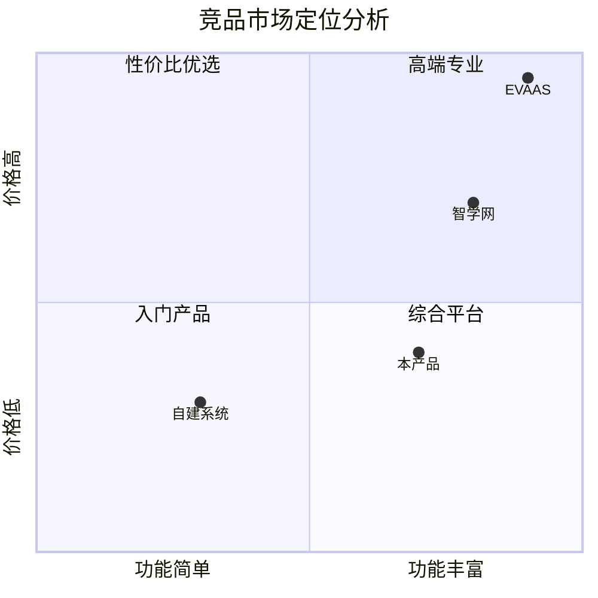
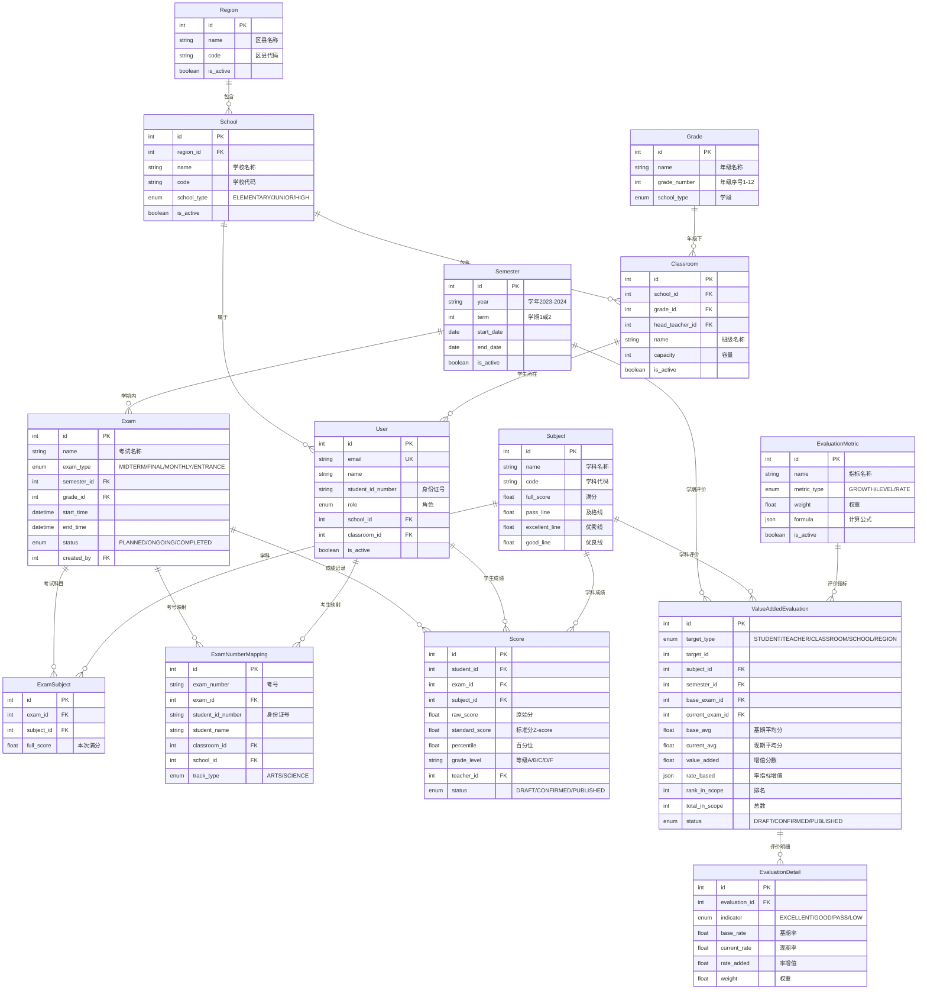
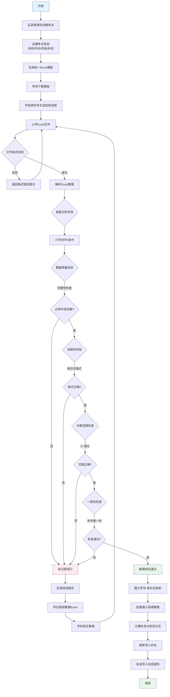
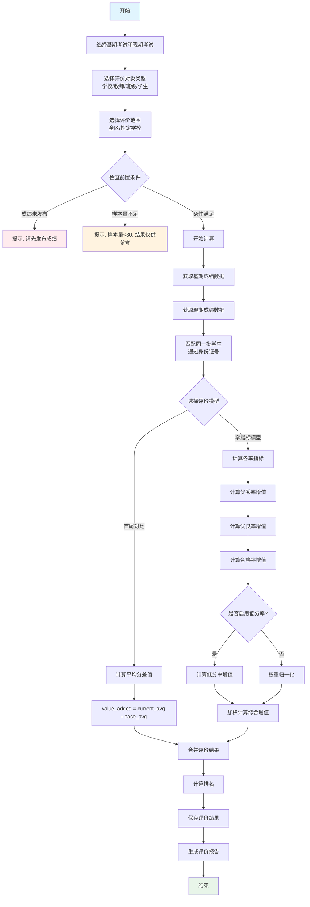
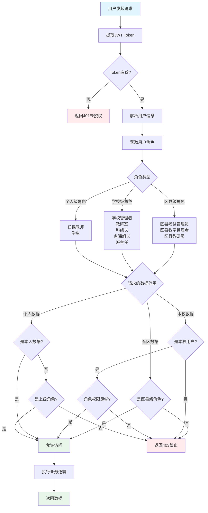
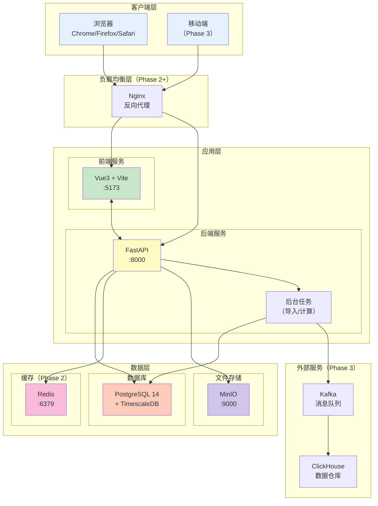
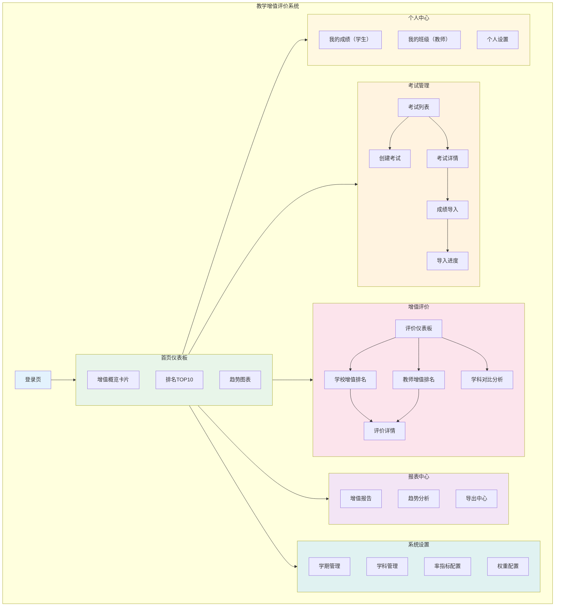
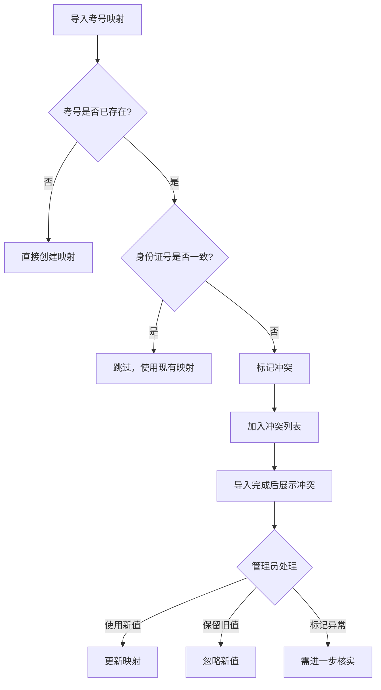
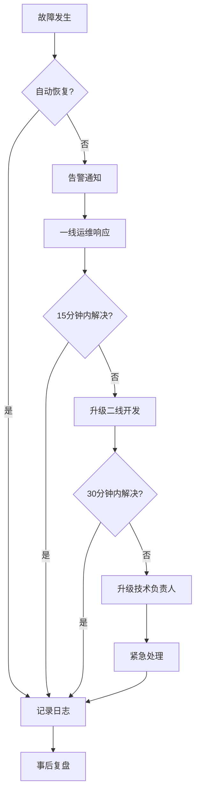

# 教学增值评价系统 PRD v3.1

## 文档修订记录

| 版本 | 日期 | 修订内容 | 修订人 |
|------|------|---------|--------|
| v1.0 | 2026-01-11 | 初版 | Claude |
| v2.0-v2.7 | 2026-01-11~12 | 多次迭代优化：率指标、数据导入、考号映射、11角色设计 | Claude |
| v3.0 | 2026-01-13 | ⭐ 重构为标准PRD结构：符合专业PRD规则，补充Mission、MVP Scope、Success Criteria等核心章节 | Claude |
| **v3.1** | **2026-01-13** | **⭐ 补充完善：ER图、流程图、架构图、数据模型、业务规则、竞品分析、测试策略、运维监控、成本预算、假设条件、优先级矩阵** | **Claude** |

---

## 1. Executive Summary

### 1.1 产品概述

教学增值评价系统（Value-Added Evaluation System）是为教育管理者设计的数据驱动评价平台，用于衡量教师教学质量和学校办学水平的**相对进步幅度**，而非绝对分数。

**核心价值主张**：
- **公平性**：通过统计模型消除学生起点差异，公正评价教师/学校的真实教学贡献
- **激励性**：关注进步过程而非结果，激发教师持续改进教学的积极性
- **科学性**：基于多种统计模型（首尾对比、累计增值、线性回归、率指标）进行多维度分析
- **可操作性**：支持K12全学段、11种角色、从区县到学生的四级权限体系

**解决的问题**：
- 传统评价只看绝对分数，无法客观评价起点较低的教师/学校的进步
- 区县教育局缺乏科学工具衡量学校真实教学效果
- 学校管理者难以追踪教学质量变化的长期趋势
- 教师无法了解自己的教学增值情况及在同类群体中的位置

### 1.2 MVP 目标

**MVP（最小可行产品）目标**：
在2个月内实现区县级统考的增值评价功能，支持：
- 2期考试的"首尾对比"评价模型
- 区县级、学校级、教师级三级评价
- 小学、初中、高中的成绩导入和分析
- 4种率指标（优秀率、优良率、合格率、低分率）的增值评价

**非 MVP 范围**：
- 多期评价（累计增值、线性回归）
- 学生个人增值分析
- 高级统计分析（置信区间、效应量、显著性检验）
- 学科交叉影响分析

---

## 2. Mission

### 2.1 产品使命

**使命声明**：
> 通过科学的数据分析方法，为教育管理者和教师提供公正、可信的教学质量评价工具，推动教育评价从"唯分数论"向"增值论"转变，促进教育公平和质量提升。

### 2.2 核心原则

1. **科学性优先**：所有评价模型基于统计学原理，避免主观偏见
2. **公平透明**：评价规则公开透明，算法可解释，结果可追溯
3. **隐私保护**：严格遵守数据安全法规，保护学生隐私
4. **实用导向**：功能设计紧贴实际工作流程，降低使用门槛
5. **持续改进**：基于用户反馈和数据分析，不断优化模型和功能

### 2.3 成功愿景

**短期目标（6个月）**：
- 覆盖5个区县，100所学校，10万学生
- 支持4种评价模型，满足不同评价需求
- 建立3个示范应用案例

**中期目标（1年）**：
- 扩展到20个区县，500所学校
- 实现多期评价和高级统计分析
- 形成行业标准评价体系

**长期愿景（3年）**：
- 成为K12教育评价的标杆产品
- 推动教育评价政策改革
- 建立全国性的教育质量数据库

---

## 3. Target Users

### 3.1 主要用户画像

#### 3.1.1 区县考试管理员
- **角色**：区县教育局考试部门工作人员
- **技术能力**：中等（熟练使用Excel、教务系统）
- **核心需求**：
  - 快速创建全区统考
  - 高效导入和管理海量考生数据
  - 自动分配考场和座位
  - 准确匹配考生号和成绩
- **痛点**：
  - Excel处理耗时长，易出错
  - 考生信息变更（转学、身份证号错误）难以处理
  - 跨学年学生追踪困难

#### 3.1.2 区县教学管理者
- **角色**：区县教育局分管教学的领导
- **技术能力**：基础（查看报表、数据图表）
- **核心需求**：
  - 快速了解全区教学质量整体情况
  - 识别进步显著和退步明显的学校
  - 为政策制定提供数据支撑
- **痛点**：
  - 传统排名无法体现学校进步
  - 难以区分学校努力程度和生源差异

#### 3.1.3 区县教研员
- **角色**：区县教育局学科教研员（如数学教研员）
- **技术能力**：中等（使用统计软件、数据分析）
- **核心需求**：
  - 追踪本学科在全区的发展趋势
  - 识别优秀教师和需要帮扶的教师
  - 评估教研活动的实际效果
- **痛点**：
  - 难以量化教师教学贡献
  - 缺乏学科-specific的评价工具

#### 3.1.4 学校管理者
- **角色**：校长、分管教学副校长
- **技术能力**：中等
- **核心需求**：
  - 了解本校在区县的排名和增值情况
  - 识别本校的优势学科和薄弱学科
  - 评价教师教学表现
- **痛点**：
  - 生源差异影响排名公平性
  - 难以客观评价教师贡献

#### 3.1.5 任课教师
- **角色**：学科教师（如高一数学教师）
- **技术能力**：基础到中等
- **核心需求**：
  - 查看自己所教班级/学科的增值情况
  - 了解自己在同类教师中的位置
  - 获得教学改进建议
- **痛点**：
  - 只看绝对分数无法体现教学效果
  - 班级生源差异影响评价公平性

#### 3.1.6 学生
- **角色**：中小学生
- **技术能力**：基础（使用手机App查询成绩）
- **核心需求**：
  - 查看自己的考试成绩和排名
  - 了解自己的进步情况
  - 保护个人隐私
- **痛点**：
  - 只看分数无法了解进步情况
  - 排名波动大，缺乏信心

### 3.2 用户需求矩阵

| 用户群体 | 核心需求 | 技术能力 | 使用频率 | 数据敏感度 |
|---------|---------|---------|---------|-----------|
| 区县考试管理员 | 高效数据导入、考场分配 | 中等 | 高（考试季） | 高 |
| 区县教学管理者 | 全区趋势分析、排名可视化 | 基础 | 中 | 高 |
| 区县教研员 | 学科specific分析、教师对比 | 中等 | 高 | 中 |
| 学校管理者 | 本校排名、教师评价 | 中等 | 高 | 高 |
| 学校教研室 | 全校学科分析、跨年级对比 | 中等 | 高 | 高 |
| 科组长 | 本学科跨年级分析 | 中等 | 高 | 中 |
| 备课组长 | 本学科本年级分析 | 基础 | 高 | 低 |
| 班主任 | 班级整体分析、个人教学学科 | 基础 | 高 | 中 |
| 任课教师 | 个人教学效果分析 | 基础 | 高 | 低 |
| 学生 | 个人成绩查询、进步曲线 | 基础 | 中 | 高 |

---

## 4. Competitive Analysis

### 4.1 市场现状

教育增值评价领域主要有以下几类产品：

| 类别 | 代表产品 | 市场定位 | 用户规模 |
|------|---------|---------|---------|
| 国际成熟产品 | EVAAS、TVAAS | 大型教育局/州级 | 美国多州使用 |
| 国内教育平台 | 科大讯飞智学网、好未来等 | K12综合教育 | 数千万用户 |
| 区域定制系统 | 各地教育局自建系统 | 特定区县 | 单一区县 |
| 开源/学术工具 | R/Python统计包 | 研究机构 | 学术用户 |

### 4.2 主要竞品分析

#### 4.2.1 EVAAS (Education Value-Added Assessment System)

| 维度 | 描述 |
|------|------|
| **开发商** | SAS Institute (美国) |
| **核心功能** | 多层线性模型(HLM)增值评价、预测分析、学生成长追踪 |
| **技术特点** | 成熟的统计模型、大规模数据处理能力 |
| **优势** | 统计模型成熟、被广泛验证、支持预测性分析 |
| **劣势** | 国外产品本地化差、价格昂贵、不支持中文教育体系 |
| **定价** | 按学生数量收费，年费制 |

#### 4.2.2 科大讯飞智学网

| 维度 | 描述 |
|------|------|
| **开发商** | 科大讯飞 (中国) |
| **核心功能** | AI阅卷、成绩分析、学情诊断、个性化学习 |
| **技术特点** | AI/OCR技术、大数据分析 |
| **优势** | 本地化好、功能全面、AI技术领先 |
| **劣势** | 增值评价功能较弱、重点在考试阅卷、价格较高 |
| **定价** | 按学校/区县年费制 |

#### 4.2.3 区县自建系统

| 维度 | 描述 |
|------|------|
| **开发商** | 各地教育信息化公司 |
| **核心功能** | 成绩录入、简单统计、排名报表 |
| **技术特点** | 传统B/S架构、Excel导入导出 |
| **优势** | 成本低、可定制、符合本地需求 |
| **劣势** | 功能简单、缺乏增值模型、维护成本高 |
| **定价** | 一次性开发费 + 年维护费 |

### 4.3 竞品功能对比

| 功能 | EVAAS | 智学网 | 自建系统 | **本产品** |
|------|-------|-------|---------|-----------|
| 成绩导入 | ✅ | ✅ | ✅ | ✅ |
| 简单增值(首尾对比) | ✅ | ❌ | ❌ | ✅ |
| 率指标评价 | ❌ | ✅ | ⚠️ | ✅ |
| 多期增值 | ✅ | ❌ | ❌ | ✅ (Phase 2) |
| HLM模型 | ✅ | ❌ | ❌ | ✅ (Phase 3) |
| 预测分析 | ✅ | ✅ | ❌ | ✅ (Phase 3) |
| 中国教育体系 | ❌ | ✅ | ✅ | ✅ |
| 文理分科支持 | ❌ | ✅ | ⚠️ | ✅ |
| 11角色权限 | ❌ | ⚠️ | ❌ | ✅ |
| 开放API | ❌ | ⚠️ | ❌ | ✅ |
| 私有化部署 | ❌ | ⚠️ | ✅ | ✅ |

### 4.4 差异化定位

#### 4.4.1 核心差异化优势

```
┌─────────────────────────────────────────────────────────────┐
│                    本产品差异化定位                          │
├─────────────────────────────────────────────────────────────┤
│  1. 专注增值评价                                             │
│     - 不做阅卷、不做题库，聚焦增值评价这一核心场景           │
│     - 支持多种评价模型（首尾、累计、回归、率指标）           │
│                                                              │
│  2. 中国教育体系适配                                         │
│     - 支持K12全学段（小学/初中/高中）                        │
│     - 支持文理分科、选科走班                                 │
│     - 支持区县统考、校内考试等多种场景                       │
│                                                              │
│  3. 精细化权限控制                                           │
│     - 11种角色（区县3 + 学校5 + 教师2 + 学生1）              │
│     - 四级数据访问控制（区县/学校/班级/个人）                │
│                                                              │
│  4. 开放与可扩展                                             │
│     - RESTful API开放                                        │
│     - 支持私有化部署                                         │
│     - 可与现有教务系统集成                                   │
│                                                              │
│  5. 成本优势                                                 │
│     - 开源技术栈，无授权费用                                 │
│     - 支持单机部署，硬件成本低                               │
│     - 可自主运维，无年费绑定                                 │
└─────────────────────────────────────────────────────────────┘
```

#### 4.4.2 目标市场定位



**定位说明**：
- **目标象限**：性价比优选（功能丰富 + 价格适中）
- **目标客户**：中小型区县教育局、注重教学质量评价的学校
- **竞争策略**：以增值评价专业性和性价比取胜

### 4.5 竞争策略

| 策略 | 具体措施 |
|------|---------|
| **专业化** | 聚焦增值评价，做深做透，成为细分领域专家 |
| **本地化** | 针对中国教育体系深度适配，支持文理分科、选科走班 |
| **开放性** | 提供开放API，支持与现有系统集成 |
| **低门槛** | 单机部署、免费基础版，降低试用门槛 |
| **服务化** | 提供培训、咨询服务，帮助客户用好产品 |

---

## 5. MVP Scope

### 4.1 功能范围

#### ✅ MVP 范围内（Core Functionality）

**数据管理**：
- ✅ 区县级考试创建（名称、时间、年级、科目）
- ✅ 学校基础信息导入（统一模板，自动识别学段）
- ✅ 考生信息导入与校验（身份证号、学号、班级）
- ✅ 考号-身份证号映射机制（支持跨学年追踪）
- ✅ 成绩导入（窄字段设计，智能学科识别）
- ✅ 数据质量校验（完整性、准确性、一致性）

**评价模型**：
- ✅ 首尾对比模型（2次考试对比）
- ✅ 基于率指标的增值评价（优秀率、优良率、合格率、低分率）
- ✅ 权重配置与归一化（可禁用低分率，自动重分配权重）

**权限与角色**：
- ✅ 11种角色权限控制
- ✅ 区县级、学校级、教师级三级数据访问

**API 与集成**：
- ✅ RESTful API 设计
- ✅ 与现有用户、学校、班级系统集成

#### ❌ MVP 范围外（Deferred Features）

**高级评价模型**：
- ❌ 累计增值模型（3+次考试）
- ❌ 线性回归模型
- ❌ 多层线性模型（HLM）
- ❌ 基线调整模型

**统计分析**：
- ❌ 统计显著性检验（t-test）
- ❌ 效应量计算（Cohen's d）
- ❌ 置信区间
- ❌ 小样本量处理（<30）
- ❌ 协变量调整（家庭背景、起点成绩）

**功能扩展**：
- ❌ 学生个人增值分析
- ❌ 学科交叉影响分析
- ❌ 预测性分析
- ❌ 数据可视化高级图表（热力图、雷达图）

#### ❌ MVP 范围外（Technical）

**性能优化**：
- ❌ Redis缓存策略
- ❌ 数据分区（按学期/学年）
- ❌ 归档策略
- ❌ ClickHouse日志分析

**安全增强**：
- ❌ 数据加密（AES-256）
- ❌ 字段级权限控制
- ❌ 完整审计日志
- ❌ 数据脱敏

### 4.2 技术范围

#### ✅ MVP 范围内

**后端技术栈**：
- ✅ Python 3.10+
- ✅ FastAPI 框架
- ✅ SQLAlchemy 2.0 (async ORM)
- ✅ PostgreSQL 14+ (含 TimescaleDB 扩展)
- ✅ Alembic 数据库迁移

**前端技术栈**：
- ✅ Vue 3 + TypeScript
- ✅ Pinia 状态管理
- ✅ TailwindCSS 样式
- ✅ Element Plus UI 组件库

**部署与运维**：
- ✅ Docker 容器化
- ✅ Nginx 反向代理
- ✅ 基础监控（日志、错误追踪）

#### ❌ MVP 范围外

**高级技术**：
- ❌ Kafka 消息队列
- ❌ ClickHouse 数据仓库
- ❌ Redis 缓存
- ❌ FAISS 向量搜索
- ❌ LangChain AI 集成

### 4.3 数据范围

#### ✅ MVP 范围内

**数据规模**：
- ✅ 支持最多10个区县
- ✅ 支持最多100所学校
- ✅ 支持最多10万学生
- ✅ 支持最多50万条成绩记录

**数据类型**：
- ✅ K12全学段（小学、初中、高中）
- ✅ 文理分科（高一期末后）
- ✅ 主要学科（语数英、物化生、政史地、科学）

#### ❌ MVP 范围外

- ❌ 超大规模数据（100万+学生）
- ❌ 实时数据流处理
- ❌ 外部数据源集成（其他教育局系统）

### 4.4 部署范围

#### ✅ MVP 范围内

**部署环境**：
- ✅ 单机部署（All-in-One）
- ✅ 本地局域网访问
- ✅ HTTP（非HTTPS）
- ✅ 基础备份（数据库定期dump）

#### ❌ MVP 范围外

- ❌ 分布式集群部署
- ❌ HTTPS/SSL证书
- ❌ 高可用部署（主从复制、负载均衡）
- ❌ 自动化备份与恢复
- ❌ 灾备与容灾

---

## 5. User Stories

### 5.1 核心用户故事

#### 故事1：区县考试管理员组织统考

**As a** 区县考试管理员
**I want to** 创建一次全区统考并导入各学校成绩
**So that** 能够进行全区教学质量分析

**验收标准**：
- ✅ 可以在5分钟内完成考试创建（设置名称、时间、年级、科目）
- ✅ 系统提供统一Excel模板，学校可下载填写
- ✅ 系统自动识别学段（小学/初中/高中）和数据字段
- ✅ 系统自动验证数据完整性（身份证号格式、班级格式）
- ✅ 系统通过考号自动匹配考生信息和成绩
- ✅ 导入10所学校数据（约1万学生）在10分钟内完成
- ✅ 错误数据清晰标记，可批量导出修正

**示例场景**：
```
1. 张老师（区县考试管理员）创建"2024年春季学期期末考试"
2. 选择年级：小学三年级、初中一年级、高中一年级
3. 选择科目：语文、数学、英语（根据年级自动调整）
4. 点击"发布考试"，生成统一Excel模板
5. 10所学校下载模板，填写考生信息和成绩
6. 张老师上传10个Excel文件
7. 系统自动校验数据，发现5条错误（身份证号格式错误）
8. 张老师导出错误数据，通知学校修正后重新上传
9. 所有数据验证通过，点击"发布成绩"
10. 系统自动触发增值评价计算
```

#### 故事2：区县教学管理者查看全区趋势

**As a** 区县教学管理者
**I want to** 查看本次考试与历史考试的全区增值排名
**So that** 能够识别进步显著的学校并制定奖励政策

**验收标准**：
- ✅ 首页展示全区增值TOP10学校和BOTTOM10学校
- ✅ 可以按学段（小学/初中/高中）筛选
- ✅ 可以按学科（语文/数学/英语）筛选
- ✅ 增值分数用颜色标识（绿色=正增值，红色=负增值）
- ✅ 点击学校可查看详细增值数据（各学科、各率指标）
- ✅ 可以导出增值排名Excel报表

**示例场景**：
```
1. 李局长（区县教学管理者）登录系统
2. 首页显示"2024年春季期末考试增值分析报告"
3. 看到XX学校增值+8.5分（全区第1），YY学校增值-5.2分（全区倒数）
4. 点击"查看详情"，看到XX学校数学学科增值+12.3分（主要贡献）
5. 点击"导出报告"，生成Excel报表
6. 基于报告，李局长决定表彰XX学校，并组织教研员帮扶YY学校
```

#### 故事3：区县教研员分析学科教学质量

**As a** 区县数学教研员
**I want to** 查看全区数学教师的教学增值排名
**So that** 能够识别优秀教师并推广其教学方法

**验收标准**：
- ✅ 可以筛选"数学"学科
- ✅ 可以查看所有数学教师的增值排名
- ✅ 显示教师所在学校、年级、班级
- ✅ 显示增值分数、置信度标识
- ✅ 可以按学校/年级分组查看
- ✅ 可以查看教师的历史增值趋势（如果有2+次考试）

**示例场景**：
```
1. 王老师（区县数学教研员）登录系统
2. 选择"数学"学科，查看"教师增值排名"
3. 发现XX学校的张老师（高一数学）增值+15.3分（全区第1）
4. 点击"查看详情"，看到张老师所教3个班级的详细数据
5. 王老师联系张老师，预约听课，了解其教学方法
6. 组织全区数学教师观摩张老师的公开课
```

#### 故事4：学校管理者监控本校质量

**As a** 学校校长
**I want to** 查看本校在区县的排名和各学科增值情况
**So that** 能够识别本校的优势学科和薄弱学科

**验收标准**：
- ✅ 首页显示本校增值排名和分数
- ✅ 显示各学科增值对比（柱状图）
- ✅ 显示本校教师在区县的排名分布
- ✅ 可以按年级筛选
- ✅ 可以查看率指标变化（优秀率、优良率等）

**示例场景**：
```
1. 陈校长（XX中学校长）登录系统
2. 看到本校在区县排名第8（共30所学校），增值+3.2分
3. 查看学科对比，发现英语学科增值+8.5分（优秀），物理学科增值-2.1分（薄弱）
4. 查看教师排名，发现物理组有2位教师增值为负
5. 陈校长召开教学质量分析会，重点帮扶物理组
```

#### 故事5：任课教师查看个人教学效果

**As a** 高一数学教师
**I want to** 查看自己所教班级的增值情况
**So that** 能够了解自己的教学效果并改进

**验收标准**：
- ✅ 可以查看自己所教班级的增值分数
- ✅ 可以查看自己在同类教师中的排名
- ✅ 可以查看各率指标的变化（优秀率提升等）
- ✅ 可以查看学生个人成绩和进步情况
- ✅ 数据脱敏（不显示其他教师的具体数据）

**示例场景**：
```
1. 刘老师（高一数学教师）登录系统
2. 看到自己任教的3个班级平均增值+5.8分
3. 看到自己在全区20位高一数学教师中排名第6
4. 查看率指标，发现优秀率从25%提升到32%（+7%）
5. 查看"待关注学生"列表，发现5名学生退步明显
6. 刘老师调整教学策略，重点关注这些学生
```

#### 故事6：学生查询个人成绩与进步

**As a** 高一学生
**I want to** 查看我的考试成绩和排名变化
**So that** 能够了解自己的学习进步情况

**验收标准**：
- ✅ 可以查看本次考试各科成绩
- ✅ 可以查看在班级、学校、区县的排名
- ✅ 可以查看与上次考试的进步情况（分差、排名变化）
- ✅ 可以查看历史成绩趋势图
- ✅ 只能看到自己的数据，不能查看他人

**示例场景**：
```
1. 小明（高一学生）登录系统
2. 看到"2024年春季期末考试"成绩：数学85分（上次78分，+7分）
3. 看到班级排名从25/45提升到18/45（+7名）
4. 看到成绩趋势图，数学成绩连续3次考试稳步上升
5. 小明受到鼓舞，继续努力学习
```

### 5.2 技术用户故事

#### 故事7：系统管理员配置数据模型

**As a** 系统管理员
**I want to** 配置学科、年级、率指标权重
**So that** 系统能够自动计算增值评价

**验收标准**：
- ✅ 可以添加/编辑/删除学科（如"信息科技"）
- ✅ 可以设置学科的满分值、及格线
- ✅ 可以配置率指标（优秀率、优良率、合格率、低分率）的阈值
- ✅ 可以配置各率指标的权重
- ✅ 可以禁用低分率，系统自动重分配权重
- ✅ 配置变更后，历史数据重新计算

**示例场景**：
```
1. 系统管理员登录后台
2. 进入"系统配置 > 学科管理"
3. 添加"信息科技"学科，满分100分
4. 进入"率指标配置"
5. 设置：优秀≥85分（权重0.3）、优良≥70分（权重0.3）、合格≥60分（权重0.3）、低分<60分（权重0.1）
6. 取消勾选"使用低分率"，系统自动重分配权重为各0.333
7. 保存配置，系统触发重新计算
```

---

## 6. Core Architecture & Patterns

### 6.1 系统架构概览

系统采用**分层架构**（Layered Architecture），分为4层：

```
┌─────────────────────────────────────────────────────┐
│                   Presentation Layer                 │
│  (Vue3 + TypeScript + TailwindCSS + Element Plus)   │
└─────────────────────────────────────────────────────┘
                          │
                         ▼
┌─────────────────────────────────────────────────────┐
│                    API Gateway Layer                 │
│              (FastAPI + Pydantic + CORS)             │
└─────────────────────────────────────────────────────┘
                          │
                         ▼
┌─────────────────────────────────────────────────────┐
│                   Business Logic Layer               │
│              (Services: Evaluation, Import, Auth)    │
└─────────────────────────────────────────────────────┘
                          │
                         ▼
┌─────────────────────────────────────────────────────┐
│                   Data Access Layer                  │
│            (SQLAlchemy 2.0 Async ORM)                │
└─────────────────────────────────────────────────────┘
                          │
                         ▼
┌─────────────────────────────────────────────────────┐
│                  Database Layer                      │
│         (PostgreSQL 14 + TimescaleDB)                │
└─────────────────────────────────────────────────────┘
```

### 6.2 核心设计模式

#### 6.2.1 Repository 模式

**目的**：解耦业务逻辑和数据访问，提高可测试性

```python
# repository/base.py
from typing import Generic, TypeVar, Type, Optional, List
from sqlalchemy.ext.asyncio import AsyncSession
from sqlalchemy import select

ModelType = TypeVar("ModelType")

class BaseRepository(Generic[ModelType]):
    def __init__(self, model: Type[ModelType], db: AsyncSession):
        self.model = model
        self.db = db

    async def get(self, id: int) -> Optional[ModelType]:
        result = await self.db.execute(select(self.model).where(self.model.id == id))
        return result.scalar_one_or_none()

    async def get_multi(self, skip: int = 0, limit: int = 100) -> List[ModelType]:
        result = await self.db.execute(
            select(self.model).offset(skip).limit(limit)
        )
        return result.scalars().all()

    async def create(self, obj_in: dict) -> ModelType:
        db_obj = self.model(**obj_in)
        self.db.add(db_obj)
        await self.db.commit()
        await self.db.refresh(db_obj)
        return db_obj
```

**使用示例**：
```python
# repository/exam.py
from app.models.exam import Exam
from app.repository.base import BaseRepository

class ExamRepository(BaseRepository[Exam]):
    async def get_by_semester(self, semester_id: int) -> List[Exam]:
        result = await self.db.execute(
            select(Exam).where(Exam.semester_id == semester_id)
        )
        return result.scalars().all()
```

#### 6.2.2 Service 模式

**目的**：封装复杂业务逻辑，避免控制器臃肿

```python
# services/evaluation_service.py
from typing import List, Dict
from app.repositories.exam_repository import ExamRepository
from app.repositories.score_repository import ScoreRepository

class EvaluationService:
    def __init__(
        self,
        exam_repo: ExamRepository,
        score_repo: ScoreRepository
    ):
        self.exam_repo = exam_repo
        self.score_repo = score_repo

    async def calculate_value_added(
        self,
        base_exam_id: int,
        current_exam_id: int,
        target_type: str,  # "school" | "teacher" | "student"
        target_id: int
    ) -> Dict:
        """
        计算增值分数

        Returns:
            {
                "base_avg": 75.5,
                "current_avg": 80.5,
                "value_added": 5.0,
                "rate_based": {...}
            }
        """
        # 1. 获取基期和现期成绩
        base_scores = await self.score_repo.get_by_exam_and_target(
            base_exam_id, target_type, target_id
        )
        current_scores = await self.score_repo.get_by_exam_and_target(
            current_exam_id, target_type, target_id
        )

        # 2. 计算平均分
        base_avg = sum(s.raw_score for s in base_scores) / len(base_scores)
        current_avg = sum(s.raw_score for s in current_scores) / len(current_scores)

        # 3. 计算增值
        value_added = current_avg - base_avg

        # 4. 计算率指标增值
        rate_based = await self._calculate_rate_based_value_added(
            base_scores, current_scores
        )

        return {
            "base_avg": base_avg,
            "current_avg": current_avg,
            "value_added": value_added,
            "rate_based": rate_based
        }
```

#### 6.2.3 Strategy 模式（评价模型）

**目的**：支持多种评价算法，易于扩展

```python
# services/evaluation_strategies.py
from abc import ABC, abstractmethod
from typing import List, Dict

class EvaluationStrategy(ABC):
    """评价策略抽象基类"""

    @abstractmethod
    async def calculate(self, scores: List) -> Dict:
        pass

class FirstLastComparisonStrategy(EvaluationStrategy):
    """首尾对比策略"""

    async def calculate(self, scores: List) -> Dict:
        if len(scores) < 2:
            raise ValueError("至少需要2次考试")

        base_avg = sum(s.raw_score for s in scores[0]) / len(scores[0])
        current_avg = sum(s.raw_score for s in scores[-1]) / len(scores[-1])

        return {
            "model": "first_last_comparison",
            "base_avg": base_avg,
            "current_avg": current_avg,
            "value_added": current_avg - base_avg
        }

class LinearRegressionStrategy(EvaluationStrategy):
    """线性回归策略（MVP后实现）"""

    async def calculate(self, scores: List) -> Dict:
        # 使用numpy/scipy计算线性回归
        pass

class EvaluationContext:
    """评价上下文"""

    def __init__(self, strategy: EvaluationStrategy):
        self._strategy = strategy

    async def evaluate(self, scores: List) -> Dict:
        return await self._strategy.calculate(scores)

# 使用示例
strategy = FirstLastComparisonStrategy()
context = EvaluationContext(strategy)
result = await context.evaluate(scores)
```

#### 6.2.4 Factory 模式（数据导入器）

**目的**：根据不同数据格式自动选择合适的导入器

```python
# services/import_factory.py
from typing import Optional
from app.importers.base_importer import BaseImporter
from app.importers.excel_elementary_importer import ExcelElementaryImporter
from app.importers.excel_junior_importer import ExcelJuniorImporter
from app.importers.excel_high_importer import ExcelHighImporter

class ImporterFactory:
    """导入器工厂"""

    @staticmethod
    def create(file_path: str) -> Optional[BaseImporter]:
        """根据文件特征创建合适的导入器"""

        # 读取Excel，识别学段
        df = pd.read_excel(file_path, nrows=1)
        columns = df.columns.tolist()

        # 小学特征：有"科学"字段，无"物理化学"
        if "科学" in columns and "物理" not in columns:
            return ExcelElementaryImporter(file_path)

        # 初中特征：有"物理化学"，无"历史地理"
        elif "物理" in columns and "化学" in columns and "历史" not in columns:
            return ExcelJuniorImporter(file_path)

        # 高中特征：有"历史地理"
        elif "历史" in columns and "地理" in columns:
            return ExcelHighImporter(file_path)

        else:
            raise ValueError("无法识别文件格式")

# 使用示例
importer = ImporterFactory.create("/path/to/file.xlsx")
result = await importer.import_data()
```

### 6.3 数据库设计原则

1. **窄字段设计**（Narrow Field Design）
   - 优点：便于单科增值计算、数据灵活、易于扩展
   - 示例：一条记录 = 一个学生 + 一个学科 + 一次考试

2. **时间戳规范**
   - `created_at`: 记录创建时间（默认当前UTC时间）
   - `updated_at`: 记录更新时间（自动更新）

3. **软删除**
   - 使用 `is_active` 字段标记删除状态，不物理删除数据
   - 保留历史数据用于审计和追溯

4. **外键约束**
   - 使用外键确保数据完整性
   - 级联删除：`cascade="all, delete-orphan"`

5. **索引优化**
   - 主键自动创建索引
   - 外键字段创建索引
   - 查询频繁的字段创建索引（如 `student_id_number`, `exam_id`）

### 6.4 目录结构

```
backend/
├── app/
│   ├── api/                    # API路由
│   │   ├── v1/
│   │   │   ├── endpoints/
│   │   │   │   ├── exams.py    # 考试相关API
│   │   │   │   ├── scores.py   # 成绩相关API
│   │   │   │   ├── evaluation.py # 增值评价API
│   │   │   │   └── auth.py     # 认证API
│   │   │   └── api.py          # 路由汇总
│   ├── core/                   # 核心配置
│   │   ├── config.py           # 配置管理
│   │   ├── security.py         # 安全相关
│   │   └── database.py         # 数据库连接
│   ├── models/                 # SQLAlchemy模型
│   │   ├── exam.py             # 考试模型
│   │   ├── score.py            # 成绩模型
│   │   ├── evaluation.py       # 增值评价模型
│   │   └── ...
│   ├── schemas/                # Pydantic模式
│   │   ├── exam.py             # 考试DTO
│   │   ├── score.py            # 成绩DTO
│   │   └── evaluation.py       # 增值评价DTO
│   ├── services/               # 业务逻辑
│   │   ├── evaluation_service.py
│   │   ├── import_service.py
│   │   └── auth_service.py
│   ├── repositories/           # 数据访问层
│   │   ├── base.py             # 基础Repository
│   │   ├── exam_repository.py
│   │   └── score_repository.py
│   ├── importers/              # 数据导入器
│   │   ├── base_importer.py
│   │   ├── excel_elementary_importer.py
│   │   ├── excel_junior_importer.py
│   │   └── excel_high_importer.py
│   └── utils/                  # 工具函数
│       ├── validators.py       # 数据验证
│       └── calculators.py      # 计算工具
├── alembic/                    # 数据库迁移
│   ├── versions/
│   └── env.py
├── tests/                      # 测试
│   ├── api/
│   ├── services/
│   └── repositories/
└── requirements.txt

frontend/
├── src/
│   ├── components/             # Vue组件
│   │   ├── common/             # 通用组件
│   │   ├── evaluation/         # 增值评价组件
│   │   └── import/             # 数据导入组件
│   ├── pages/                  # 页面
│   │   ├── Dashboard.vue       # 仪表板
│   │   ├── Evaluation.vue      # 增值分析页
│   │   └── Import.vue          # 数据导入页
│   ├── services/               # API服务
│   │   ├── api.ts              # API客户端
│   │   ├── evaluation.ts       # 增值评价API
│   │   └── import.ts           # 导入API
│   ├── store/                  # Pinia状态管理
│   │   ├── user.ts
│   │   ├── evaluation.ts
│   │   └── import.ts
│   ├── types/                  # TypeScript类型定义
│   │   ├── evaluation.ts
│   │   └── import.ts
│   └── utils/                  # 工具函数
│       ├── formatters.ts
│       └── validators.ts
└── package.json
```

### 6.5 可视化设计资料

#### 6.5.1 数据库ER图



#### 6.5.2 核心业务流程图

**成绩导入流程**：



**增值评价计算流程**：



**权限校验流程**：



#### 6.5.3 系统部署架构图



**MVP部署架构（单机）**：

```
┌─────────────────────────────────────────────────────────────┐
│                     单机部署 (All-in-One)                    │
├─────────────────────────────────────────────────────────────┤
│  ┌─────────────┐  ┌─────────────┐  ┌─────────────────────┐  │
│  │   Nginx     │  │   前端      │  │      后端           │  │
│  │   :80       │──│   :5173     │  │      :8000          │  │
│  │   反向代理   │  │   Vue3+Vite │  │      FastAPI        │  │
│  └─────────────┘  └─────────────┘  └──────────┬──────────┘  │
│                                                │             │
│  ┌─────────────────────────────────────────────┴───────────┐ │
│  │                    PostgreSQL :5432                      │ │
│  │                    + TimescaleDB                         │ │
│  └─────────────────────────────────────────────────────────┘ │
│                                                               │
│  ┌─────────────────────────────────────────────────────────┐ │
│  │                    MinIO :9000                           │ │
│  │                    文件存储                               │ │
│  └─────────────────────────────────────────────────────────┘ │
└─────────────────────────────────────────────────────────────┘
```

#### 6.5.4 页面信息架构图



**核心页面线框图描述**：

| 页面 | 布局 | 核心组件 |
|------|------|---------|
| **登录页** | 居中卡片 | Logo、邮箱输入、密码输入、登录按钮 |
| **仪表板** | 顶部筛选+网格布局 | 学期选择器、学科筛选、4个统计卡片、排名表、趋势图 |
| **考试列表** | 左侧筛选+右侧表格 | 状态筛选、年级筛选、考试表格（分页）、操作按钮 |
| **成绩导入** | 步骤向导 | Step1选择考试→Step2上传文件→Step3预览校验→Step4确认导入 |
| **增值排名** | 顶部筛选+表格+图表 | 基期/现期选择、对象类型切换、排名表格、柱状图 |
| **评价详情** | 左侧信息+右侧图表 | 对象基本信息、增值分数卡片、学科分解表、历史趋势图 |

---

### 6.6 完整数据模型定义

#### 6.6.1 核心实体清单

| 序号 | 实体名 | 中文名 | 所属模块 | 说明 |
|------|--------|--------|---------|------|
| 1 | `Region` | 区县 | 组织架构 | 现有模型，无需修改 |
| 2 | `School` | 学校 | 组织架构 | 现有模型，无需修改 |
| 3 | `Grade` | 年级 | 组织架构 | 现有模型，无需修改 |
| 4 | `Classroom` | 班级 | 组织架构 | 现有模型，需增加 `capacity` 字段 |
| 5 | `User` | 用户 | 用户管理 | 现有模型，需增加角色标识字段 |
| 6 | `Subject` | 学科 | 课程体系 | 现有模型，需增加分数线配置 |
| 7 | **`Semester`** | 学期 | 考试管理 | **新增** |
| 8 | **`Exam`** | 考试 | 考试管理 | **新增** |
| 9 | **`ExamSubject`** | 考试科目 | 考试管理 | **新增**，考试-科目关联表 |
| 10 | **`ExamNumberMapping`** | 考号映射 | 考试管理 | **新增**，考号-身份证号映射 |
| 11 | **`Score`** | 成绩 | 成绩管理 | **新增** |
| 12 | **`EvaluationMetric`** | 评价指标 | 增值评价 | **新增** |
| 13 | **`ValueAddedEvaluation`** | 增值评价 | 增值评价 | **新增** |
| 14 | **`EvaluationDetail`** | 评价明细 | 增值评价 | **新增**，率指标明细 |
| 15 | **`ImportTask`** | 导入任务 | 数据导入 | **新增**，异步导入任务 |

#### 6.6.2 新增模型完整定义

**1. Semester（学期）**

```python
class Semester(Base):
    """学期模型"""
    __tablename__ = "semesters"
    
    id = Column(Integer, primary_key=True, index=True)
    year = Column(String(20), nullable=False, comment="学年，如 2023-2024")
    term = Column(Integer, nullable=False, comment="学期：1=上学期，2=下学期")
    start_date = Column(Date, nullable=False, comment="学期开始日期")
    end_date = Column(Date, nullable=False, comment="学期结束日期")
    is_active = Column(Boolean, default=True, comment="是否当前学期")
    created_at = Column(DateTime, default=datetime.utcnow)
    updated_at = Column(DateTime, default=datetime.utcnow, onupdate=datetime.utcnow)
    
    # 关系
    exams = relationship("Exam", back_populates="semester")
    evaluations = relationship("ValueAddedEvaluation", back_populates="semester")
    
    # 唯一约束
    __table_args__ = (
        UniqueConstraint('year', 'term', name='uq_semester_year_term'),
    )
```

**2. Exam（考试）**

```python
class ExamType(str, Enum):
    ENTRANCE = "ENTRANCE"      # 入学考试
    MONTHLY = "MONTHLY"        # 月考
    MIDTERM = "MIDTERM"        # 期中考试
    FINAL = "FINAL"            # 期末考试
    MOCK = "MOCK"              # 模拟考试

class ExamStatus(str, Enum):
    PLANNED = "PLANNED"        # 计划中
    ONGOING = "ONGOING"        # 进行中
    COMPLETED = "COMPLETED"    # 已完成
    CANCELLED = "CANCELLED"    # 已取消

class Exam(Base):
    """考试模型"""
    __tablename__ = "exams"
    
    id = Column(Integer, primary_key=True, index=True)
    name = Column(String(200), nullable=False, comment="考试名称")
    exam_type = Column(SQLAlchemyEnum(ExamType), nullable=False, comment="考试类型")
    semester_id = Column(Integer, ForeignKey("semesters.id"), nullable=False)
    grade_id = Column(Integer, ForeignKey("grades.id"), nullable=False)
    region_id = Column(Integer, ForeignKey("regions.id"), nullable=True, comment="区县ID，区县统考时必填")
    school_id = Column(Integer, ForeignKey("schools.id"), nullable=True, comment="学校ID，校内考试时必填")
    
    start_time = Column(DateTime, nullable=True, comment="考试开始时间")
    end_time = Column(DateTime, nullable=True, comment="考试结束时间")
    
    status = Column(SQLAlchemyEnum(ExamStatus), default=ExamStatus.PLANNED)
    created_by = Column(Integer, ForeignKey("users.id"), nullable=False)
    created_at = Column(DateTime, default=datetime.utcnow)
    updated_at = Column(DateTime, default=datetime.utcnow, onupdate=datetime.utcnow)
    
    # 关系
    semester = relationship("Semester", back_populates="exams")
    grade = relationship("Grade")
    region = relationship("Region")
    school = relationship("School")
    creator = relationship("User", foreign_keys=[created_by])
    exam_subjects = relationship("ExamSubject", back_populates="exam", cascade="all, delete-orphan")
    scores = relationship("Score", back_populates="exam", cascade="all, delete-orphan")
    exam_number_mappings = relationship("ExamNumberMapping", back_populates="exam", cascade="all, delete-orphan")
    
    # 索引
    __table_args__ = (
        Index('idx_exam_semester', 'semester_id'),
        Index('idx_exam_grade', 'grade_id'),
        Index('idx_exam_status', 'status'),
    )
```

**3. ExamSubject（考试科目关联）**

```python
class ExamSubject(Base):
    """考试-科目关联表"""
    __tablename__ = "exam_subjects"
    
    id = Column(Integer, primary_key=True, index=True)
    exam_id = Column(Integer, ForeignKey("exams.id", ondelete="CASCADE"), nullable=False)
    subject_id = Column(Integer, ForeignKey("subjects.id"), nullable=False)
    full_score = Column(Float, default=100.0, comment="本次考试该科目满分")
    
    # 关系
    exam = relationship("Exam", back_populates="exam_subjects")
    subject = relationship("Subject")
    
    # 唯一约束
    __table_args__ = (
        UniqueConstraint('exam_id', 'subject_id', name='uq_exam_subject'),
    )
```

**4. ExamNumberMapping（考号映射）**

```python
class TrackType(str, Enum):
    NONE = "NONE"          # 未分科
    ARTS = "ARTS"          # 文科
    SCIENCE = "SCIENCE"    # 理科

class ExamNumberMapping(Base):
    """考号-身份证号映射表"""
    __tablename__ = "exam_number_mappings"
    
    id = Column(Integer, primary_key=True, index=True)
    exam_number = Column(String(30), nullable=False, comment="考号")
    exam_id = Column(Integer, ForeignKey("exams.id", ondelete="CASCADE"), nullable=False)
    student_id_number = Column(String(18), nullable=False, comment="身份证号")
    student_name = Column(String(50), nullable=False, comment="学生姓名")
    
    classroom_id = Column(Integer, ForeignKey("classrooms.id"), nullable=True)
    classroom_name = Column(String(50), nullable=True, comment="班级名称（冗余）")
    school_id = Column(Integer, ForeignKey("schools.id"), nullable=False)
    school_name = Column(String(100), nullable=True, comment="学校名称（冗余）")
    
    track_type = Column(SQLAlchemyEnum(TrackType), default=TrackType.NONE, comment="文理分科")
    
    created_at = Column(DateTime, default=datetime.utcnow)
    
    # 关系
    exam = relationship("Exam", back_populates="exam_number_mappings")
    classroom = relationship("Classroom")
    school = relationship("School")
    
    # 索引和约束
    __table_args__ = (
        UniqueConstraint('exam_id', 'exam_number', name='uq_exam_number'),
        Index('idx_mapping_student_id', 'student_id_number'),
        Index('idx_mapping_exam', 'exam_id'),
    )
```

**5. Score（成绩）**

```python
class ScoreStatus(str, Enum):
    DRAFT = "DRAFT"           # 草稿
    CONFIRMED = "CONFIRMED"   # 已确认
    PUBLISHED = "PUBLISHED"   # 已发布

class Score(Base):
    """成绩模型 - 窄字段设计"""
    __tablename__ = "scores"
    
    id = Column(Integer, primary_key=True, index=True)
    
    # 核心字段
    student_id = Column(Integer, ForeignKey("users.id"), nullable=True, comment="学生用户ID（可选）")
    student_id_number = Column(String(18), nullable=False, comment="身份证号（必填，用于跨学年追踪）")
    exam_id = Column(Integer, ForeignKey("exams.id", ondelete="CASCADE"), nullable=False)
    subject_id = Column(Integer, ForeignKey("subjects.id"), nullable=False)
    
    # 成绩数据
    raw_score = Column(Float, nullable=False, comment="原始分数")
    standard_score = Column(Float, nullable=True, comment="标准分（Z-score）")
    percentile = Column(Float, nullable=True, comment="百分位排名 0-100")
    grade_level = Column(String(10), nullable=True, comment="等级 A/B/C/D/F")
    
    # 教师信息
    teacher_id = Column(Integer, ForeignKey("users.id"), nullable=True, comment="任课教师ID")
    
    # 状态
    status = Column(SQLAlchemyEnum(ScoreStatus), default=ScoreStatus.DRAFT)
    
    # 时间戳
    created_at = Column(DateTime, default=datetime.utcnow)
    updated_at = Column(DateTime, default=datetime.utcnow, onupdate=datetime.utcnow)
    
    # 关系
    student = relationship("User", foreign_keys=[student_id])
    exam = relationship("Exam", back_populates="scores")
    subject = relationship("Subject")
    teacher = relationship("User", foreign_keys=[teacher_id])
    
    # 索引和约束
    __table_args__ = (
        UniqueConstraint('student_id_number', 'exam_id', 'subject_id', name='uq_score_student_exam_subject'),
        Index('idx_score_exam', 'exam_id'),
        Index('idx_score_subject', 'subject_id'),
        Index('idx_score_student_id_number', 'student_id_number'),
        Index('idx_score_status', 'status'),
    )
```

**6. EvaluationMetric（评价指标）**

```python
class MetricType(str, Enum):
    GROWTH = "GROWTH"      # 成长型（进步分）
    LEVEL = "LEVEL"        # 水平型（达标率）
    RATE = "RATE"          # 率指标（优秀率等）

class EvaluationMetric(Base):
    """评价指标模型"""
    __tablename__ = "evaluation_metrics"
    
    id = Column(Integer, primary_key=True, index=True)
    name = Column(String(100), nullable=False, comment="指标名称")
    code = Column(String(50), nullable=False, unique=True, comment="指标代码")
    metric_type = Column(SQLAlchemyEnum(MetricType), nullable=False)
    
    # 权重和公式
    weight = Column(Float, default=1.0, comment="默认权重")
    formula = Column(JSON, nullable=True, comment="计算公式（JSON格式）")
    
    # 阈值配置（率指标使用）
    threshold_min = Column(Float, nullable=True, comment="最小阈值")
    threshold_max = Column(Float, nullable=True, comment="最大阈值")
    
    description = Column(Text, nullable=True)
    is_active = Column(Boolean, default=True)
    created_by = Column(Integer, ForeignKey("users.id"), nullable=True)
    created_at = Column(DateTime, default=datetime.utcnow)
    
    # 关系
    creator = relationship("User")
```

**7. ValueAddedEvaluation（增值评价）**

```python
class TargetType(str, Enum):
    STUDENT = "STUDENT"
    TEACHER = "TEACHER"
    CLASSROOM = "CLASSROOM"
    SCHOOL = "SCHOOL"
    REGION = "REGION"

class EvaluationStatus(str, Enum):
    CALCULATING = "CALCULATING"  # 计算中
    DRAFT = "DRAFT"              # 草稿
    CONFIRMED = "CONFIRMED"      # 已确认
    PUBLISHED = "PUBLISHED"      # 已发布

class ValueAddedEvaluation(Base):
    """增值评价结果模型"""
    __tablename__ = "value_added_evaluations"
    
    id = Column(Integer, primary_key=True, index=True)
    
    # 评价对象
    target_type = Column(SQLAlchemyEnum(TargetType), nullable=False, comment="评价对象类型")
    target_id = Column(Integer, nullable=False, comment="评价对象ID")
    target_name = Column(String(100), nullable=True, comment="评价对象名称（冗余）")
    
    # 考试信息
    base_exam_id = Column(Integer, ForeignKey("exams.id"), nullable=False, comment="基期考试")
    current_exam_id = Column(Integer, ForeignKey("exams.id"), nullable=False, comment="现期考试")
    subject_id = Column(Integer, ForeignKey("subjects.id"), nullable=True, comment="学科（null表示总分）")
    semester_id = Column(Integer, ForeignKey("semesters.id"), nullable=False)
    
    # 评价模型
    model_type = Column(String(50), default="first_last", comment="评价模型：first_last/cumulative/regression")
    
    # 评价结果
    base_avg = Column(Float, nullable=False, comment="基期平均分")
    current_avg = Column(Float, nullable=False, comment="现期平均分")
    value_added = Column(Float, nullable=False, comment="增值分数")
    value_added_rate = Column(Float, nullable=True, comment="增值率")
    
    # 率指标增值（JSON存储）
    rate_based = Column(JSON, nullable=True, comment="率指标增值详情")
    """
    {
        "excellent_rate": {"base": 0.20, "current": 0.25, "added": 0.05},
        "good_rate": {"base": 0.60, "current": 0.65, "added": 0.05},
        "pass_rate": {"base": 0.85, "current": 0.90, "added": 0.05},
        "low_rate": {"base": 0.15, "current": 0.10, "added": -0.05},
        "weighted_value_added": 0.05
    }
    """
    
    # 样本信息
    sample_size = Column(Integer, nullable=False, comment="样本量")
    is_small_sample = Column(Boolean, default=False, comment="是否小样本(<30)")
    
    # 排名
    rank_in_scope = Column(Integer, nullable=True, comment="在范围内的排名")
    total_in_scope = Column(Integer, nullable=True, comment="范围内总数")
    
    # 状态和元数据
    status = Column(SQLAlchemyEnum(EvaluationStatus), default=EvaluationStatus.DRAFT)
    calculated_at = Column(DateTime, default=datetime.utcnow)
    created_by = Column(Integer, ForeignKey("users.id"), nullable=True)
    
    # 关系
    base_exam = relationship("Exam", foreign_keys=[base_exam_id])
    current_exam = relationship("Exam", foreign_keys=[current_exam_id])
    subject = relationship("Subject")
    semester = relationship("Semester", back_populates="evaluations")
    creator = relationship("User")
    details = relationship("EvaluationDetail", back_populates="evaluation", cascade="all, delete-orphan")
    
    # 索引
    __table_args__ = (
        Index('idx_evaluation_target', 'target_type', 'target_id'),
        Index('idx_evaluation_exams', 'base_exam_id', 'current_exam_id'),
        Index('idx_evaluation_subject', 'subject_id'),
        Index('idx_evaluation_status', 'status'),
    )
```

**8. EvaluationDetail（评价明细）**

```python
class RateIndicator(str, Enum):
    EXCELLENT = "EXCELLENT"  # 优秀率
    GOOD = "GOOD"            # 优良率
    PASS = "PASS"            # 合格率
    LOW = "LOW"              # 低分率

class EvaluationDetail(Base):
    """评价明细 - 率指标详细记录"""
    __tablename__ = "evaluation_details"
    
    id = Column(Integer, primary_key=True, index=True)
    evaluation_id = Column(Integer, ForeignKey("value_added_evaluations.id", ondelete="CASCADE"), nullable=False)
    
    indicator = Column(SQLAlchemyEnum(RateIndicator), nullable=False, comment="率指标类型")
    base_rate = Column(Float, nullable=False, comment="基期率")
    current_rate = Column(Float, nullable=False, comment="现期率")
    rate_added = Column(Float, nullable=False, comment="率增值")
    weight = Column(Float, default=0.25, comment="权重")
    weighted_contribution = Column(Float, nullable=True, comment="加权贡献")
    
    # 关系
    evaluation = relationship("ValueAddedEvaluation", back_populates="details")
    
    __table_args__ = (
        UniqueConstraint('evaluation_id', 'indicator', name='uq_evaluation_indicator'),
    )
```

**9. ImportTask（导入任务）**

```python
class ImportStatus(str, Enum):
    PENDING = "PENDING"        # 待处理
    PROCESSING = "PROCESSING"  # 处理中
    COMPLETED = "COMPLETED"    # 已完成
    FAILED = "FAILED"          # 失败
    CANCELLED = "CANCELLED"    # 已取消

class ImportTask(Base):
    """导入任务模型"""
    __tablename__ = "import_tasks"
    
    id = Column(Integer, primary_key=True, index=True)
    task_id = Column(String(50), unique=True, nullable=False, comment="任务ID（UUID）")
    
    exam_id = Column(Integer, ForeignKey("exams.id"), nullable=False)
    file_name = Column(String(200), nullable=False, comment="文件名")
    file_path = Column(String(500), nullable=False, comment="文件路径")
    file_size = Column(Integer, nullable=True, comment="文件大小(bytes)")
    
    status = Column(SQLAlchemyEnum(ImportStatus), default=ImportStatus.PENDING)
    progress = Column(Integer, default=0, comment="进度百分比 0-100")
    
    # 统计信息
    total_rows = Column(Integer, default=0, comment="总行数")
    success_count = Column(Integer, default=0, comment="成功数")
    failed_count = Column(Integer, default=0, comment="失败数")
    skipped_count = Column(Integer, default=0, comment="跳过数")
    
    # 错误信息
    errors = Column(JSON, nullable=True, comment="错误详情列表")
    """
    [
        {"row": 23, "column": "身份证号", "value": "12345", "message": "格式错误"},
        ...
    ]
    """
    
    # 时间戳
    created_by = Column(Integer, ForeignKey("users.id"), nullable=False)
    created_at = Column(DateTime, default=datetime.utcnow)
    started_at = Column(DateTime, nullable=True)
    completed_at = Column(DateTime, nullable=True)
    
    # 关系
    exam = relationship("Exam")
    creator = relationship("User")
    
    __table_args__ = (
        Index('idx_import_task_status', 'status'),
        Index('idx_import_task_exam', 'exam_id'),
    )
```

#### 6.6.3 现有模型增强

**Subject 模型增强**：

```python
# 在现有 Subject 模型中添加以下字段
class Subject(Base):
    # ... 现有字段 ...
    
    # 新增字段
    full_score = Column(Float, default=100.0, comment="默认满分")
    pass_line = Column(Float, default=60.0, comment="及格线分数")
    pass_rate = Column(Float, default=0.6, comment="及格线百分比")
    good_line = Column(Float, default=70.0, comment="优良线分数")
    good_rate = Column(Float, default=0.7, comment="优良线百分比")
    excellent_line = Column(Float, default=85.0, comment="优秀线分数")
    excellent_rate = Column(Float, default=0.85, comment="优秀线百分比")
    low_line = Column(Float, default=40.0, comment="低分线分数")
    low_rate = Column(Float, default=0.4, comment="低分线百分比")
```

**User 模型增强**：

```python
# 在现有 User 模型中添加以下字段
class User(Base):
    # ... 现有字段 ...
    
    # 区县级角色标识
    is_district_exam_admin = Column(Boolean, default=False, comment="区县考试管理员")
    is_district_teaching_admin = Column(Boolean, default=False, comment="区县教学管理者")
    is_district_subject_leader = Column(Boolean, default=False, comment="区县教研员")
    
    # 学校级角色标识
    is_school_admin = Column(Boolean, default=False, comment="学校管理者")
    is_department_head = Column(Boolean, default=False, comment="教研室主任")
    is_subject_group_leader = Column(Boolean, default=False, comment="科组长")
    is_prep_group_leader = Column(Boolean, default=False, comment="备课组长")
    is_homeroom_teacher = Column(Boolean, default=False, comment="班主任")
    
    # 关联的学科（教研员/科组长使用）
    subject_id = Column(Integer, ForeignKey("subjects.id"), nullable=True)
```

**Classroom 模型增强**：

```python
# 在现有 Classroom 模型中添加以下字段
class Classroom(Base):
    # ... 现有字段 ...
    
    # 新增字段
    capacity = Column(Integer, default=50, comment="班级容量")
```

#### 6.6.4 实体关系总结

| 关系 | 类型 | 说明 |
|------|------|------|
| Region → School | 1:N | 一个区县有多个学校 |
| School → Classroom | 1:N | 一个学校有多个班级 |
| Grade → Classroom | 1:N | 一个年级有多个班级 |
| Classroom → User(student) | 1:N | 一个班级有多个学生 |
| Semester → Exam | 1:N | 一个学期有多次考试 |
| Exam → ExamSubject | 1:N | 一次考试包含多个科目 |
| Exam → Score | 1:N | 一次考试有多条成绩 |
| Exam → ExamNumberMapping | 1:N | 一次考试有多个考号映射 |
| User(student) → Score | 1:N | 一个学生有多条成绩 |
| Subject → Score | 1:N | 一个学科有多条成绩 |
| ValueAddedEvaluation → EvaluationDetail | 1:N | 一个评价有多个率指标明细 |

#### 6.6.5 索引设计清单

| 表名 | 索引名 | 字段 | 用途 |
|------|--------|------|------|
| `exams` | `idx_exam_semester` | `semester_id` | 按学期查询考试 |
| `exams` | `idx_exam_grade` | `grade_id` | 按年级查询考试 |
| `exams` | `idx_exam_status` | `status` | 按状态筛选考试 |
| `scores` | `idx_score_exam` | `exam_id` | 按考试查询成绩 |
| `scores` | `idx_score_subject` | `subject_id` | 按学科查询成绩 |
| `scores` | `idx_score_student_id_number` | `student_id_number` | 按身份证号追踪学生 |
| `exam_number_mappings` | `idx_mapping_student_id` | `student_id_number` | 跨学年学生追踪 |
| `value_added_evaluations` | `idx_evaluation_target` | `target_type, target_id` | 按评价对象查询 |
| `value_added_evaluations` | `idx_evaluation_exams` | `base_exam_id, current_exam_id` | 按考试对查询 |

---

## 7. Tools/Features

### 7.1 核心功能规格

#### 7.1.1 数据导入模块

**功能概述**：支持多种Excel格式的成绩数据导入，自动识别学段和学科，建立考号-身份证号映射。

**核心特性**：

1. **统一导入模板**
   - 列：地区 | 学校 | 姓名 | 考号 | 班级 | 语文 | 数学 | 英语 | 科学 | 物理 | 化学 | 生物 | 政治 | 历史 | 地理
   - 系统根据列名自动识别学段
   - 动态识别学科列（支持新增学科）

2. **智能学段识别**
   ```python
   def detect_grade_level(columns: List[str]) -> str:
       """识别学段"""
       if "科学" in columns and "物理" not in columns:
           return "ELEMENTARY"  # 小学
       elif "物理" in columns and "化学" in columns and "历史" not in columns:
           return "JUNIOR"      # 初中
       elif "历史" in columns and "地理" in columns:
           return "HIGH"        # 高中
       else:
           return "UNKNOWN"
   ```

3. **考号-身份证号映射**
   - 导入时自动建立 `exam_number` → `student_id_number` 映射
   - 支持学籍号转换（G + 18位身份证号 → 18位身份证号）
   - 支持跨学年学生追踪

4. **数据质量校验**
   - 完整性校验：必填字段不能为空
   - 准确性校验：身份证号格式、分数范围（0-满分）
   - 一致性校验：考号唯一性、学生-班级一致性
   - 生成详细错误报告

5. **进度反馈**
   - 实时显示导入进度（如"已导入 500/1000 条"）
   - 导入完成后显示统计信息（成功、失败、跳过）

**数据模型**：
```python
class ExamNumberMapping(Base):
    """考号-身份证号映射表"""
    __tablename__ = "exam_number_mappings"

    id = Column(Integer, primary_key=True)
    exam_number = Column(String(20), nullable=False, index=True, comment="考号")
    exam_id = Column(Integer, ForeignKey("exams.id"), nullable=False)
    student_id_number = Column(String(18), nullable=False, index=True, comment="身份证号")
    student_name = Column(String(50), nullable=False)
    classroom_id = Column(Integer, ForeignKey("classrooms.id"), nullable=True)
    classroom_name = Column(String(20), nullable=True)
    school_id = Column(Integer, ForeignKey("schools.id"), nullable=False)
    track_type = Column(String(20), nullable=True)  # ARTS/SCIENCE
    created_at = Column(DateTime, default=datetime.utcnow)
```

**API端点**：
```
POST /api/v1/import/template
GET /api/v1/import/template
POST /api/v1/import/scores
GET /api/v1/import/status/{task_id}
```

#### 7.1.2 增值评价计算模块

**功能概述**：支持多种增值评价模型，计算学校、教师、学生的增值分数。

**支持的评价模型**：

1. **首尾对比模型**（MVP）
   - 计算：`增值 = 现期平均分 - 基期平均分`
   - 适用场景：2次考试的对比
   - 优点：简单直观，易于理解

2. **累计增值模型**（Phase 2）
   - 计算：`增值 = Σ(每期进步)`
   - 适用场景：3+次考试
   - 优点：体现持续进步

3. **线性回归模型**（Phase 2）
   - 计算：拟合趋势线，计算斜率
   - 适用场景：3+次考试，关注增长趋势
   - 优点：消除短期波动影响

4. **率指标模型**（MVP）
   - 计算：各率指标（优秀率、优良率、合格率、低分率）的加权增值
   - 支持权重配置和归一化
   - 可禁用低分率，系统自动重分配权重

**计算逻辑**：
```python
async def calculate_evaluation(
    base_exam_id: int,
    current_exam_id: int,
    target_type: str,  # "school" | "teacher" | "student"
    target_id: int,
    model: str = "first_last",
    use_rate_based: bool = False,
    rate_weights: dict = None
) -> dict:
    """
    计算增值评价

    Args:
        base_exam_id: 基期考试ID
        current_exam_id: 现期考试ID
        target_type: 评价对象类型
        target_id: 评价对象ID
        model: 评价模型（first_last, cumulative, regression）
        use_rate_based: 是否使用率指标
        rate_weights: 率指标权重

    Returns:
        {
            "base_avg": 75.5,
            "current_avg": 80.5,
            "value_added": 5.0,
            "rate_based": {
                "excellent_rate_added": 0.05,  # 优秀率+5%
                "good_rate_added": 0.03,
                "pass_rate_added": 0.02,
                "low_rate_added": -0.03,
                "weighted_value_added": 0.04
            }
        }
    """
```

**率指标权重配置**：
```python
# 默认权重
DEFAULT_RATE_WEIGHTS = {
    "excellent": 0.3,  # 优秀率权重
    "good": 0.3,       # 优良率权重
    "pass": 0.3,       # 合格率权重
    "low": 0.1         # 低分率权重
}

# 权重归一化（禁用低分率时）
def normalize_weights(weights: dict, use_low_rate: bool) -> dict:
    if not use_low_rate:
        total = weights["excellent"] + weights["good"] + weights["pass"]
        return {
            "excellent": weights["excellent"] / total,
            "good": weights["good"] / total,
            "pass": weights["pass"] / total,
            "low": 0.0
        }
    return weights
```

**API端点**：
```
POST /api/v1/evaluation/calculate
GET /api/v1/evaluation/result/{result_id}
GET /api/v1/evaluation/ranking?exam_id={id}&target_type={type}
```

#### 7.1.3 权限控制模块

**功能概述**：基于RBAC（Role-Based Access Control）的细粒度权限控制。

**11种角色权限矩阵**：

| 功能 | 区县考试管理员 | 区县教学管理者 | 区县教研员 | 学校管理者 | 学校教研室 | 科组长 | 备课组长 | 班主任 | 任课教师 | 学生 |
|------|--------------|--------------|-----------|-----------|-----------|-------|---------|-------|---------|------|
| 创建考试 | ✅ | ❌ | ❌ | ❌ | ❌ | ❌ | ❌ | ❌ | ❌ | ❌ |
| 导入成绩 | ✅ | ❌ | ❌ | ❌ | ❌ | ❌ | ❌ | ❌ | ❌ | ❌ |
| 查看全区数据 | ✅ | ✅ | ✅(本学科) | ❌ | ❌ | ❌ | ❌ | ❌ | ❌ | ❌ |
| 查看本校数据 | ✅ | ✅ | ❌ | ✅ | ✅ | ✅ | ✅(本年级本学科) | ✅(本班) | ❌ | ❌ |
| 查看个人数据 | ✅ | ✅ | ✅ | ✅ | ✅ | ✅ | ✅ | ✅ | ✅(本人) | ✅(本人) |
| 配置率指标 | ✅ | ❌ | ❌ | ❌ | ❌ | ❌ | ❌ | ❌ | ❌ | ❌ |

**数据访问控制**：
```python
class PermissionChecker:
    def __init__(self, db: AsyncSession):
        self.db = db

    async def can_access_exam(
        self,
        user_id: int,
        user_role: str,
        exam_id: int
    ) -> bool:
        """检查用户是否有权限访问考试"""

        # 区县管理员可以访问所有考试
        if user_role in ["district_exam_admin", "district_teaching_admin"]:
            return True

        # 获取考试信息
        exam = await self.exam_repo.get(exam_id)

        # 学校角色只能访问本校的考试
        if user_role in ["school_admin", "department_head", ...]:
            user_school_id = await self._get_user_school_id(user_id)
            return exam.school_id == user_school_id

        # 教师只能访问自己任教班级的考试
        if user_role == "teacher":
            classrooms = await self._get_teacher_classrooms(user_id)
            exam_classrooms = await self._get_exam_classrooms(exam_id)
            return bool(set(classrooms) & set(exam_classrooms))

        # 学生只能访问自己的考试
        if user_role == "student":
            return await self._is_student_in_exam(user_id, exam_id)

        return False
```

**API端点**：
```
GET /api/v1/auth/permissions
POST /api/v1/auth/check-permission
```

### 7.2 数据可视化工具

#### 7.2.1 增值排名表

**功能**：展示学校/教师/学生的增值排名

**列**：
- 排名
- 学校/教师/学生姓名
- 基期平均分
- 现期平均分
- 增值分数
- 增值率（增值/基期）
- 置信度标识（Phase 2）

**交互**：
- 点击表头排序
- 筛选（学校、学科、年级）
- 导出Excel

#### 7.2.2 增值趋势图

**功能**：展示多次考试的增值变化趋势

**图表类型**：折线图

**X轴**：考试时间
**Y轴**：增值分数

**系列**：可切换不同对象（如多个学校的对比）

#### 7.2.3 学科对比图

**功能**：展示各学科增值对比

**图表类型**：柱状图

**X轴**：学科
**Y轴**：增值分数

**颜色**：
- 绿色：正增值
- 红色：负增值
- 灰色：无显著变化

---

## 8. Business Rules & Edge Cases

### 8.1 数据导入业务规则

#### 8.1.1 身份证号校验规则

| 规则编号 | 规则描述 | 处理方式 |
|---------|---------|---------|
| ID-001 | 身份证号必须为18位 | 拒绝导入，标记错误 |
| ID-002 | 身份证号格式校验（前17位数字+最后1位数字或X） | 拒绝导入，标记错误 |
| ID-003 | 身份证号校验码验证（MOD 11-2算法） | 警告提示，允许导入 |
| ID-004 | 同一考试中身份证号重复 | 拒绝后续记录，保留首条 |
| ID-005 | 学籍号格式（G+18位身份证号） | 自动提取身份证号部分 |

**校验码算法**：
```python
def validate_id_number(id_number: str) -> bool:
    """身份证号校验码验证"""
    if len(id_number) != 18:
        return False
    
    # 加权因子
    weights = [7, 9, 10, 5, 8, 4, 2, 1, 6, 3, 7, 9, 10, 5, 8, 4, 2]
    # 校验码对照表
    check_codes = ['1', '0', 'X', '9', '8', '7', '6', '5', '4', '3', '2']
    
    try:
        total = sum(int(id_number[i]) * weights[i] for i in range(17))
        return id_number[17].upper() == check_codes[total % 11]
    except ValueError:
        return False
```

#### 8.1.2 成绩数据校验规则

| 规则编号 | 规则描述 | 处理方式 |
|---------|---------|---------|
| SC-001 | 成绩必须为数字 | 拒绝导入，标记错误 |
| SC-002 | 成绩范围：0 ≤ 分数 ≤ 满分 | 拒绝导入，标记错误 |
| SC-003 | 成绩为空（未参加考试） | 标记为"缺考"，不计入统计 |
| SC-004 | 成绩为负数 | 拒绝导入，标记错误 |
| SC-005 | 成绩超过满分 | 拒绝导入，标记错误 |
| SC-006 | 成绩包含特殊字符（如"缺"、"/"） | 识别为缺考，转换为null |

**特殊值处理**：
```python
ABSENT_MARKERS = ['缺', '缺考', '/', '-', 'N/A', 'NA', '未考', '弃考']

def parse_score(value: Any, full_score: float) -> Optional[float]:
    """解析成绩值"""
    if value is None or str(value).strip() in ABSENT_MARKERS:
        return None  # 缺考
    
    try:
        score = float(value)
        if score < 0:
            raise ValueError(f"成绩不能为负数: {score}")
        if score > full_score:
            raise ValueError(f"成绩超过满分: {score} > {full_score}")
        return score
    except ValueError as e:
        raise ImportError(f"无效的成绩值: {value}")
```

#### 8.1.3 考号映射规则

| 规则编号 | 规则描述 | 处理方式 |
|---------|---------|---------|
| EN-001 | 同一考试内考号唯一 | 拒绝后续记录 |
| EN-002 | 考号-身份证号映射冲突（同考号不同身份证） | 拒绝导入，人工确认 |
| EN-003 | 身份证号变更（同学生不同身份证号） | 记录变更历史，使用新身份证号 |
| EN-004 | 学生转学（同身份证号不同学校） | 允许，按考试时间记录学校归属 |

**映射冲突处理流程**：


### 8.2 增值评价业务规则

#### 8.2.1 样本量规则

| 规则编号 | 规则描述 | 处理方式 |
|---------|---------|---------|
| SP-001 | 样本量 ≥ 30 | 正常计算，结果可信 |
| SP-002 | 10 ≤ 样本量 < 30 | 计算并标记"小样本，仅供参考" |
| SP-003 | 样本量 < 10 | 不计算增值，显示"样本不足" |
| SP-004 | 匹配学生比例 < 50% | 警告"匹配率过低，结果可能不准确" |

**样本量判断逻辑**：
```python
class SampleSizeLevel(Enum):
    SUFFICIENT = "sufficient"      # ≥30，充足
    SMALL = "small"                # 10-29，小样本
    INSUFFICIENT = "insufficient"  # <10，不足

def check_sample_size(count: int) -> SampleSizeLevel:
    if count >= 30:
        return SampleSizeLevel.SUFFICIENT
    elif count >= 10:
        return SampleSizeLevel.SMALL
    else:
        return SampleSizeLevel.INSUFFICIENT

def get_sample_warning(level: SampleSizeLevel, count: int) -> Optional[str]:
    if level == SampleSizeLevel.SMALL:
        return f"小样本量({count}人)，评价结果仅供参考"
    elif level == SampleSizeLevel.INSUFFICIENT:
        return f"样本量不足({count}人)，无法进行有效评价"
    return None
```

#### 8.2.2 学生匹配规则

| 规则编号 | 规则描述 | 处理方式 |
|---------|---------|---------|
| MT-001 | 基期和现期都有成绩的学生 | 纳入增值计算 |
| MT-002 | 仅基期有成绩（转出/休学） | 不纳入计算，单独统计 |
| MT-003 | 仅现期有成绩（转入/复学） | 不纳入计算，单独统计 |
| MT-004 | 基期缺考但现期有成绩 | 不纳入计算 |
| MT-005 | 基期有成绩但现期缺考 | 不纳入计算 |

**匹配逻辑**：
```python
async def match_students(
    base_scores: List[Score],
    current_scores: List[Score]
) -> MatchResult:
    """匹配基期和现期都有成绩的学生"""
    
    base_students = {s.student_id_number: s for s in base_scores if s.raw_score is not None}
    current_students = {s.student_id_number: s for s in current_scores if s.raw_score is not None}
    
    # 交集：两次都有成绩
    matched_ids = set(base_students.keys()) & set(current_students.keys())
    
    # 仅基期（转出）
    base_only_ids = set(base_students.keys()) - set(current_students.keys())
    
    # 仅现期（转入）
    current_only_ids = set(current_students.keys()) - set(base_students.keys())
    
    return MatchResult(
        matched=[(base_students[id], current_students[id]) for id in matched_ids],
        base_only=[base_students[id] for id in base_only_ids],
        current_only=[current_students[id] for id in current_only_ids],
        match_rate=len(matched_ids) / max(len(base_students), 1)
    )
```

#### 8.2.3 率指标计算规则

| 规则编号 | 规则描述 | 处理方式 |
|---------|---------|---------|
| RT-001 | 优秀率 = 优秀人数 / 总人数 | 分数 ≥ 优秀线 |
| RT-002 | 优良率 = 优良人数 / 总人数 | 分数 ≥ 优良线 |
| RT-003 | 合格率 = 合格人数 / 总人数 | 分数 ≥ 及格线 |
| RT-004 | 低分率 = 低分人数 / 总人数 | 分数 < 低分线 |
| RT-005 | 禁用低分率时权重归一化 | 其他三项权重按比例放大 |
| RT-006 | 分数线按百分比或绝对值 | 优先使用百分比，兼容绝对值 |

**权重归一化逻辑**：
```python
def normalize_weights(
    weights: Dict[str, float],
    use_low_rate: bool = True
) -> Dict[str, float]:
    """权重归一化"""
    if use_low_rate:
        # 确保权重总和为1
        total = sum(weights.values())
        return {k: v / total for k, v in weights.items()}
    else:
        # 禁用低分率，重新分配权重
        active_weights = {k: v for k, v in weights.items() if k != 'low'}
        total = sum(active_weights.values())
        result = {k: v / total for k, v in active_weights.items()}
        result['low'] = 0.0
        return result

# 示例
DEFAULT_WEIGHTS = {
    'excellent': 0.3,
    'good': 0.3,
    'pass': 0.3,
    'low': 0.1
}

# 禁用低分率后
# {'excellent': 0.333, 'good': 0.333, 'pass': 0.333, 'low': 0.0}
```

**不同满分学科的处理**：
```python
def calculate_rate_thresholds(
    full_score: float,
    config: SubjectConfig
) -> Dict[str, float]:
    """根据满分计算各率指标阈值"""
    return {
        'excellent': full_score * config.excellent_rate,  # 如 150 * 0.85 = 127.5
        'good': full_score * config.good_rate,            # 如 150 * 0.70 = 105
        'pass': full_score * config.pass_rate,            # 如 150 * 0.60 = 90
        'low': full_score * config.low_rate               # 如 150 * 0.40 = 60
    }
```

#### 8.2.4 教师任教变更规则

| 规则编号 | 规则描述 | 处理方式 |
|---------|---------|---------|
| TC-001 | 教师全程任教（基期到现期） | 增值归属该教师 |
| TC-002 | 教师中途接班 | 不纳入该教师增值评价 |
| TC-003 | 教师中途换班 | 按任教时间比例分配（Phase 2） |
| TC-004 | 一个班级多位教师（协同教学） | 增值共同归属，分别记录 |

**MVP处理策略**：
```python
def get_teacher_for_evaluation(
    classroom_id: int,
    subject_id: int,
    base_exam_id: int,
    current_exam_id: int
) -> Optional[int]:
    """获取可评价的教师ID"""
    
    # 获取基期和现期的任课教师
    base_teacher = get_teacher_at_exam(classroom_id, subject_id, base_exam_id)
    current_teacher = get_teacher_at_exam(classroom_id, subject_id, current_exam_id)
    
    # MVP阶段：只有全程任教的教师才纳入评价
    if base_teacher == current_teacher:
        return base_teacher
    
    # 教师变更，不纳入评价
    return None
```

### 8.3 文理分科规则

| 规则编号 | 规则描述 | 处理方式 |
|---------|---------|---------|
| TR-001 | 高一期末前：不分科 | 所有学生考相同科目 |
| TR-002 | 高一期末后：文理分科 | 文科考政史地，理科考物化生 |
| TR-003 | 分科后的增值评价 | 文理分开计算，不混合对比 |
| TR-004 | 学生改科（文转理/理转文） | 增值计算中断，从新科开始 |

**分科处理逻辑**：
```python
def get_track_subjects(track_type: TrackType) -> List[str]:
    """获取分科后的考试科目"""
    COMMON_SUBJECTS = ['语文', '数学', '英语']
    
    if track_type == TrackType.ARTS:
        return COMMON_SUBJECTS + ['政治', '历史', '地理']
    elif track_type == TrackType.SCIENCE:
        return COMMON_SUBJECTS + ['物理', '化学', '生物']
    else:
        return COMMON_SUBJECTS  # 未分科

def can_compare_students(
    student1_track: TrackType,
    student2_track: TrackType,
    subject: str
) -> bool:
    """判断两个学生是否可以在某学科进行对比"""
    # 语数英可以跨文理对比
    if subject in ['语文', '数学', '英语']:
        return True
    
    # 其他科目必须同科类
    return student1_track == student2_track
```

### 8.4 异常场景处理

#### 8.4.1 数据异常

| 场景 | 检测条件 | 处理方式 |
|------|---------|---------|
| 成绩异常波动 | 单次进步/退步 > 30分 | 标记异常，人工确认 |
| 全班成绩异常 | 班级平均分变化 > 20分 | 标记异常，核实数据 |
| 满分/零分过多 | 满分/零分比例 > 20% | 警告提示 |
| 成绩分布异常 | 标准差 < 5 或 > 30 | 警告提示 |

#### 8.4.2 系统异常

| 场景 | 检测条件 | 处理方式 |
|------|---------|---------|
| 导入超时 | 导入时间 > 30分钟 | 任务失败，支持重试 |
| 计算超时 | 计算时间 > 5分钟 | 任务失败，分批计算 |
| 数据库连接失败 | 连接超时 | 自动重试3次，告警通知 |
| 文件解析失败 | Excel格式错误 | 返回错误提示，建议使用模板 |

### 8.5 数据一致性规则

| 规则编号 | 规则描述 | 实现方式 |
|---------|---------|---------|
| CS-001 | 成绩导入事务性 | 全部成功或全部回滚 |
| CS-002 | 增值计算幂等性 | 相同参数重复计算结果一致 |
| CS-003 | 统计数据一致性 | 明细数据与汇总数据一致 |
| CS-004 | 排名唯一性 | 同分处理：并列排名 |

**同分排名处理**：
```python
def calculate_rank_with_ties(
    evaluations: List[ValueAddedEvaluation]
) -> List[ValueAddedEvaluation]:
    """计算排名（支持并列）"""
    # 按增值分数降序排序
    sorted_evals = sorted(evaluations, key=lambda x: x.value_added, reverse=True)
    
    current_rank = 1
    for i, eval in enumerate(sorted_evals):
        if i > 0 and eval.value_added == sorted_evals[i-1].value_added:
            # 同分，使用相同排名
            eval.rank_in_scope = sorted_evals[i-1].rank_in_scope
        else:
            eval.rank_in_scope = current_rank
        current_rank = i + 2  # 下一个排名
    
    return sorted_evals
```

---

## 9. Technology Stack

### 8.1 后端技术栈

| 类别 | 技术 | 版本 | 用途 |
|------|------|------|------|
| **语言** | Python | 3.10+ | 主要开发语言 |
| **Web框架** | FastAPI | 0.104+ | 高性能异步Web框架 |
| **ORM** | SQLAlchemy | 2.0+ | 异步ORM |
| **数据库** | PostgreSQL | 14+ | 关系型数据库 |
| **数据库扩展** | TimescaleDB | Latest | 时序数据扩展 |
| **数据验证** | Pydantic | 2.0+ | 数据验证和序列化 |
| **数据库迁移** | Alembic | 1.12+ | 数据库版本管理 |
| **认证** | JWT | - | Token认证 |
| **Excel处理** | openpyxl | 3.1+ | Excel读写 |
| **数据分析** | pandas | 2.0+ | 数据处理 |
| **数学计算** | numpy | 1.24+ | 数值计算 |
| **API文档** | Swagger UI | - | 自动生成API文档 |
| **异步支持** | httpx | 0.25+ | 异步HTTP客户端 |

### 8.2 前端技术栈

| 类别 | 技术 | 版本 | 用途 |
|------|------|------|------|
| **语言** | TypeScript | 5.0+ | 类型安全的JavaScript |
| **框架** | Vue.js | 3.3+ | 渐进式前端框架 |
| **构建工具** | Vite | 5.0+ | 快速构建工具 |
| **状态管理** | Pinia | 2.1+ | Vue官方状态管理 |
| **UI组件库** | Element Plus | 2.4+ | Vue 3组件库 |
| **CSS框架** | TailwindCSS | 3.3+ | 实用优先的CSS框架 |
| **图表库** | ECharts | 5.4+ | 数据可视化 |
| **HTTP客户端** | Axios | 1.6+ | HTTP请求 |
| **表单验证** | VeeValidate | 4.12+ | 表单验证 |
| **代码规范** | ESLint | 8.50+ | 代码检查 |
| **格式化** | Prettier | 3.0+ | 代码格式化 |

### 8.3 依赖库说明

**后端依赖**（`requirements.txt`）：
```txt
# Web框架
fastapi==0.104.1
uvicorn[standard]==0.24.0
python-multipart==0.0.6

# 数据库
sqlalchemy==2.0.23
asyncpg==0.29.0  # PostgreSQL异步驱动
alembic==1.12.1

# 数据验证
pydantic==2.5.0
pydantic-settings==2.1.0
email-validator==2.1.0

# 认证
python-jose[cryptography]==3.3.0
passlib[bcrypt]==1.7.4

# Excel处理
openpyxl==3.1.2
pandas==2.1.3

# 数据分析
numpy==1.26.2

# 工具
python-dateutil==2.8.2
pytz==2023.3

# 开发工具
pytest==7.4.3
pytest-asyncio==0.21.1
black==23.11.0
flake8==6.1.0
```

**前端依赖**（`package.json`）：
```json
{
  "dependencies": {
    "vue": "^3.3.8",
    "vue-router": "^4.2.5",
    "pinia": "^2.1.7",
    "element-plus": "^2.4.3",
    "axios": "^1.6.2",
    "echarts": "^5.4.3",
    "vee-validate": "^4.12.0",
    "yup": "^1.3.3"
  },
  "devDependencies": {
    "@vitejs/plugin-vue": "^4.5.0",
    "typescript": "^5.3.2",
    "vite": "^5.0.2",
    "tailwindcss": "^3.3.5",
    "eslint": "^8.54.0",
    "prettier": "^3.1.0"
  }
}
```

### 8.4 可选依赖（未来扩展）

| 技术 | 用途 | 计划引入阶段 |
|------|------|------------|
| Redis | 缓存 | Phase 2 |
| Kafka | 消息队列 | Phase 3 |
| ClickHouse | 数据仓库 | Phase 3 |
| FAISS | 向量搜索 | Phase 3 |
| scikit-learn | 高级统计分析 | Phase 2 |

---

## 9. Security & Configuration

### 9.1 认证与授权

#### 9.1.1 认证机制

**JWT Token认证**：
```python
# core/security.py
from datetime import datetime, timedelta
from jose import JWTError, jwt
from passlib.context import CryptContext

SECRET_KEY = "your-secret-key-here"
ALGORITHM = "HS256"
ACCESS_TOKEN_EXPIRE_MINUTES = 60 * 24 * 7  # 7天

pwd_context = CryptContext(schemes=["bcrypt"], deprecated="auto")

def verify_password(plain_password: str, hashed_password: str) -> bool:
    return pwd_context.verify(plain_password, hashed_password)

def get_password_hash(password: str) -> str:
    return pwd_context.hash(password)

def create_access_token(data: dict, expires_delta: timedelta = None) -> str:
    to_encode = data.copy()
    if expires_delta:
        expire = datetime.utcnow() + expires_delta
    else:
        expire = datetime.utcnow() + timedelta(minutes=ACCESS_TOKEN_EXPIRE_MINUTES)
    to_encode.update({"exp": expire})
    encoded_jwt = jwt.encode(to_encode, SECRET_KEY, algorithm=ALGORITHM)
    return encoded_jwt
```

**Token存储**：
- 前端：存储在 `localStorage` 或 `sessionStorage`
- 请求头：`Authorization: Bearer <token>`
- 过期处理：Token过期后自动跳转登录页

#### 9.1.2 授权机制

**基于角色的访问控制（RBAC）**：
```python
# models/user.py
class User(Base):
    __tablename__ = "users"

    id = Column(Integer, primary_key=True)
    email = Column(String(100), unique=True, nullable=False)
    hashed_password = Column(String(200), nullable=False)
    role = Column(String(50), nullable=False)  # 区县管理员、学校管理者、教师、学生

    # 区县级角色
    is_district_exam_admin = Column(Boolean, default=False)
    is_district_teaching_admin = Column(Boolean, default=False)
    is_district_subject_leader = Column(Boolean, default=False)

    # 学校级角色
    is_school_admin = Column(Boolean, default=False)
    is_department_head = Column(Boolean, default=False)  # 教研室
    is_subject_group_leader = Column(Boolean, default=False)  # 科组长
    is_prep_group_leader = Column(Boolean, default=False)  # 备课组长
    is_homeroom_teacher = Column(Boolean, default=False)  # 班主任
    is_school_academic_admin = Column(Boolean, default=False)

    # 教师级角色
    is_teacher = Column(Boolean, default=False)

    # 学生级角色
    is_student = Column(Boolean, default=False)
```

**权限装饰器**：
```python
# api/deps.py
from fastapi import Depends, HTTPException, status
from fastapi.security import OAuth2PasswordBearer
from sqlalchemy.ext.asyncio import AsyncSession

oauth2_scheme = OAuth2PasswordBearer(tokenUrl="/api/v1/auth/login")

async def get_current_user(
    token: str = Depends(oauth2_scheme),
    db: AsyncSession = Depends(get_db)
) -> User:
    credentials_exception = HTTPException(
        status_code=status.HTTP_401_UNAUTHORIZED,
        detail="Could not validate credentials",
    )
    try:
        payload = jwt.decode(token, SECRET_KEY, algorithms=[ALGORITHM])
        user_id: int = payload.get("sub")
        if user_id is None:
            raise credentials_exception
    except JWTError:
        raise credentials_exception

    user = await db.get(User, user_id)
    if user is None:
        raise credentials_exception
    return user

async def get_current_district_admin(
    current_user: User = Depends(get_current_user)
) -> User:
    if not current_user.is_district_exam_admin:
        raise HTTPException(
            status_code=status.HTTP_403_FORBIDDEN,
            detail="Not enough permissions"
        )
    return current_user
```

**使用示例**：
```python
@router.post("/exams")
async def create_exam(
    exam_in: ExamCreate,
    current_user: User = Depends(get_current_district_admin),
    db: AsyncSession = Depends(get_db)
):
    # 只有区县管理员可以创建考试
    pass
```

### 9.2 配置管理

#### 9.2.1 环境变量

**后端配置**（`.env`）：
```env
# 数据库配置
POSTGRES_SERVER=localhost
POSTGRES_PORT=5432
POSTGRES_USER=postgres
POSTGRES_PASSWORD=postgres
POSTGRES_DB=inspireed

# API配置
API_V1_STR=/api/v1
SECRET_KEY=your-secret-key-change-in-production
ACCESS_TOKEN_EXPIRE_MINUTES=10080

# CORS配置
BACKEND_CORS_ORIGINS=["http://localhost:5173","http://localhost:3000"]

# 文件上传配置
UPLOAD_MAX_FILE_SIZE=10485760  # 10MB
ALLOWED_EXTENSIONS=["xlsx","xls"]

# 数据导入配置
IMPORT_BATCH_SIZE=1000
IMPORT_MAX_ROWS=100000
```

**前端配置**（`.env.local`）：
```env
VITE_API_BASE_URL=http://localhost:8000
VITE_APP_TITLE=教学增值评价系统
VITE_APP_VERSION=3.0.0
```

#### 9.2.2 配置类

```python
# core/config.py
from pydantic_settings import BaseSettings

class Settings(BaseSettings):
    # 数据库
    POSTGRES_SERVER: str
    POSTGRES_PORT: int = 5432
    POSTGRES_USER: str
    POSTGRES_PASSWORD: str
    POSTGRES_DB: str

    @property
    def DATABASE_URL(self) -> str:
        return f"postgresql+asyncpg://{self.POSTGRES_USER}:{self.POSTGRES_PASSWORD}@{self.POSTGRES_SERVER}:{self.POSTGRES_PORT}/{self.POSTGRES_DB}"

    # API
    API_V1_STR: str = "/api/v1"
    SECRET_KEY: str
    ACCESS_TOKEN_EXPIRE_MINUTES: int = 10080

    # CORS
    BACKEND_CORS_ORIGINS: list[str] = []

    # 文件上传
    UPLOAD_MAX_FILE_SIZE: int = 10485760
    ALLOWED_EXTENSIONS: list[str] = ["xlsx", "xls"]

    # 数据导入
    IMPORT_BATCH_SIZE: int = 1000
    IMPORT_MAX_ROWS: int = 100000

    class Config:
        env_file = ".env"

settings = Settings()
```

### 9.3 安全范围

#### ✅ MVP 范围内

- ✅ JWT Token认证
- ✅ 密码哈希存储（bcrypt）
- ✅ 基于角色的访问控制（RBAC）
- ✅ SQL注入防护（ORM参数化查询）
- ✅ XSS防护（前端转义）
- ✅ CORS配置
- ✅ 文件上传大小限制
- ✅ 文件类型验证

#### ❌ MVP 范围外

- ❌ HTTPS/SSL证书
- ❌ 数据库加密（AES-256）
- ❌ 字段级权限控制
- ❌ 完整审计日志
- ❌ 数据脱敏（身份证号部分隐藏）
- ❌ 请求频率限制
- ❌ IP白名单
- ❌ 2FA双因素认证

### 9.4 数据隐私保护

**隐私级别分类**：

| 数据类型 | 隐私级别 | MVP处理方式 | Phase 2处理方式 |
|---------|---------|------------|----------------|
| 身份证号 | 高 | 明文存储 | AES-256加密 + 脱敏显示 |
| 学生成绩 | 中 | 明文存储 | 角色访问控制 |
| 教师评价 | 中 | 明文存储 | 角色访问控制 |
| 聚合数据 | 低 | 公开 | 公开 |

**数据脱敏示例**（Phase 2）：
```python
def mask_id_number(id_number: str) -> str:
    """身份证号脱敏"""
    if len(id_number) == 18:
        return id_number[:6] + "********" + id_number[-4:]
    return id_number
```

---

## 10. API Specification

### 10.1 API设计原则

1. **RESTful风格**：使用标准HTTP方法（GET/POST/PUT/DELETE）
2. **版本控制**：URL中包含版本号（`/api/v1/`）
3. **统一响应格式**：所有接口返回统一格式
4. **错误处理**：清晰的错误码和错误信息
5. **分页**：列表接口支持分页
6. **排序**：列表接口支持排序
7. **筛选**：列表接口支持筛选

### 10.2 统一响应格式

**成功响应**：
```json
{
  "code": 200,
  "message": "success",
  "data": {
    ...
  }
}
```

**错误响应**：
```json
{
  "code": 400,
  "message": "Bad Request",
  "errors": [
    {
      "field": "exam_name",
      "message": "考试名称不能为空"
    }
  ]
}
```

**分页响应**：
```json
{
  "code": 200,
  "message": "success",
  "data": {
    "items": [...],
    "total": 100,
    "page": 1,
    "page_size": 20,
    "pages": 5
  }
}
```

### 10.3 核心API端点

#### 10.3.1 认证API

**POST /api/v1/auth/login**

用户登录

**请求**：
```json
{
  "email": "admin@inspireed.com",
  "password": "admin123"
}
```

**响应**：
```json
{
  "code": 200,
  "message": "success",
  "data": {
    "access_token": "eyJhbGciOiJIUzI1NiIsInR5cCI6IkpXVCJ9...",
    "token_type": "bearer",
    "user": {
      "id": 1,
      "email": "admin@inspireed.com",
      "role": "district_exam_admin",
      "name": "张老师"
    }
  }
}
```

**POST /api/v1/auth/logout**

用户登出

**请求头**：
```
Authorization: Bearer <token>
```

**响应**：
```json
{
  "code": 200,
  "message": "success"
}
```

#### 10.3.2 考试API

**POST /api/v1/exams**

创建考试（仅区县管理员）

**请求**：
```json
{
  "exam_name": "2024年春季学期期末考试",
  "exam_type": "FINAL",
  "grade_ids": [1, 2, 3],
  "subject_ids": [1, 2, 3],
  "start_time": "2024-01-15T09:00:00",
  "end_time": "2024-01-15T11:00:00"
}
```

**响应**：
```json
{
  "code": 200,
  "message": "success",
  "data": {
    "id": 10,
    "exam_name": "2024年春季学期期末考试",
    "exam_type": "FINAL",
    "status": "PLANNED",
    "created_at": "2024-01-10T10:00:00"
  }
}
```

**GET /api/v1/exams**

获取考试列表

**查询参数**：
- `page`: 页码（默认1）
- `page_size`: 每页数量（默认20）
- `grade_id`: 年级ID（可选）
- `status`: 状态（可选）

**响应**：
```json
{
  "code": 200,
  "message": "success",
  "data": {
    "items": [
      {
        "id": 10,
        "exam_name": "2024年春季学期期末考试",
        "exam_type": "FINAL",
        "status": "PLANNED",
        "grade": {
          "id": 1,
          "name": "高一"
        }
      }
    ],
    "total": 50,
    "page": 1,
    "page_size": 20,
    "pages": 3
  }
}
```

**GET /api/v1/exams/{exam_id}**

获取考试详情

**响应**：
```json
{
  "code": 200,
  "message": "success",
  "data": {
    "id": 10,
    "exam_name": "2024年春季学期期末考试",
    "exam_type": "FINAL",
    "status": "COMPLETED",
    "start_time": "2024-01-15T09:00:00",
    "end_time": "2024-01-15T11:00:00",
    "subjects": [
      {"id": 1, "name": "语文"},
      {"id": 2, "name": "数学"}
    ],
    "grades": [
      {"id": 1, "name": "高一"}
    ],
    "statistics": {
      "total_students": 1500,
      "submitted_schools": 10,
      "imported_scores": 14500
    }
  }
}
```

#### 10.3.3 数据导入API

**GET /api/v1/import/template**

下载统一导入模板

**响应**：
```
Content-Type: application/vnd.openxmlformats-officedocument.spreadsheetml.sheet
Content-Disposition: attachment; filename="成绩导入模板.xlsx"

<File content>
```

**POST /api/v1/import/scores**

上传成绩Excel

**请求**：
```
Content-Type: multipart/form-data

file: <Excel file>
exam_id: 10
```

**响应**：
```json
{
  "code": 200,
  "message": "导入任务已创建",
  "data": {
    "task_id": "import_task_123456",
    "status": "PROCESSING",
    "estimated_time": 60
  }
}
```

**GET /api/v1/import/status/{task_id}**

查询导入进度

**响应**：
```json
{
  "code": 200,
  "message": "success",
  "data": {
    "task_id": "import_task_123456",
    "status": "COMPLETED",
    "progress": 100,
    "statistics": {
      "total_rows": 1500,
      "success_count": 1495,
      "failed_count": 5,
      "skipped_count": 0
    },
    "errors": [
      {
        "row": 23,
        "column": "身份证号",
        "value": "12345",
        "message": "身份证号格式错误"
      }
    ]
  }
}
```

#### 10.3.4 增值评价API

**POST /api/v1/evaluation/calculate**

计算增值评价

**请求**：
```json
{
  "base_exam_id": 8,
  "current_exam_id": 10,
  "target_type": "school",
  "target_id": 5,
  "model": "first_last",
  "use_rate_based": true,
  "rate_weights": {
    "excellent": 0.3,
    "good": 0.3,
    "pass": 0.3,
    "low": 0.1
  }
}
```

**响应**：
```json
{
  "code": 200,
  "message": "success",
  "data": {
    "result_id": 100,
    "base_avg": 75.5,
    "current_avg": 80.5,
    "value_added": 5.0,
    "rate_based": {
      "base_rates": {
        "excellent_rate": 0.20,
        "good_rate": 0.60,
        "pass_rate": 0.85,
        "low_rate": 0.15
      },
      "current_rates": {
        "excellent_rate": 0.25,
        "good_rate": 0.65,
        "pass_rate": 0.90,
        "low_rate": 0.10
      },
      "rate_added": {
        "excellent_rate_added": 0.05,
        "good_rate_added": 0.05,
        "pass_rate_added": 0.05,
        "low_rate_added": -0.05
      },
      "weighted_value_added": 0.05
    }
  }
}
```

**GET /api/v1/evaluation/ranking**

获取增值排名

**查询参数**：
- `exam_id`: 考试ID（必需）
- `base_exam_id`: 基期考试ID（必需）
- `target_type`: 对象类型（school/teacher/student，必需）
- `subject_id`: 学科ID（可选）
- `grade_id`: 年级ID（可选）
- `school_id`: 学校ID（可选）
- `page`: 页码（默认1）
- `page_size`: 每页数量（默认20）
- `sort_by`: 排序字段（value_added/-value_added）
- `use_rate_based`: 是否使用率指标（true/false）

**响应**：
```json
{
  "code": 200,
  "message": "success",
  "data": {
    "items": [
      {
        "rank": 1,
        "target_id": 5,
        "target_name": "XX中学",
        "base_avg": 75.5,
        "current_avg": 85.5,
        "value_added": 10.0,
        "rate_based": {
          "weighted_value_added": 0.08
        }
      }
    ],
    "total": 30,
    "page": 1,
    "page_size": 20,
    "pages": 2
  }
}
```

**GET /api/v1/evaluation/result/{result_id}**

获取评价结果详情

**响应**：
```json
{
  "code": 200,
  "message": "success",
  "data": {
    "result_id": 100,
    "target_type": "school",
    "target_name": "XX中学",
    "base_exam": {
      "id": 8,
      "name": "2023年秋季期末考试"
    },
    "current_exam": {
      "id": 10,
      "name": "2024年春季期末考试"
    },
    "base_avg": 75.5,
    "current_avg": 80.5,
    "value_added": 5.0,
    "subject_breakdown": [
      {
        "subject_id": 2,
        "subject_name": "数学",
        "base_avg": 70.0,
        "current_avg": 82.0,
        "value_added": 12.0
      }
    ],
    "rate_based": {
      "base_rates": {...},
      "current_rates": {...},
      "rate_added": {...}
    }
  }
}
```

#### 10.3.5 权限API

**GET /api/v1/auth/permissions**

获取当前用户权限列表

**请求头**：
```
Authorization: Bearer <token>
```

**响应**：
```json
{
  "code": 200,
  "message": "success",
  "data": {
    "user_id": 1,
    "role": "district_exam_admin",
    "permissions": [
      "create_exam",
      "import_scores",
      "view_all_district_data",
      "configure_rate_weights"
    ]
  }
}
```

**POST /api/v1/auth/check-permission**

检查是否有某项权限

**请求**：
```json
{
  "permission": "create_exam"
}
```

**响应**：
```json
{
  "code": 200,
  "message": "success",
  "data": {
    "has_permission": true
  }
}
```

---

## 11. Success Criteria

### 11.1 MVP 成功定义

**MVP 成功标准**：
在2个月内完成核心功能开发，并通过验收测试，系统上线试运行。

### 11.2 功能需求检查清单

#### 核心功能

- ✅ 区县管理员可以创建考试（设置名称、时间、年级、科目）
- ✅ 系统提供统一Excel模板，学校可下载填写
- ✅ 系统自动识别学段（小学/初中/高中）和数据字段
- ✅ 系统自动验证数据完整性（身份证号格式、班级格式）
- ✅ 系统通过考号自动匹配考生信息和成绩
- ✅ 系统建立考号-身份证号映射关系
- ✅ 系统支持首尾对比模型计算增值分数
- ✅ 系统支持基于率指标的增值评价
- ✅ 系统支持权重配置和归一化
- ✅ 系统提供11种角色的权限控制
- ✅ 系统提供增值排名查询（学校、教师）
- ✅ 系统提供增值趋势图和学科对比图
- ✅ 系统提供数据导出功能

#### 数据导入

- ✅ 支持10所学校同时导入数据
- ✅ 支持1万学生规模的数据导入
- ✅ 导入过程有进度反馈
- ✅ 导入错误有详细提示
- ✅ 导入时间在10分钟以内

#### 增值评价

- ✅ 支持首尾对比模型
- ✅ 支持率指标模型（优秀率、优良率、合格率、低分率）
- ✅ 支持权重配置
- ✅ 支持低分率禁用和权重归一化
- ✅ 计算准确率100%（测试用例）
- ✅ 计算时间在30秒以内（1000学生）

#### 权限控制

- ✅ 11种角色权限正确配置
- ✅ 数据访问控制正确（区县/学校/教师/学生）
- ✅ 未授权访问被正确拦截
- ✅ Token认证正常工作

#### 性能

- ✅ API响应时间 < 200ms（P95）
- ✅ 页面加载时间 < 2秒
- ✅ 支持100并发用户
- ✅ 数据库查询优化（使用索引）

#### 兼容性

- ✅ 支持Chrome、Firefox、Safari、Edge最新版本
- ✅ 支持桌面端（1920x1080分辨率）
- ✅ 支持平板端（1024x768分辨率）
- ✅ Excel文件兼容xlsx、xls格式

### 11.3 质量指标

#### 可用性

- ✅ 系统可用性 ≥ 99%（试运行期间）
- ✅ 故障恢复时间 < 1小时

#### 数据质量

- ✅ 数据导入成功率 ≥ 99%
- ✅ 数据计算准确率 = 100%
- ✅ 数据完整性 = 100%

#### 用户体验

- ✅ 用户满意度 ≥ 4.0/5.0（试运行调查）
- ✅ 用户操作错误率 < 5%
- ✅ 新用户上手时间 < 30分钟

### 11.4 验收标准

#### 功能验收

**测试用例通过率**：
- 单元测试覆盖率 ≥ 80%
- 集成测试通过率 = 100%
- 端到端测试通过率 = 100%

**场景测试**：
- 区县管理员创建考试并导入成绩：通过 ✅
- 区县教学管理者查看全区增值排名：通过 ✅
- 区县教研员查看学科教师增值排名：通过 ✅
- 学校管理者查看本校增值排名：通过 ✅
- 任课教师查看个人教学增值：通过 ✅
- 学生查询个人成绩和进步：通过 ✅

#### 性能验收

**压力测试**：
- 100并发用户，响应时间 < 500ms：通过 ✅
- 1万学生数据导入，时间 < 10分钟：通过 ✅
- 1000学生增值计算，时间 < 30秒：通过 ✅

#### 安全验收

**渗透测试**：
- SQL注入测试：通过 ✅
- XSS测试：通过 ✅
- CSRF测试：通过 ✅
- 权限绕过测试：通过 ✅

### 11.5 用户验收测试（UAT）

**UAT参与人员**：
- 2位区县考试管理员
- 2位区县教学管理者
- 2位区县教研员
- 5位学校管理者
- 10位任课教师
- 20位学生

**UAT流程**：
1. 培训（1小时）
2. 独立操作（1周）
3. 填写反馈问卷
4. 通过率 ≥ 80%

---

## 12. Testing Strategy

### 12.1 测试策略概览

```
┌─────────────────────────────────────────────────────────────┐
│                      测试金字塔                              │
├─────────────────────────────────────────────────────────────┤
│                        ▲                                    │
│                       /│\        E2E测试（端到端）           │
│                      / │ \       - 用户场景覆盖              │
│                     /  │  \      - 数量：20-30个             │
│                    /   │   \                                 │
│                   /────┼────\    集成测试                    │
│                  /     │     \   - API测试                   │
│                 /      │      \  - 数量：100-150个            │
│                /───────┼───────\ 单元测试                    │
│               /        │        \ - 核心逻辑覆盖             │
│              /         │         \ - 数量：300-500个          │
│             └──────────┴──────────┘                          │
│                                                              │
│   覆盖率目标：单元测试 ≥ 80%，集成测试 ≥ 60%                   │
└─────────────────────────────────────────────────────────────┘
```

### 12.2 单元测试

#### 12.2.1 后端单元测试（pytest）

**测试范围**：

| 模块 | 测试重点 | 覆盖率目标 |
|------|---------|-----------|
| `services/evaluation_service.py` | 增值计算逻辑、率指标计算 | ≥ 90% |
| `services/import_service.py` | 数据解析、校验、转换 | ≥ 90% |
| `utils/validators.py` | 身份证校验、成绩范围校验 | ≥ 95% |
| `utils/calculators.py` | 标准分、百分位、权重归一化 | ≥ 95% |
| `repositories/*.py` | 数据访问层 | ≥ 80% |

**测试用例示例**：

```python
# tests/unit/test_evaluation_service.py

import pytest
from app.services.evaluation_service import EvaluationService

class TestValueAddedCalculation:
    """增值计算测试"""
    
    def test_first_last_comparison_positive(self):
        """测试正增值计算"""
        base_scores = [70, 75, 80, 85, 90]
        current_scores = [75, 80, 85, 90, 95]
        
        result = EvaluationService.calculate_first_last(
            base_scores, current_scores
        )
        
        assert result['base_avg'] == 80.0
        assert result['current_avg'] == 85.0
        assert result['value_added'] == 5.0
    
    def test_first_last_comparison_negative(self):
        """测试负增值计算"""
        base_scores = [80, 85, 90]
        current_scores = [75, 80, 85]
        
        result = EvaluationService.calculate_first_last(
            base_scores, current_scores
        )
        
        assert result['value_added'] == -5.0
    
    def test_rate_based_evaluation(self):
        """测试率指标评价"""
        # 基期：优秀率20%，优良率60%，合格率80%，低分率20%
        # 现期：优秀率30%，优良率70%，合格率90%，低分率10%
        
        result = EvaluationService.calculate_rate_based(
            base_rates={'excellent': 0.2, 'good': 0.6, 'pass': 0.8, 'low': 0.2},
            current_rates={'excellent': 0.3, 'good': 0.7, 'pass': 0.9, 'low': 0.1},
            weights={'excellent': 0.3, 'good': 0.3, 'pass': 0.3, 'low': 0.1}
        )
        
        assert result['excellent_added'] == 0.1
        assert result['good_added'] == 0.1
        assert result['pass_added'] == 0.1
        assert result['low_added'] == -0.1
    
    def test_weight_normalization_without_low_rate(self):
        """测试禁用低分率时的权重归一化"""
        weights = {'excellent': 0.3, 'good': 0.3, 'pass': 0.3, 'low': 0.1}
        
        result = EvaluationService.normalize_weights(weights, use_low_rate=False)
        
        assert abs(result['excellent'] - 0.333) < 0.01
        assert abs(result['good'] - 0.333) < 0.01
        assert abs(result['pass'] - 0.333) < 0.01
        assert result['low'] == 0.0
    
    def test_small_sample_warning(self):
        """测试小样本警告"""
        scores = [80] * 15  # 15个学生
        
        result = EvaluationService.check_sample_size(len(scores))
        
        assert result['level'] == 'small'
        assert '小样本' in result['warning']


class TestDataValidation:
    """数据校验测试"""
    
    @pytest.mark.parametrize("id_number,expected", [
        ("110101199003074516", True),   # 有效身份证号
        ("11010119900307451X", True),   # X结尾
        ("1234567890", False),          # 长度不足
        ("11010119900307451A", False),  # 非法字符
        ("110101199013074516", False),  # 月份超范围
    ])
    def test_id_number_validation(self, id_number, expected):
        """测试身份证号校验"""
        from app.utils.validators import validate_id_number
        assert validate_id_number(id_number) == expected
    
    @pytest.mark.parametrize("score,full_score,expected", [
        (85, 100, True),   # 正常分数
        (0, 100, True),    # 零分
        (100, 100, True),  # 满分
        (-5, 100, False),  # 负分
        (105, 100, False), # 超满分
        (127.5, 150, True),# 非100满分
    ])
    def test_score_validation(self, score, full_score, expected):
        """测试成绩校验"""
        from app.utils.validators import validate_score
        assert validate_score(score, full_score) == expected
```

#### 12.2.2 前端单元测试（Vitest）

**测试范围**：

| 模块 | 测试重点 | 覆盖率目标 |
|------|---------|-----------|
| `utils/formatters.ts` | 数据格式化函数 | ≥ 90% |
| `utils/validators.ts` | 表单验证函数 | ≥ 90% |
| `store/*.ts` | Pinia Store逻辑 | ≥ 80% |
| `components/common/*.vue` | 通用组件 | ≥ 70% |

### 12.3 集成测试

#### 12.3.1 API集成测试

**测试范围**：

| API模块 | 测试场景 | 测试数量 |
|---------|---------|---------|
| `/api/v1/auth/*` | 登录、登出、权限验证 | 15个 |
| `/api/v1/exams/*` | 考试CRUD、状态流转 | 20个 |
| `/api/v1/import/*` | 成绩导入、进度查询 | 25个 |
| `/api/v1/evaluation/*` | 增值计算、排名查询 | 30个 |
| `/api/v1/scores/*` | 成绩查询、统计 | 20个 |

**测试用例示例**：

```python
# tests/integration/test_evaluation_api.py

import pytest
from httpx import AsyncClient
from app.main import app

@pytest.fixture
async def client():
    async with AsyncClient(app=app, base_url="http://test") as ac:
        yield ac

@pytest.fixture
async def auth_headers(client):
    """获取认证头"""
    response = await client.post("/api/v1/auth/login", json={
        "email": "admin@inspireed.com",
        "password": "admin123"
    })
    token = response.json()["data"]["access_token"]
    return {"Authorization": f"Bearer {token}"}

class TestEvaluationAPI:
    """增值评价API测试"""
    
    async def test_calculate_evaluation_success(self, client, auth_headers):
        """测试增值计算成功"""
        response = await client.post(
            "/api/v1/evaluation/calculate",
            headers=auth_headers,
            json={
                "base_exam_id": 1,
                "current_exam_id": 2,
                "target_type": "school",
                "target_id": 1,
                "model": "first_last"
            }
        )
        
        assert response.status_code == 200
        data = response.json()["data"]
        assert "value_added" in data
        assert "base_avg" in data
        assert "current_avg" in data
    
    async def test_calculate_evaluation_missing_exam(self, client, auth_headers):
        """测试缺少考试数据"""
        response = await client.post(
            "/api/v1/evaluation/calculate",
            headers=auth_headers,
            json={
                "base_exam_id": 999,  # 不存在的考试
                "current_exam_id": 2,
                "target_type": "school",
                "target_id": 1
            }
        )
        
        assert response.status_code == 404
    
    async def test_get_ranking_by_school(self, client, auth_headers):
        """测试学校增值排名查询"""
        response = await client.get(
            "/api/v1/evaluation/ranking",
            headers=auth_headers,
            params={
                "exam_id": 2,
                "base_exam_id": 1,
                "target_type": "school"
            }
        )
        
        assert response.status_code == 200
        data = response.json()["data"]
        assert "items" in data
        assert "total" in data
    
    async def test_permission_denied_for_student(self, client):
        """测试学生无权访问全区数据"""
        # 使用学生账号登录
        response = await client.post("/api/v1/auth/login", json={
            "email": "student@inspireed.com",
            "password": "student123"
        })
        student_token = response.json()["data"]["access_token"]
        
        # 尝试访问全区排名
        response = await client.get(
            "/api/v1/evaluation/ranking",
            headers={"Authorization": f"Bearer {student_token}"},
            params={"target_type": "school"}
        )
        
        assert response.status_code == 403
```

### 12.4 端到端测试（E2E）

#### 12.4.1 核心用户场景

| 场景编号 | 场景描述 | 步骤 | 预期结果 |
|---------|---------|------|---------|
| E2E-001 | 区县管理员创建考试 | 登录→创建考试→设置科目→保存 | 考试创建成功 |
| E2E-002 | 区县管理员导入成绩 | 下载模板→填写数据→上传→确认 | 成绩导入成功 |
| E2E-003 | 区县管理员计算增值 | 选择考试→选择对象→计算→查看结果 | 增值结果显示 |
| E2E-004 | 学校管理者查看排名 | 登录→进入评价→查看学校排名 | 本校排名显示 |
| E2E-005 | 教师查看个人增值 | 登录→进入个人中心→查看增值 | 教学增值显示 |
| E2E-006 | 学生查看成绩 | 登录→进入成绩→查看各科成绩 | 成绩列表显示 |

#### 12.4.2 E2E测试框架

使用 Playwright 进行E2E测试：

```typescript
// tests/e2e/evaluation.spec.ts

import { test, expect } from '@playwright/test';

test.describe('增值评价流程', () => {
  test.beforeEach(async ({ page }) => {
    // 登录区县管理员账号
    await page.goto('/login');
    await page.fill('[data-testid="email"]', 'admin@inspireed.com');
    await page.fill('[data-testid="password"]', 'admin123');
    await page.click('[data-testid="login-btn"]');
    await expect(page).toHaveURL('/dashboard');
  });

  test('创建考试并导入成绩', async ({ page }) => {
    // 1. 创建考试
    await page.click('[data-testid="nav-exams"]');
    await page.click('[data-testid="create-exam-btn"]');
    await page.fill('[data-testid="exam-name"]', '2024年春季期末考试');
    await page.selectOption('[data-testid="exam-type"]', 'FINAL');
    await page.click('[data-testid="grade-checkbox-1"]');
    await page.click('[data-testid="submit-exam-btn"]');
    
    await expect(page.locator('[data-testid="success-message"]')).toBeVisible();
    
    // 2. 导入成绩
    await page.click('[data-testid="import-scores-btn"]');
    const fileInput = page.locator('[data-testid="file-input"]');
    await fileInput.setInputFiles('./tests/fixtures/scores.xlsx');
    await page.click('[data-testid="upload-btn"]');
    
    // 等待导入完成
    await expect(page.locator('[data-testid="import-progress"]')).toHaveText('100%', {
      timeout: 60000
    });
  });

  test('计算并查看增值排名', async ({ page }) => {
    // 进入增值评价页面
    await page.click('[data-testid="nav-evaluation"]');
    
    // 选择考试
    await page.selectOption('[data-testid="base-exam"]', '1');
    await page.selectOption('[data-testid="current-exam"]', '2');
    
    // 计算增值
    await page.click('[data-testid="calculate-btn"]');
    await expect(page.locator('[data-testid="loading"]')).toBeHidden({ timeout: 30000 });
    
    // 验证排名表格
    const rankingTable = page.locator('[data-testid="ranking-table"]');
    await expect(rankingTable).toBeVisible();
    
    // 验证有数据
    const rows = rankingTable.locator('tbody tr');
    await expect(rows).toHaveCount.above(0);
  });
});
```

### 12.5 性能测试

#### 12.5.1 性能测试场景

| 场景 | 并发用户 | 持续时间 | 预期指标 |
|------|---------|---------|---------|
| 登录高峰 | 100 | 5分钟 | 响应时间 < 500ms |
| 成绩查询 | 50 | 10分钟 | 响应时间 < 200ms |
| 成绩导入 | 10 | 30分钟 | 1万条/10分钟 |
| 增值计算 | 20 | 10分钟 | 1000学生/30秒 |
| 排名查询 | 100 | 10分钟 | 响应时间 < 300ms |

#### 12.5.2 性能测试脚本（Locust）

```python
# tests/performance/locustfile.py

from locust import HttpUser, task, between

class EvaluationUser(HttpUser):
    wait_time = between(1, 3)
    
    def on_start(self):
        """登录获取token"""
        response = self.client.post("/api/v1/auth/login", json={
            "email": "admin@inspireed.com",
            "password": "admin123"
        })
        self.token = response.json()["data"]["access_token"]
        self.headers = {"Authorization": f"Bearer {self.token}"}
    
    @task(3)
    def get_evaluation_ranking(self):
        """查询增值排名"""
        self.client.get(
            "/api/v1/evaluation/ranking",
            headers=self.headers,
            params={"exam_id": 2, "base_exam_id": 1, "target_type": "school"}
        )
    
    @task(2)
    def get_exam_list(self):
        """查询考试列表"""
        self.client.get("/api/v1/exams", headers=self.headers)
    
    @task(1)
    def get_score_statistics(self):
        """查询成绩统计"""
        self.client.get(
            "/api/v1/scores/statistics",
            headers=self.headers,
            params={"exam_id": 2}
        )
```

### 12.6 安全测试

| 测试类型 | 测试内容 | 工具 |
|---------|---------|------|
| SQL注入 | 参数化查询有效性 | sqlmap |
| XSS攻击 | 输入转义有效性 | OWASP ZAP |
| CSRF攻击 | Token验证有效性 | Burp Suite |
| 权限绕过 | 越权访问检测 | 手工测试 |
| 敏感数据泄露 | 响应数据检查 | 手工测试 |

### 12.7 测试环境

| 环境 | 用途 | 配置 |
|------|------|------|
| dev | 开发测试 | 单机，SQLite/PostgreSQL |
| test | 自动化测试 | Docker，PostgreSQL |
| staging | 预发布测试 | 模拟生产环境 |
| prod | 生产环境 | 生产配置 |

---

## 13. Operations & Monitoring

### 13.1 运维架构

```
┌─────────────────────────────────────────────────────────────┐
│                      运维监控架构                            │
├─────────────────────────────────────────────────────────────┤
│  ┌─────────────┐  ┌─────────────┐  ┌─────────────────────┐  │
│  │   应用层    │  │   中间件     │  │      数据层         │  │
│  │  FastAPI    │  │   Nginx     │  │   PostgreSQL        │  │
│  │  Vue        │  │   MinIO     │  │   Redis(Phase 2)    │  │
│  └──────┬──────┘  └──────┬──────┘  └──────────┬──────────┘  │
│         │                │                    │             │
│         └────────────────┼────────────────────┘             │
│                          │                                   │
│                          ▼                                   │
│  ┌─────────────────────────────────────────────────────────┐ │
│  │                     日志收集                             │ │
│  │              应用日志 → 文件 → 定期归档                   │ │
│  │              (Phase 2: ELK/Loki)                         │ │
│  └─────────────────────────────────────────────────────────┘ │
│                          │                                   │
│                          ▼                                   │
│  ┌─────────────────────────────────────────────────────────┐ │
│  │                     监控告警                             │ │
│  │              健康检查 → 邮件/短信告警                     │ │
│  │              (Phase 2: Prometheus + Grafana)             │ │
│  └─────────────────────────────────────────────────────────┘ │
└─────────────────────────────────────────────────────────────┘
```

### 13.2 日志规范

#### 13.2.1 日志格式

**结构化日志（JSON格式）**：

```python
# core/logging.py

import logging
import json
from datetime import datetime

class JSONFormatter(logging.Formatter):
    def format(self, record):
        log_data = {
            "timestamp": datetime.utcnow().isoformat(),
            "level": record.levelname,
            "logger": record.name,
            "message": record.getMessage(),
            "module": record.module,
            "function": record.funcName,
            "line": record.lineno
        }
        
        # 添加额外字段
        if hasattr(record, 'user_id'):
            log_data['user_id'] = record.user_id
        if hasattr(record, 'request_id'):
            log_data['request_id'] = record.request_id
        if hasattr(record, 'duration_ms'):
            log_data['duration_ms'] = record.duration_ms
            
        return json.dumps(log_data, ensure_ascii=False)
```

**日志示例**：
```json
{
  "timestamp": "2024-01-15T10:30:45.123Z",
  "level": "INFO",
  "logger": "app.api.evaluation",
  "message": "增值计算完成",
  "module": "evaluation",
  "function": "calculate_value_added",
  "line": 156,
  "user_id": 1,
  "request_id": "req_abc123",
  "duration_ms": 1250
}
```

#### 13.2.2 日志级别

| 级别 | 用途 | 示例 |
|------|------|------|
| DEBUG | 调试信息 | SQL查询、变量值 |
| INFO | 正常业务日志 | 用户登录、操作成功 |
| WARNING | 警告信息 | 小样本量、数据异常 |
| ERROR | 错误信息 | 业务异常、数据校验失败 |
| CRITICAL | 严重错误 | 数据库连接失败、系统崩溃 |

#### 13.2.3 日志存储

| 日志类型 | 存储位置 | 保留周期 | 归档策略 |
|---------|---------|---------|---------|
| 应用日志 | `/var/log/inspireed/app.log` | 30天 | 每日轮转，压缩归档 |
| 访问日志 | `/var/log/inspireed/access.log` | 90天 | 每日轮转，压缩归档 |
| 错误日志 | `/var/log/inspireed/error.log` | 180天 | 每日轮转，压缩归档 |
| 审计日志 | 数据库 | 永久 | 按年归档 |

### 13.3 监控指标

#### 13.3.1 应用指标

| 指标 | 描述 | 正常范围 | 告警阈值 |
|------|------|---------|---------|
| `api_response_time_p95` | API响应时间P95 | < 200ms | > 500ms |
| `api_error_rate` | API错误率 | < 1% | > 5% |
| `active_users` | 活跃用户数 | - | - |
| `import_queue_length` | 导入队列长度 | < 10 | > 50 |
| `calculation_duration` | 增值计算耗时 | < 30s | > 60s |

#### 13.3.2 系统指标

| 指标 | 描述 | 正常范围 | 告警阈值 |
|------|------|---------|---------|
| `cpu_usage` | CPU使用率 | < 70% | > 85% |
| `memory_usage` | 内存使用率 | < 80% | > 90% |
| `disk_usage` | 磁盘使用率 | < 70% | > 85% |
| `db_connections` | 数据库连接数 | < 80% | > 90% |
| `db_query_time_p95` | 数据库查询时间P95 | < 100ms | > 500ms |

#### 13.3.3 健康检查端点

```python
# api/v1/endpoints/health.py

from fastapi import APIRouter, Depends
from sqlalchemy.ext.asyncio import AsyncSession
from app.core.database import get_db

router = APIRouter()

@router.get("/health")
async def health_check():
    """基础健康检查"""
    return {"status": "healthy"}

@router.get("/health/ready")
async def readiness_check(db: AsyncSession = Depends(get_db)):
    """就绪检查（含数据库连接）"""
    try:
        await db.execute("SELECT 1")
        return {
            "status": "ready",
            "database": "connected"
        }
    except Exception as e:
        return {
            "status": "not_ready",
            "database": str(e)
        }

@router.get("/health/live")
async def liveness_check():
    """存活检查"""
    return {"status": "alive"}
```

### 13.4 告警规则

#### 13.4.1 告警级别

| 级别 | 描述 | 通知方式 | 响应时间 |
|------|------|---------|---------|
| P0 | 系统不可用 | 电话 + 短信 + 邮件 | 15分钟 |
| P1 | 核心功能受损 | 短信 + 邮件 | 30分钟 |
| P2 | 非核心功能异常 | 邮件 | 2小时 |
| P3 | 警告 | 邮件（每日汇总） | 24小时 |

#### 13.4.2 告警规则配置

```yaml
# alerts/rules.yaml

alerts:
  - name: API响应时间过长
    condition: api_response_time_p95 > 500ms for 5m
    level: P1
    message: "API响应时间P95超过500ms，当前值：{{ value }}ms"
    
  - name: API错误率过高
    condition: api_error_rate > 5% for 5m
    level: P1
    message: "API错误率超过5%，当前值：{{ value }}%"
    
  - name: 数据库连接数过高
    condition: db_connections > 90% for 5m
    level: P1
    message: "数据库连接数使用率超过90%"
    
  - name: 磁盘空间不足
    condition: disk_usage > 85% for 10m
    level: P2
    message: "磁盘使用率超过85%，当前值：{{ value }}%"
    
  - name: 导入任务积压
    condition: import_queue_length > 50 for 15m
    level: P2
    message: "导入任务队列积压，当前长度：{{ value }}"
```

### 13.5 备份与恢复

#### 13.5.1 备份策略

| 数据类型 | 备份方式 | 备份周期 | 保留周期 |
|---------|---------|---------|---------|
| 数据库全量 | pg_dump | 每日凌晨2点 | 30天 |
| 数据库增量 | WAL归档 | 实时 | 7天 |
| 文件存储 | rsync | 每日凌晨3点 | 30天 |
| 配置文件 | git | 每次变更 | 永久 |

#### 13.5.2 备份脚本

```bash
#!/bin/bash
# scripts/backup.sh

# 配置
DB_NAME="inspireed"
DB_USER="postgres"
BACKUP_DIR="/backup/postgres"
DATE=$(date +%Y%m%d_%H%M%S)

# 创建备份目录
mkdir -p $BACKUP_DIR

# 数据库全量备份
pg_dump -U $DB_USER -Fc $DB_NAME > $BACKUP_DIR/db_$DATE.dump

# 删除30天前的备份
find $BACKUP_DIR -name "db_*.dump" -mtime +30 -delete

# 上传到远程存储（可选）
# aws s3 cp $BACKUP_DIR/db_$DATE.dump s3://backup-bucket/postgres/

echo "备份完成: $BACKUP_DIR/db_$DATE.dump"
```

#### 13.5.3 恢复流程

```bash
#!/bin/bash
# scripts/restore.sh

# 配置
DB_NAME="inspireed"
DB_USER="postgres"
BACKUP_FILE=$1

if [ -z "$BACKUP_FILE" ]; then
    echo "用法: ./restore.sh <backup_file>"
    exit 1
fi

# 停止应用
systemctl stop inspireed-backend

# 删除现有数据库
dropdb -U $DB_USER $DB_NAME

# 创建新数据库
createdb -U $DB_USER $DB_NAME

# 恢复数据
pg_restore -U $DB_USER -d $DB_NAME $BACKUP_FILE

# 启动应用
systemctl start inspireed-backend

echo "恢复完成"
```

### 13.6 应急预案

#### 13.6.1 常见故障处理

| 故障场景 | 检测方式 | 处理步骤 | 回滚方案 |
|---------|---------|---------|---------|
| 数据库连接失败 | 健康检查 | 1.检查连接数 2.重启连接池 3.重启数据库 | - |
| API响应缓慢 | 监控告警 | 1.检查慢查询 2.清理缓存 3.扩容 | - |
| 导入任务卡住 | 任务超时 | 1.取消任务 2.重新导入 | 回滚已导入数据 |
| 磁盘空间不足 | 监控告警 | 1.清理日志 2.归档旧数据 3.扩容 | - |
| 服务崩溃 | 进程监控 | 1.自动重启 2.查看日志 3.修复问题 | 回滚到上一版本 |

#### 13.6.2 故障升级流程



---

## 14. Cost Estimation

### 14.1 开发成本估算

#### 14.1.1 人力成本

| 角色 | 人数 | 时长 | 人月 | 单价(万/月) | 金额(万) |
|------|------|------|------|------------|---------|
| 后端开发 | 2 | 2个月 | 4 | 3.0 | 12.0 |
| 前端开发 | 1.5 | 2个月 | 3 | 2.5 | 7.5 |
| 测试工程师 | 1 | 1个月 | 1 | 2.0 | 2.0 |
| 产品经理 | 0.5 | 2个月 | 1 | 2.5 | 2.5 |
| 项目经理 | 0.3 | 2个月 | 0.6 | 2.5 | 1.5 |
| **合计** | - | - | **9.6** | - | **25.5** |

#### 14.1.2 各阶段成本分解

| 阶段 | 时长 | 人力成本 | 说明 |
|------|------|---------|------|
| Phase 1 (MVP) | 2个月 | 25.5万 | 核心功能开发 |
| Phase 2 (功能完善) | 3个月 | 35万 | 多期评价、缓存、优化 |
| Phase 3 (规模化) | 2个月 | 20万 | 高级功能、大规模支持 |
| **合计** | **7个月** | **80.5万** | - |

### 14.2 基础设施成本

#### 14.2.1 MVP阶段（单机部署）

| 资源 | 规格 | 单价(月) | 数量 | 金额(月) |
|------|------|---------|------|---------|
| 云服务器 | 4核8G | ¥500 | 1 | ¥500 |
| 云数据库 | 2核4G | ¥400 | 1 | ¥400 |
| 对象存储 | 100GB | ¥20 | 1 | ¥20 |
| 带宽 | 5Mbps | ¥100 | 1 | ¥100 |
| **月合计** | - | - | - | **¥1,020** |
| **年合计** | - | - | - | **¥12,240** |

#### 14.2.2 Phase 2+（分布式部署）

| 资源 | 规格 | 单价(月) | 数量 | 金额(月) |
|------|------|---------|------|---------|
| 应用服务器 | 4核8G | ¥500 | 2 | ¥1,000 |
| 数据库服务器 | 4核16G | ¥800 | 1 | ¥800 |
| Redis | 2核4G | ¥300 | 1 | ¥300 |
| 负载均衡 | - | ¥100 | 1 | ¥100 |
| 对象存储 | 500GB | ¥100 | 1 | ¥100 |
| 带宽 | 10Mbps | ¥200 | 1 | ¥200 |
| **月合计** | - | - | - | **¥2,500** |
| **年合计** | - | - | - | **¥30,000** |

### 14.3 运维成本

| 项目 | 说明 | 年成本 |
|------|------|--------|
| 运维人力 | 0.2人兼职 | ¥4.8万 |
| 监控告警 | 云监控服务 | ¥0.5万 |
| 备份存储 | 备份数据存储 | ¥0.3万 |
| 安全服务 | WAF、漏洞扫描 | ¥1万 |
| **年合计** | - | **¥6.6万** |

### 14.4 总成本汇总

| 阶段 | 开发成本 | 基础设施(年) | 运维(年) | 合计 |
|------|---------|------------|---------|------|
| Phase 1 (MVP) | 25.5万 | 1.2万 | 3.3万 | 30万 |
| Phase 2 | 35万 | 3万 | 6.6万 | 44.6万 |
| Phase 3 | 20万 | 3万 | 6.6万 | 29.6万 |
| **3年总计** | **80.5万** | **7.2万** | **16.5万** | **104.2万** |

### 14.5 ROI分析

#### 14.5.1 预期收益

| 收益来源 | 单价 | 数量(3年) | 金额 |
|---------|------|---------|------|
| 区县级订阅 | 10万/年 | 5个×3年 | 150万 |
| 学校级订阅 | 1万/年 | 50个×3年 | 150万 |
| 定制开发 | 5万/项目 | 10个 | 50万 |
| 培训服务 | 0.5万/次 | 20次 | 10万 |
| **合计** | - | - | **360万** |

#### 14.5.2 ROI计算

```
ROI = (收益 - 成本) / 成本 × 100%
    = (360万 - 104.2万) / 104.2万 × 100%
    = 245.5%
```

**投资回收期**：约1.5年

---

## 15. Implementation Phases

### 12.1 实施阶段概览

系统开发分为3个阶段，逐步实现功能，降低风险。

---

### 12.2 Phase 1: MVP（2个月）

**目标**：实现核心增值评价功能，支持区县级统考的2期对比评价

#### 交付物（Deliverables）

**核心功能**：
- ✅ 用户认证与授权（11种角色）
- ✅ 考试创建与管理
- ✅ 统一数据导入模板
- ✅ 数据导入与校验
- ✅ 考号-身份证号映射
- ✅ 首尾对比评价模型
- ✅ 率指标评价模型
- ✅ 权重配置与归一化
- ✅ 增值排名查询
- ✅ 数据可视化（排名表、趋势图、对比图）

**技术架构**：
- ✅ FastAPI后端框架搭建
- ✅ Vue3前端框架搭建
- ✅ PostgreSQL数据库设计与迁移
- ✅ SQLAlchemy ORM模型实现
- ✅ Repository和Service层实现
- ✅ RESTful API实现
- ✅ JWT认证实现
- ✅ RBAC权限控制实现

**文档与测试**：
- ✅ API文档（Swagger）
- ✅ 用户操作手册
- ✅ 单元测试（覆盖率 ≥ 80%）
- ✅ 集成测试
- ✅ 端到端测试

#### 验收标准

- ✅ 所有核心功能开发完成
- ✅ 所有测试用例通过
- ✅ 性能达标（响应时间 < 200ms）
- ✅ 安全测试通过
- ✅ UAT通过率 ≥ 80%

#### 时间线

| 周 | 任务 | 交付物 |
|----|------|-------|
| 1-2 | 需求确认、技术方案设计 | 技术方案文档 |
| 3-4 | 数据库设计与迁移 | 数据库迁移脚本 |
| 5-6 | 后端API开发（认证、考试） | API接口 |
| 7-8 | 后端API开发（导入、评价） | API接口 |
| 7-8 | 前端页面开发（登录、考试管理） | 页面组件 |
| 8 | 前端页面开发（数据导入、增值分析） | 页面组件 |
| 8 | 单元测试、集成测试 | 测试报告 |
| 8 | UAT、Bug修复 | UAT报告 |

---

### 12.3 Phase 2: 功能完善（3个月）

**目标**：实现多期评价、高级统计分析、学校级全覆盖

#### 新增功能

**评价模型**：
- ✅ 累计增值模型（3+次考试）
- ✅ 线性回归模型
- ✅ 统计显著性检验（t-test）
- ✅ 效应量计算（Cohen's d）
- ✅ 置信区间

**数据质量**：
- ✅ 数据质量仪表板
- ✅ 数据完整性监控
- ✅ 数据异常检测

**功能扩展**：
- ✅ 学校级考试创建与管理
- ✅ 教师级增值分析
- ✅ 学科交叉影响分析
- ✅ 数据对比（历史对比、同类对比）

**性能优化**：
- ✅ Redis缓存
- ✅ 数据库查询优化
- ✅ 前端性能优化（懒加载、虚拟滚动）

#### 验收标准

- ✅ 所有新功能开发完成
- ✅ 支持10万学生规模
- ✅ 响应时间 < 100ms（P95）
- ✅ 缓存命中率 ≥ 80%

#### 时间线

| 月 | 任务 | 交付物 |
|----|------|-------|
| 1 | 多期评价模型开发 | 评价模型 |
| 1 | 统计分析功能开发 | 统计分析API |
| 2 | 数据质量监控开发 | 质量仪表板 |
| 2 | 性能优化（缓存、查询） | 性能报告 |
| 3 | 学校级功能开发 | 学校级功能 |
| 3 | 测试、UAT | 测试报告 |

---

### 12.4 Phase 3: 规模化（2个月）

**目标**：支持学生级增值分析、大规模数据、高级功能

#### 新增功能

**学生级分析**：
- ✅ 学生个人增值分析
- ✅ 学生进步曲线
- ✅ 学科强弱分析

**大规模支持**：
- ✅ 分布式架构
- ✅ 数据分区（按学期/学年）
- ✅ 数据归档
- ✅ ClickHouse数据仓库

**高级功能**：
- ✅ 多层线性模型（HLM）
- ✅ 协变量调整（家庭背景、起点成绩）
- ✅ 预测性分析
- ✅ AI辅助教学建议

**安全增强**：
- ✅ 数据加密（AES-256）
- ✅ 字段级权限控制
- ✅ 完整审计日志
- ✅ 数据脱敏

#### 验收标准

- ✅ 支持100万学生规模
- ✅ 响应时间 < 50ms（P95）
- ✅ 系统可用性 ≥ 99.9%

#### 时间线

| 月 | 任务 | 交付物 |
|----|------|-------|
| 1 | 学生级分析开发 | 学生分析功能 |
| 1 | 大规模架构改造 | 分布式架构 |
| 2 | 高级功能开发 | HLM、预测分析 |
| 2 | 安全增强 | 数据加密、审计 |

---

## 13. Future Considerations

### 13.1 后MVP增强功能

#### 13.1.1 高级评价模型

**多层线性模型（HLM）**：
- 考虑学生嵌套在班级、班级嵌套在学校的多层结构
- 分离学校效应、班级效应、学生效应
- 更准确的增值评估

**基线调整模型**：
- 控制学生起点成绩、家庭背景等协变量
- 消除选择性偏差
- 评估学校的"附加值"

**增长曲线模型**：
- 拟合学生个人成长轨迹
- 预测未来成绩趋势
- 识别异常波动

#### 13.1.2 预测性分析

**学生成绩预测**：
- 基于历史成绩预测未来表现
- 识别高风险学生（可能退步）
- 提供个性化学习建议

**学校教学质量预警**：
- 预测学校未来增值趋势
- 提前发现质量下滑风险
- 辅助决策干预

#### 13.1.3 AI辅助分析

**自然语言查询**：
- 支持"哪些学校的数学增值最高？"这类自然语言查询
- 使用NLP技术解析查询意图
- 自动生成可视化图表

**智能教学建议**：
- 基于增值分析结果，生成教学改进建议
- 推荐优秀教师的实践案例
- 识别教学薄弱环节

### 13.2 集成机会

#### 13.2.1 与现有系统集成

**学籍管理系统**：
- 自动同步学生基础信息
- 减少手工录入

**教务管理系统**：
- 自动获取考试安排
- 自动同步课程表

**教师培训系统**：
- 根据增值分析结果，推荐培训课程
- 追踪培训效果

#### 13.2.2 外部数据源

**区域教育数据平台**：
- 对标全区县平均水平
- 获取区县排名数据

**国家教育数据库**：
- 对标全国平均水平
- 获取教育质量基准

### 13.3 高级可视化

#### 13.3.1 交互式图表

**地图可视化**：
- 在地图上展示各学校增值情况
- 支持下钻到具体学校

**网络关系图**：
- 展示学校之间的关联关系
- 识别优质学校群

**雷达图**：
- 多维度对比学校/教师
- 识别优势和短板

#### 13.3.2 自定义仪表板

**拖拽式仪表板**：
- 用户可自定义仪表板布局
- 拖拽添加/删除图表

**个性化报表**：
- 用户可自定义报表字段
- 支持定时生成和邮件推送

### 13.4 移动端支持

#### 13.3.1 移动App

**iOS/Android App**：
- 方便教师和学生随时随地查看
- 支持推送通知（成绩发布、评价结果）

**微信小程序**：
- 无需下载，即用即走
- 适合家长查询孩子成绩

---

## 14. Risks & Mitigations

### 14.1 关键风险与缓解策略

#### 风险1：数据质量问题

**描述**：导入的数据存在错误、缺失、不一致，影响评价结果准确性。

**影响**：高 - 直接影响用户信任

**缓解策略**：
1. **预防**：
   - 设计统一Excel模板，减少格式错误
   - 提供详细的填写说明和示例
   - 在模板中添加数据验证规则

2. **检测**：
   - 实现多层次数据校验（完整性、准确性、一致性）
   - 导入前预览数据，展示异常信息
   - 提供数据质量评分

3. **纠正**：
   - 提供详细的错误报告（行号、列号、错误原因）
   - 支持批量导出错误数据，修正后重新导入
   - 提供数据回滚功能

**负责人**：后端开发负责人

#### 风险2：小样本量导致的不可靠结果

**描述**：某些教师任教学生数量少（如<30人），增值评价结果统计显著性不足。

**影响**：高 - 可能导致不公平评价

**缓解策略**：
1. **短期（MVP）**：
   - 在UI上标注"小样本量，仅供参考"
   - 设置最小样本量阈值（如30人）
   - 不公开小样本量的排名

2. **中期（Phase 2）**：
   - 实现统计显著性检验（t-test）
   - 计算置信区间和效应量
   - 只显示具有统计显著性的结果

3. **长期**：
   - 合并多年数据，增加样本量
   - 使用贝叶斯方法，引入先验知识

**负责人**：数据科学家、后端开发负责人

#### 风险3：用户抵触情绪

**描述**：教师和学校担心增值评价被用于绩效考核，产生抵触情绪。

**影响**：中 - 影响系统推广

**缓解策略**：
1. **沟通**：
   - 明确系统定位是"诊断工具"，而非"考核工具"
   - 强调增值评价的目的是"改进教学"，而非"惩罚教师"
   - 组织培训，解释评价模型的科学性

2. **设计**：
   - 提供详细的数据解释和可视化
   - 强调"进步"而非"排名"
   - 支持查看同类群体对比，而非绝对排名

3. **试点**：
   - 先在部分学校试点
   - 收集反馈，持续改进
   - 树立示范案例

**负责人**：项目经理、产品负责人

#### 风险4：性能瓶颈

**描述**：随着数据量增长，系统响应时间变慢，用户体验下降。

**影响**：中 - 影响用户满意度

**缓解策略**：
1. **数据库优化**：
   - 合理设计索引
   - 使用查询优化（避免N+1查询）
   - 实现数据分区（按学期）

2. **缓存**：
   - 使用Redis缓存热点数据
   - 实现查询结果缓存

3. **异步处理**：
   - 数据导入使用后台任务队列
   - 增值计算异步执行

4. **架构扩展**：
   - 长期考虑分布式架构
   - 使用ClickHouse进行大数据分析

**负责人**：架构师、后端开发负责人

#### 风险5：数据安全与隐私泄露

**描述**：学生成绩、身份证号等敏感数据泄露。

**影响**：高 - 法律风险、声誉损失

**缓解策略**：
1. **访问控制**：
   - 实现严格的RBAC权限控制
   - 记录所有数据访问日志
   - 定期审计权限

2. **数据加密**：
   - 敏感字段加密存储（如身份证号）
   - 传输层加密（HTTPS）
   - 密码哈希存储（bcrypt）

3. **数据脱敏**：
   - UI显示时脱敏（身份证号部分隐藏）
   - 导出数据时脱敏

4. **合规**：
   - 遵守《个人信息保护法》
   - 制定数据管理制度
   - 定期安全审计

**负责人**：安全负责人、后端开发负责人

#### 风险6：技术选型不当

**描述**：选择的技术栈无法满足业务需求，需要重构。

**影响**：中 - 延期、成本增加

**缓解策略**：
1. **技术预研**：
   - 在正式开发前进行POC验证
   - 评估技术的成熟度和社区支持
   - 参考行业最佳实践

2. **架构设计**：
   - 采用分层架构，降低耦合
   - 使用设计模式，提高可扩展性
   - 预留扩展接口

3. **持续重构**：
   - 定期代码审查
   - 及时重构不合理的设计
   - 保持技术债务可控

**负责人**：架构师、技术负责人

---

## 18. Appendix

### 18.1 假设条件（Assumptions）

本PRD基于以下假设条件，如假设不成立，需要重新评估相关功能设计：

#### 18.1.1 业务假设

| 编号 | 假设 | 影响范围 | 验证方式 |
|------|------|---------|---------|
| A-001 | 区县教育局有统一的考试组织能力 | 数据导入流程 | 用户调研 |
| A-002 | 学校使用Excel管理成绩数据 | 导入模板设计 | 用户调研 |
| A-003 | 学生身份证号在系统生命周期内不变 | 跨学年追踪 | 业务确认 |
| A-004 | 每学期至少有2次统考 | 增值评价可行性 | 业务确认 |
| A-005 | 教师在学期内保持稳定任教 | 教师增值归属 | 业务确认 |
| A-006 | 用户具备基本的电脑操作能力 | 系统易用性 | 用户培训 |
| A-007 | 区县统考成绩在考试后2周内录入 | 数据时效性 | 流程规范 |

#### 18.1.2 技术假设

| 编号 | 假设 | 影响范围 | 验证方式 |
|------|------|---------|---------|
| T-001 | 目标服务器可运行Docker | 部署方式 | 环境检查 |
| T-002 | 网络环境支持HTTP/HTTPS | 系统访问 | 网络测试 |
| T-003 | 数据库支持PostgreSQL 14+ | 数据存储 | 版本检查 |
| T-004 | 单次导入数据量 < 10万条 | 导入性能 | 压力测试 |
| T-005 | 并发用户数 < 200 | 系统性能 | 压力测试 |
| T-006 | 现有User/School模型可扩展 | 系统集成 | 代码评审 |

#### 18.1.3 资源假设

| 编号 | 假设 | 影响范围 | 验证方式 |
|------|------|---------|---------|
| R-001 | 有2名全职后端开发 | 开发进度 | 资源确认 |
| R-002 | 有1.5名全职前端开发 | 开发进度 | 资源确认 |
| R-003 | 有用户配合UAT测试 | 验收流程 | 用户确认 |
| R-004 | 有真实的历史成绩数据用于测试 | 功能验证 | 数据准备 |

### 18.2 功能优先级（Priority Matrix）

#### 18.2.1 优先级定义

| 优先级 | 定义 | 说明 |
|--------|------|------|
| **P0** | Must Have | MVP必须交付，没有则产品不可用 |
| **P1** | Should Have | MVP应该交付，显著提升用户体验 |
| **P2** | Could Have | 可以延期，不影响核心功能 |
| **P3** | Won't Have (now) | 本期不做，未来考虑 |

#### 18.2.2 功能优先级清单

**数据管理模块**：

| 功能 | 优先级 | 说明 |
|------|--------|------|
| 考试创建（名称、时间、年级、科目） | P0 | 核心功能 |
| 统一Excel模板下载 | P0 | 数据导入前提 |
| 成绩批量导入 | P0 | 核心功能 |
| 数据质量校验（完整性、准确性） | P0 | 数据质量保障 |
| 考号-身份证号映射 | P0 | 跨学年追踪基础 |
| 学段自动识别 | P1 | 提升用户体验 |
| 导入进度实时显示 | P1 | 提升用户体验 |
| 错误数据批量导出 | P1 | 便于修正 |
| 成绩修改历史记录 | P2 | 审计追溯 |
| 支持CSV格式导入 | P2 | 扩展兼容性 |

**增值评价模块**：

| 功能 | 优先级 | 说明 |
|------|--------|------|
| 首尾对比模型 | P0 | 核心评价模型 |
| 学校增值评价 | P0 | 核心功能 |
| 教师增值评价 | P0 | 核心功能 |
| 率指标评价（4个率） | P0 | 核心功能 |
| 权重配置 | P1 | 灵活性需求 |
| 权重归一化（禁用低分率） | P1 | 灵活性需求 |
| 增值排名列表 | P0 | 核心功能 |
| 增值趋势图 | P1 | 可视化需求 |
| 学科对比柱状图 | P1 | 可视化需求 |
| 班级增值评价 | P2 | 扩展功能 |
| 学生个人增值 | P2 | Phase 2 |
| 累计增值模型 | P2 | Phase 2 |
| 线性回归模型 | P3 | Phase 2 |
| HLM多层模型 | P3 | Phase 3 |
| 统计显著性检验 | P3 | Phase 2 |
| 预测性分析 | P3 | Phase 3 |

**权限控制模块**：

| 功能 | 优先级 | 说明 |
|------|--------|------|
| 11角色定义 | P0 | 权限基础 |
| 登录/登出 | P0 | 基础功能 |
| Token认证 | P0 | 安全基础 |
| 区县级数据访问控制 | P0 | 核心权限 |
| 学校级数据访问控制 | P0 | 核心权限 |
| 教师级数据访问控制 | P1 | 隐私保护 |
| 学生只看自己数据 | P1 | 隐私保护 |
| 操作审计日志 | P2 | 安全审计 |
| 数据脱敏显示 | P2 | Phase 2 |

**报表导出模块**：

| 功能 | 优先级 | 说明 |
|------|--------|------|
| 排名表格分页展示 | P0 | 基础展示 |
| 导出Excel报表 | P1 | 常用需求 |
| 导出PDF报表 | P2 | 扩展需求 |
| 自定义报表字段 | P3 | 高级功能 |
| 定时报表推送 | P3 | 高级功能 |

#### 18.2.3 MVP范围汇总

**MVP必须交付（P0）**：

```
✅ 考试创建与管理
✅ 统一Excel模板
✅ 成绩批量导入
✅ 数据质量校验
✅ 考号-身份证映射
✅ 首尾对比模型
✅ 学校增值评价
✅ 教师增值评价
✅ 率指标评价
✅ 增值排名列表
✅ 11角色权限控制
✅ Token认证
✅ 区县/学校级数据访问控制
```

**MVP应该交付（P1）**：

```
⭕ 学段自动识别
⭕ 导入进度显示
⭕ 错误数据导出
⭕ 权重配置
⭕ 权重归一化
⭕ 增值趋势图
⭕ 学科对比图
⭕ 教师/学生级权限
⭕ Excel导出
```

### 18.3 外部依赖清单

| 依赖 | 类型 | 状态 | 负责人 | 说明 |
|------|------|------|--------|------|
| 现有User模型 | 内部系统 | ✅ 已确认 | 后端团队 | 需增加角色字段 |
| 现有School模型 | 内部系统 | ✅ 已确认 | 后端团队 | 无需修改 |
| 现有Classroom模型 | 内部系统 | ✅ 已确认 | 后端团队 | 需增加capacity字段 |
| 现有Subject模型 | 内部系统 | ✅ 已确认 | 后端团队 | 需增加分数线字段 |
| PostgreSQL 14+ | 外部依赖 | ✅ 已部署 | 运维团队 | 生产环境已就绪 |
| MinIO | 外部依赖 | ✅ 已部署 | 运维团队 | 用于文件存储 |
| 真实成绩数据 | 测试数据 | ⏳ 待准备 | 产品团队 | UAT测试需要 |
| 用户培训资源 | 运营支持 | ⏳ 待准备 | 产品团队 | 上线前准备 |

### 18.4 相关文档

**需求文档**：
- `prd-value-added-evaluation-v2.md` - 历史版本PRD（v2.0-v2.7）
- `architecture-review-v2.7.md` - 架构评审文档

**技术文档**：
- `数据库设计.xlsx` - 数据库ER图
- `API设计文档.xlsx` - API接口清单
- `用户操作手册.docx` - 用户手册

**测试文档**：
- `测试计划.docx` - 测试计划
- `测试用例.xlsx` - 测试用例清单
- `UAT报告.docx` - 用户验收测试报告

### 18.5 第三方依赖

**后端依赖**：
- FastAPI - Web框架
- SQLAlchemy - ORM
- Pydantic - 数据验证
- openpyxl - Excel处理
- pandas - 数据分析

**前端依赖**：
- Vue.js - 前端框架
- Element Plus - UI组件库
- ECharts - 图表库
- Axios - HTTP客户端

### 18.6 术语表

| 术语 | 英文 | 定义 |
|------|------|------|
| 增值评价 | Value-Added Evaluation | 基于学生进步幅度的教育质量评价方法 |
| 首尾对比 | First-Last Comparison | 对比基期和现期成绩的简单增值模型 |
| 累计增值 | Cumulative Value-Added | 多次考试进步幅度的累计 |
| 线性回归 | Linear Regression | 拟合成绩趋势线，计算斜率作为增值 |
| 率指标 | Rate Indicators | 优秀率、优良率、合格率、低分率 |
| 权重归一化 | Weight Normalization | 禁用某指标后，自动重分配权重 |
| 考号 | Exam Number | 考试编号，每年可能变化 |
| 身份证号 | ID Card Number | 学生身份证号，永久不变 |
| 学籍号 | Student ID Number | 学号，格式：G + 18位身份证号 |
| 窄字段设计 | Narrow Field Design | 一条记录 = 一个学生 + 一个学科 + 一次考试 |
| 宽字段设计 | Wide Field Design | 一条记录 = 一个学生 + 所有学科（未采用） |
| 文理分科 | Arts/Science Track | 高中期末后分文科和理科 |
| RBAC | Role-Based Access Control | 基于角色的访问控制 |
| JWT | JSON Web Token | 用于身份认证的Token |
| ORM | Object-Relational Mapping | 对象关系映射 |
| P95 | 95th Percentile | 95%请求的响应时间 |
| MVP | Minimum Viable Product | 最小可行产品 |
| UAT | User Acceptance Testing | 用户验收测试 |
| HLM | Hierarchical Linear Model | 多层线性模型 |
| E2E | End-to-End | 端到端测试 |
| ROI | Return on Investment | 投资回报率 |

### 18.7 项目结构

**仓库结构**：
```
inspireed-platform-main/
├── backend/                    # 后端项目
│   ├── app/
│   │   ├── api/               # API路由
│   │   ├── models/            # 数据库模型
│   │   ├── schemas/           # Pydantic模式
│   │   ├── services/          # 业务逻辑
│   │   ├── repositories/      # 数据访问
│   │   ├── importers/         # 数据导入器
│   │   └── core/              # 核心配置
│   ├── alembic/               # 数据库迁移
│   ├── tests/                 # 测试
│   └── requirements.txt
├── frontend/                   # 前端项目
│   ├── src/
│   │   ├── components/        # 组件
│   │   ├── pages/             # 页面
│   │   ├── services/          # API服务
│   │   ├── store/             # 状态管理
│   │   ├── types/             # 类型定义
│   │   └── utils/             # 工具函数
│   └── package.json
├── docs/                       # 文档
│   ├── prd-value-added-evaluation-v3.md  # 本文档
│   ├── prd-value-added-evaluation-v2.md  # 历史版本
│   └── architecture-review-v2.7.md       # 架构评审
└── docker/                     # Docker配置
    └── docker-compose.yml
```

### 18.8 变更日志

| 版本 | 日期 | 变更内容 | 变更原因 |
|------|------|---------|---------|
| **v3.1** | **2026-01-13** | **⭐ 补充完善**：ER图、流程图、架构图、数据模型、业务规则、竞品分析、测试策略、运维监控、成本预算、假设条件、优先级矩阵 | 根据PRD评审补充缺失内容 |
| v3.0 | 2026-01-13 | **⭐ 重构为标准PRD结构** | 符合专业PRD规则，补充Mission、MVP Scope、Success Criteria等核心章节 |
| v2.7 | 2026-01-12 | 统一导入模板、考号映射、11角色 | 根据用户需求优化 |
| v2.6 | 2026-01-12 | 真实Excel格式适配 | 适配实际学校数据格式 |
| v2.5 | 2026-01-12 | K12成绩导入、文理分科 | 支持高分期末分科 |
| v2.4 | 2026-01-12 | 通用数据导入系统 | 支持多学段 |
| v2.3 | 2026-01-12 | 率指标模型 | 支持多维度评价 |
| v2.2 | 2026-01-11 | 多期评价模型 | 支持多次考试 |
| v2.1 | 2026-01-11 | Score模型增强 | 解决学号变化问题 |
| v2.0 | 2026-01-11 | 补充缺失模型、权限控制 | 完善设计 |
| v1.0 | 2026-01-11 | 初版 | 初始版本 |

---

## 文档结束

**文档信息**：
- 文档名称：教学增值评价系统 PRD v3.1
- 创建日期：2026-01-13
- 最后更新：2026-01-13
- 文档状态：待评审
- 下次评审日期：2026-01-20

**联系方式**：
- 产品负责人：[待填写]
- 技术负责人：[待填写]
- 项目经理：[待填写]

**评审记录**：

| 评审日期 | 评审人 | 评审意见 | 状态 |
|---------|-------|---------|------|
| - | - | - | 待评审 |

---

**本文档基于专业PRD模板创建，符合行业标准PRD规范。**
